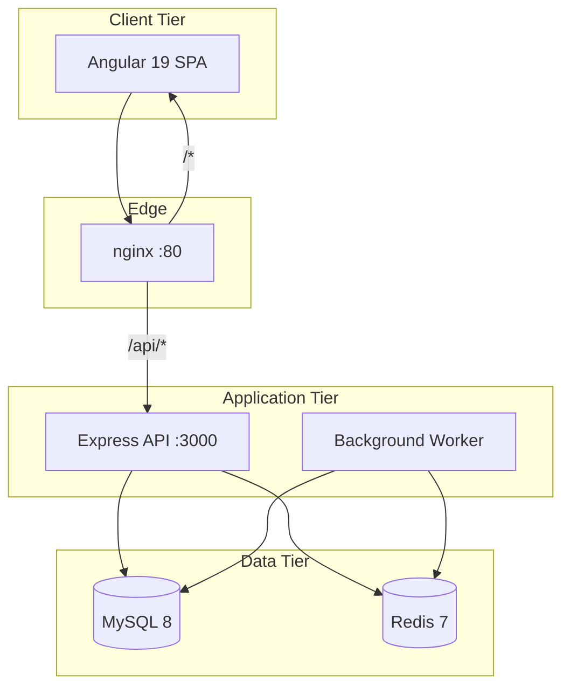

# Architecture — v1.0.0-rc1

Enterprise Merchant Management Portal — system architecture overview.

> Extended documentation: [Documentation/ARCHITECTURE.md](./Documentation/ARCHITECTURE.md)

## Topology

## Monorepo Structure

| Package | Stack | Role |
|---------|-------|------|
| `Frontend_Fintech` | Angular 19, Material | SPA, public checkout pages |
| `Backend_Fintech` | Express, TypeScript, Zod | REST API, auth, business logic |
| `Database_Fintech` | MySQL 8 SQL | Schema, seed, migrations |
| `e2e` | Playwright | End-to-end UI tests |
| `performance` | k6 | Load/performance tests |
| `security` | OWASP ZAP scripts | DAST, dependency audit |

## API Design

- Base path: `/api`
- Versioned modules: `/api/v1/*`
- Auth: `/api/auth/*`
- Public: `/api/v1/public/checkout`, `payment-links`, `qr-payments`
- OpenAPI: `/api/docs` (Swagger UI)

## Multi-Tenancy

- Organization context via `X-Organization-Id` header + JWT claims
- Repository-level `organization_id` filtering
- Audit logs tenant-scoped

## Background Processing

- **Worker process:** `Backend_Fintech/src/worker.ts`
- Queues: webhooks, email, reports, settlements
- Claim pattern: `SELECT ... FOR UPDATE` (MySQL) or Redis distributed locks

## Deployment

Docker Compose services: `mysql`, `redis`, `backend`, `worker`, `frontend`.

Health probes:

- Liveness: `GET /api/live`
- Readiness: `GET /api/ready` (DB + dependencies)
- Health: `GET /api/health`

Graceful shutdown: SIGTERM/SIGINT → drain HTTP → close pool/Redis (10s timeout).

## CI/CD

`.github/workflows/ci.yml`: backend build, integration, frontend build, database validation, Playwright E2E.

Optional: `performance.yml`, `security.yml` (workflow_dispatch).
