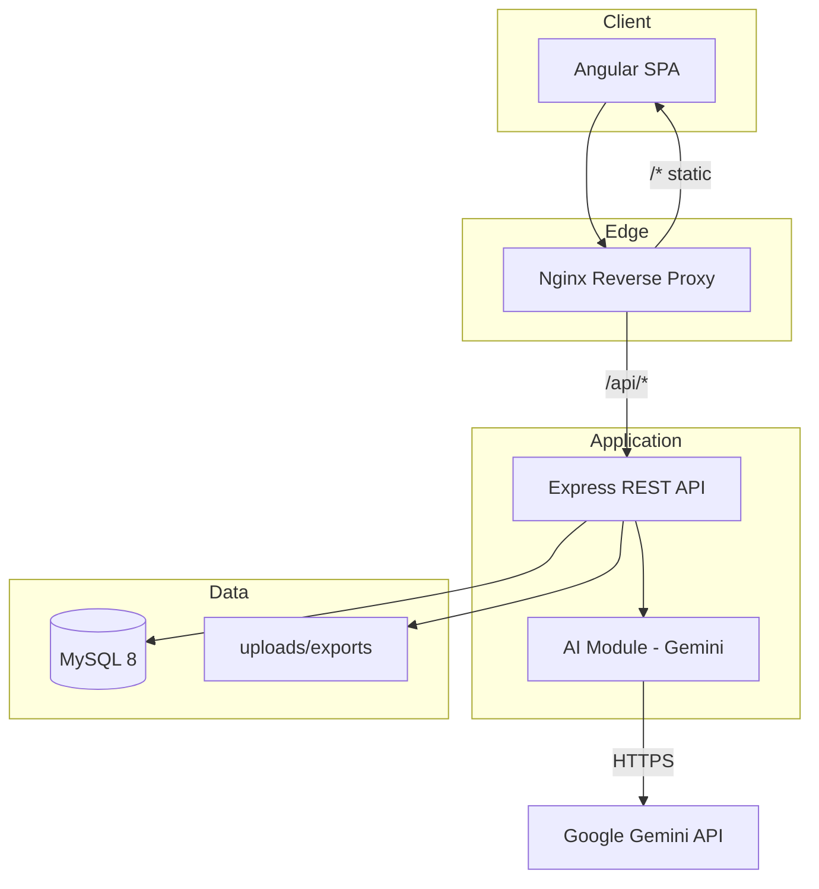
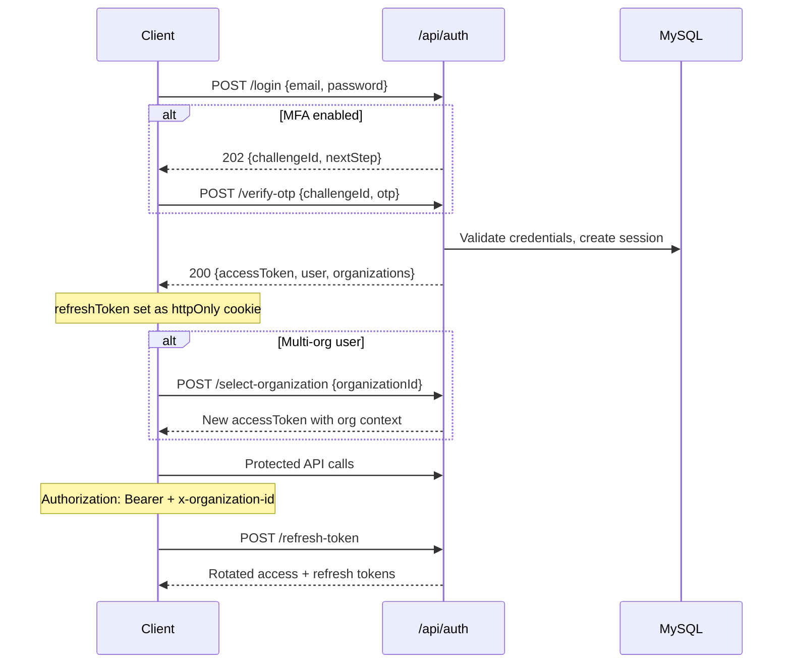

# Architecture — Merchant Pro v1.0.0 RC1

This document describes the implemented architecture of the Merchant Pro platform as of Release Candidate 1.

---

## High-Level Architecture



### Deployment topologies

| Topology | Components |
| -------- | ---------- |
| **Development** | Angular dev server (4200) + Express (3000) + local MySQL |
| **Docker Compose** | frontend (nginx:80) + backend (3000) + mysql (3306) |
| **PM2 + Nginx** | Nginx serves SPA + proxies `/api` to PM2-managed backend |

---

## Angular Architecture

The frontend follows a feature-module layout under `Frontend_Fintech/src/app/`.

```
src/app/
├── core/                    # Singleton services, guards, interceptors
│   ├── auth/                # JWT, permissions, session
│   └── api/                 # HTTP client wrappers
├── features/                # Lazy-loaded feature modules
│   ├── auth/
│   ├── dashboard/
│   ├── merchants/
│   ├── transactions/
│   ├── settlements/
│   ├── refunds/
│   ├── chargebacks/
│   ├── reports/
│   ├── settings/
│   ├── support/
│   ├── operations/
│   └── ...
├── routing/                 # Top-level route definitions
└── shared/                  # Reusable UI components
```

### Key patterns

- **Lazy loading:** Feature routes use `loadComponent` / `loadChildren` for code splitting.
- **Guards:** `authGuard` protects authenticated routes; `permissionGuard` enforces RBAC per route.
- **Interceptors:** Attach `Authorization: Bearer` and `x-organization-id` headers to API requests.
- **Environment config:** `environment.ts` (dev: `http://localhost:3000/api`) vs `environment.prod.ts` (prod: `/api` via reverse proxy).
- **Material Design:** Angular Material 19 for tables, forms, dialogs, and navigation.

### Frontend routes (authenticated)

| Path | Feature |
| ---- | ------- |
| `/dashboard` | Executive dashboard |
| `/merchants` | Merchant management |
| `/transactions` | Transaction management |
| `/settlements` | Settlement management |
| `/refunds` | Refund management |
| `/chargebacks` | Chargeback management |
| `/customers` | Customer management |
| `/reports` | Reports and analytics |
| `/support` | Support tickets |
| `/operations` | Operations center |
| `/settings/*` | Organization and system settings |
| `/users`, `/roles` | User and role administration |
| `/audit` | Audit log viewer |
| `/notifications` | Notification inbox |

Public routes: `/auth/*`, `/pay/:token`, `/qr/:token`.

---

## Backend Architecture

The backend is an Express application organized by domain modules under `Backend_Fintech/src/app/modules/`.

```
src/app/
├── app.ts                   # Express app factory, middleware, route mounting
├── config/                  # env.ts, validate-env.ts, http-security.ts
├── database/                # MySQL connection pool
├── shared/
│   ├── rbac/                # Permission constants and middleware
│   ├── logger/              # Structured JSON logger
│   └── middleware/          # Request context, logging, error handling
└── modules/
    ├── auth/
    ├── dashboard/
    ├── merchants/
    ├── transactions/
    ├── settlements/
    ├── refunds/
    ├── chargebacks/
    ├── reports/
    ├── settings/
    ├── support/
    ├── operations/
    ├── ai/
    ├── system/
    └── ...
```

### Request pipeline

1. Helmet, CORS, compression
2. Cookie parser, JSON body parser
3. **Request context middleware** — assigns/propagates `X-Request-Id`
4. **Request logging middleware** — structured access log
5. Morgan HTTP logger
6. Route handlers with auth + org + permission middleware
7. Not-found and global error handlers

### Module boundaries

Each module owns its routes, controllers, services, DTOs (Zod schemas), and repository/data access. Modules do not share database queries across boundaries; cross-module data access goes through service interfaces (e.g., AI module reuses `AnalyticsService` from reports).

| Module | Route prefix | Responsibility |
| ------ | ------------ | -------------- |
| auth | `/api/auth` | Login, MFA, sessions, password reset |
| dashboard | `/api/v1/dashboard/executive` | KPIs, charts, dashboard AI |
| merchants | `/api/v1/merchants` | Merchant CRUD, KYC documents |
| transactions | `/api/v1/transactions` | Transaction lifecycle |
| settlements | `/api/v1/settlements` | Settlements and batches |
| refunds | `/api/v1/refunds` | Refund workflow |
| chargebacks | `/api/v1/chargebacks` | Dispute management |
| reports | `/api/v1/reports`, `/api/v1/analytics` | Reports and analytics |
| settings | `/api/v1/settings` | Org configuration |
| support | `/api/v1/support` | Support tickets |
| operations | `/api/v1/operations` | Ops monitoring |
| ai | `/api/v1/ai` | General AI assistant |
| system | `/api/v1/system` | Health, readiness, version |
| audit | `/api/v1/audit` | Audit and API logs |

---

## Authentication Flow



### Token model

- **Access token (JWT):** Short-lived (default 15m). Contains `sub`, `sessionId`, `organizationId`, `organizationRoleCode`.
- **Refresh token:** httpOnly cookie (`refreshToken` by default). Rotated on refresh.
- **Session idle timeout:** Configurable via `SESSION_IDLE_MINUTES` (default 15).
- **MFA:** TOTP-based OTP via `otplib`. Challenge returned as HTTP 202.

---

## RBAC

Role-Based Access Control is enforced at the API layer via permission middleware and at the frontend via route guards.

### Permission format

Permissions follow `{resource}:{action}` (e.g., `merchants:read`, `refunds:approve`).

### Special roles

| Role | Behavior |
| ---- | -------- |
| `super_admin` | Bypasses all permission checks (`*` permission) |
| Organization `owner` / `admin` | Full permissions within org |
| Organization `viewer` | Read and export only |
| Organization `member` | Read/export; no write/approve/resolve/delete |

### Permission count

69 permissions are seeded in `master_database.sql`, including `system:view` (id 69) for observability endpoints.

Frontend permission constants mirror backend definitions in `permissions.constants.ts` / `permissions.ts`.

---

## Audit

The audit module (`/api/v1/audit`) records:

- **Audit logs** — user actions (create, update, delete) with entity type, entity ID, and change details
- **API logs** — HTTP request/response metadata
- **Webhook logs** — inbound/outbound webhook events

All audit entries include `correlation_id` (from `X-Request-Id`) for traceability.

Permissions: `audit:read`, `audit:export`.

---

## AI Foundation

The AI module (`/api/v1/ai`) provides a general-purpose assistant accessible from the floating action button in the UI.

### Architecture

```
User message
  → Intent detection (keyword rules)
  → AnalyticsService data fetch (reuse, no duplicate SQL)
  → Enriched prompt with BACKEND DATA + business data rules
  → Gemini provider (generateContent API)
  → Response to client
```

### Provider

- **Default:** Google Gemini (`AI_PROVIDER=gemini`)
- **Model:** `gemini-flash-latest` (configurable via `GEMINI_MODEL`)
- **Rate limit:** `AI_RATE_LIMIT_PER_MINUTE` (default 20)
- **Permission:** `ai:chat`

OpenAI and Groq providers are defined in configuration but return `503` if selected (not implemented).

### Business data rules

When backend analytics data is injected into the prompt, the AI is instructed to:

- Always answer using provided business data
- Never estimate, fabricate, or invent values
- Report zero counts as zero
- Flag inconsistent data explicitly

---

## Dashboard AI

Dashboard AI is a separate entry point at `POST /api/v1/dashboard/executive/ai/chat`.

| Aspect | General AI | Dashboard AI |
| ------ | ---------- | ------------ |
| Route | `/api/v1/ai/chat` | `/api/v1/dashboard/executive/ai/chat` |
| Permissions | `ai:chat` | `ai:chat` + `dashboard:read` |
| Context | Intent-based analytics | Dashboard period KPIs and charts |
| Quick actions | No | Yes (`summarize_revenue`, etc.) |

Both use the same Gemini provider and business-data prompt rules.

---

## Observability

### Public liveness

`GET /api/health` — no authentication. Returns DB connection status. Used by Docker HEALTHCHECK and load balancers.

### Authenticated system endpoints

Requires JWT + `system:view` permission:

| Endpoint | Purpose |
| -------- | ------- |
| `GET /api/v1/system/health` | Application, database, AI provider status |
| `GET /api/v1/system/readiness` | DB, AI, storage, queue readiness |
| `GET /api/v1/system/version` | Version, build, commit, environment |

Frontend UI: **Settings → System Status** (`/settings/system-status`).

Health states: `healthy`, `degraded`, `unhealthy`. Component states: `up`, `down`, `degraded`, `unknown`.

---

## Logging

### Structured logger

Location: `Backend_Fintech/src/app/shared/logger/logger.ts`

Outputs JSON with fields: `timestamp`, `level`, `message`, `requestId`, `userId`, `organizationId`, `route`.

Controlled by `LOG_LEVEL` (`debug`, `info`, `warn`, `error`).

### HTTP access logs

- **Morgan:** `combined` format in production, `dev` in development
- **Request logging middleware:** Logs method, status code, duration on response finish

### Log locations

| Deployment | Location |
| ---------- | -------- |
| Development | stdout |
| PM2 | `Backend_Fintech/logs/pm2-out.log`, `pm2-error.log` |
| Docker | `backend_logs` volume → `/app/logs` |

---

## Correlation IDs

Every request receives a unique `X-Request-Id`:

1. Accepted from inbound `x-request-id` header if present
2. Otherwise auto-generated (UUID)
3. Set on response header `X-Request-Id`
4. Propagated to structured logs, error handler, and audit records

Implementation: `request-context.middleware.ts` using `AsyncLocalStorage`.

---

## Deployment Architecture

### Docker Compose

```
┌─────────────┐     ┌──────────────┐     ┌─────────────┐
│  frontend   │────▶│   backend    │────▶│    mysql    │
│ nginx :80   │/api │  node :3000  │     │  mysql:3306 │
└─────────────┘     └──────────────┘     └─────────────┘
       │                    │
       │              uploads + logs volumes
   FRONTEND_PORT       BACKEND_PORT
   (default 4200)       (default 3000)
```

### PM2 + Nginx (host)

```
Internet → Nginx (:443 TLS) → /api/* → PM2 backend (:3000)
                            → /*     → Angular static files
```

Nginx config: `deploy/nginx/fintech.conf`  
PM2 config: `ecosystem.config.cjs`

### Graceful shutdown

`server.ts` handles `SIGTERM` / `SIGINT`:

1. Stop accepting new connections
2. Close MySQL connection pool
3. Force exit after 10s timeout
4. PM2 `wait_ready` — backend sends `process.send('ready')` when listening

---

## Security Layers

| Layer | Implementation |
| ----- | -------------- |
| Transport | TLS required in production (Nginx termination) |
| Headers | Helmet (CSP, HSTS in production) |
| CORS | Origin whitelist via `CORS_ORIGIN` |
| Auth | JWT + refresh rotation + session revocation |
| RBAC | Permission middleware on every protected route |
| Rate limiting | Login, OTP, AI endpoints |
| Input validation | Zod schemas on all request bodies |
| Secrets | Production env validation blocks placeholders |
