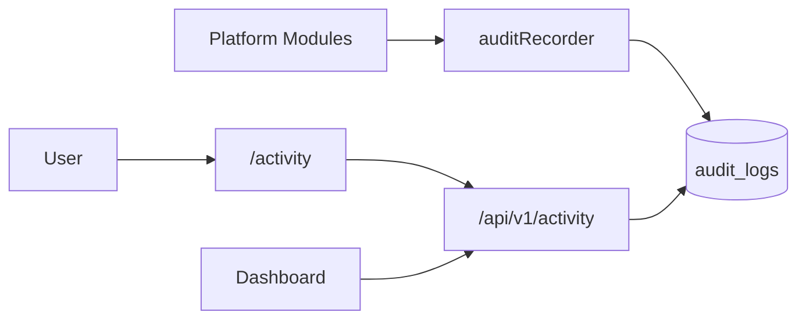
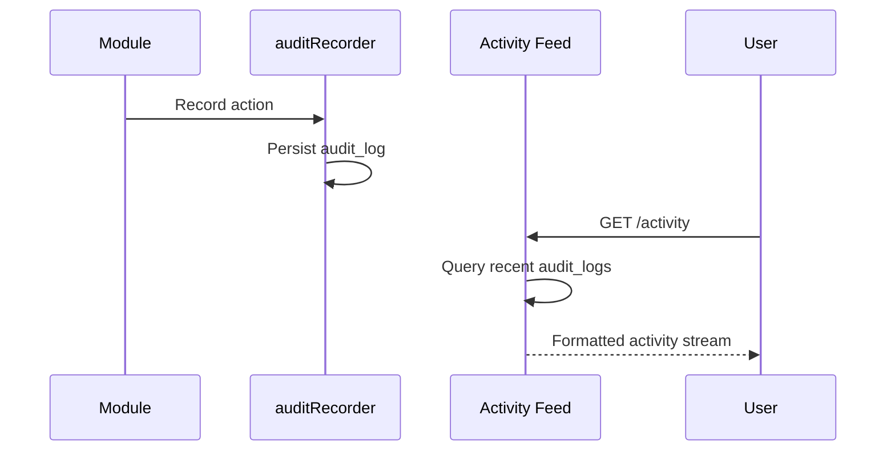

# Activity Center Module

> **Module documentation** for Merchant Pro v1.0.0-rc1. Cross-references: [PFS](../Product_Functional_Specification.md) · [Business Rules](../Business_Rules.md) · [Functional Requirements](../Functional_Requirements.md) · [User Journeys](../User_Journeys.md) · [Feature Matrix](../Feature_Matrix.md)

## Table of Contents

1. [Purpose](#1-purpose) · 2. [Business Objective](#2-business-objective) · 3. [Scope](#3-scope) · 4. [Primary Users](#4-primary-users) · 5. [Key Capabilities](#5-key-capabilities) · 6. [Dependencies](#6-dependencies) · 7. [Architecture Overview](#7-architecture-overview) · 8. [Inputs](#8-inputs) · 9. [Outputs](#9-outputs) · 10. [Business Rules](#10-business-rules) · 11. [Permissions and RBAC](#11-permissions-and-rbac) · 12. [API Reference](#12-api-reference) · 13. [Frontend Routes](#13-frontend-routes) · 14. [Data Model](#14-data-model) · 15. [Workflows and State Machines](#15-workflows-and-state-machines) · 16. [Integration Points](#16-integration-points) · 17. [Security Considerations](#17-security-considerations) · 18. [Success Criteria](#18-success-criteria) · 19. [Error Scenarios](#19-error-scenarios) · 20. [Operational Considerations](#20-operational-considerations) · 21. [Related Functional Requirements](#21-related-functional-requirements) · 22. [Related User Journeys](#22-related-user-journeys) · 23. [Feature Matrix Reference](#23-feature-matrix-reference) · 24. [Limitations and Status](#24-limitations-and-status) · 25. [Future Enhancements](#25-future-enhancements)

---

## 1. Purpose

Recent platform activity feed providing a chronological stream of significant events across modules for operational awareness and quick navigation.

## 2. Business Objective

Give administrators and operations users a real-time pulse of platform activity without deep-diving into audit logs. Aligns with [PFS §7.28](../Product_Functional_Specification.md#728-activity-center).

## 3. Scope

Activity stream API, activity listing UI, feed aggregation from audit and module events, and dashboard widget integration. Full forensic detail in [Audit.md](./Audit.md).

## 4. Primary Users

| Persona | Usage |
|---------|-------|
| Operations User | Monitor recent platform events |
| Platform Administrator | Review team activity |
| Finance User | Track payment-related events |

## 5. Key Capabilities

| Capability | Description |
|------------|-------------|
| Activity stream | Chronological event feed |
| Event types | Payments, merchants, users, settings |
| Filtering | By module, date range, user |
| Pagination | Cursor or page-based |
| Dashboard widget | Recent activity on dashboard |
| Navigation | Click-through to entity detail |

## 6. Dependencies

| Dependency | Purpose |
|------------|---------|
| Audit | Primary activity data source |
| Authorization | activity_center:read |
| Organization context | Org-scoped feed |
| Dashboard | Activity widget embed |

## 7. Architecture Overview

## 8. Inputs

| Input | Description |
|-------|-------------|
| page, pageSize | Pagination |
| module | Filter by module |
| fromDate, toDate | Date range |
| userId | Filter by actor |

## 9. Outputs

| Output | Description |
|--------|-------------|
| Activity items | id, action, entity, user, timestamp |
| Pagination | total, hasMore |
| Entity links | Route to detail page |

## 10. Business Rules

Activity feed filtered by organization when context present (BR-AUD-002). Sensitive fields masked (BR-AUD-003).

## 11. Permissions and RBAC

| Permission | Action |
|------------|--------|
| `activity_center:read` | View activity feed |

## 12. API Reference

Base path: `/api/v1/activity` — authenticated, org-scoped.

| Method | Path | Permission |
|--------|------|------------|
| GET | `/api/v1/activity` | `activity_center:read` |

Query parameters: pagination, module, date range, user filters.

## 13. Frontend Routes

| Route | Permission |
|-------|------------|
| `/activity` | `activity_center:read` |

Nav label: **Activity**.

## 14. Data Model

Activity reads from `audit_logs` with presentation-layer formatting:

| Field | Description |
|-------|-------------|
| module | Source module |
| action_code | Action performed |
| entity_type, entity_id | Target entity |
| user_id | Acting user |
| description | Human-readable summary |
| created_at | Event timestamp |
| risk_level | Event severity |

## 15. Workflows and State Machines

## 16. Integration Points

| Module | Integration |
|--------|-------------|
| Audit | Data source |
| Dashboard | Activity widget |
| Search Center | Navigate from search to activity |
| All modules | Event generation via auditRecorder |

## 17. Security Considerations

- Org-scoped activity only
- PII masked in descriptions
- No activity feed for unauthenticated users
- High-risk events flagged visually

## 18. Success Criteria

| Criterion | Measure |
|-----------|---------|
| Freshness | Events appear within seconds |
| Relevance | Significant actions included |
| Navigation | Click-through to entity works |

## 19. Error Scenarios

| Scenario | HTTP |
|----------|------|
| Missing permission | 403 |
| Invalid date range | 400 |
| Empty feed | 200 with empty array |

## 20. Operational Considerations

- Activity feed query performance (indexed created_at)
- Define which actions appear in feed vs audit-only
- Retention aligned with audit log policy

## 21. Related Functional Requirements

FR-ACT-001 in [Functional Requirements](../Functional_Requirements.md#audit--operations-fr-ops).

## 22. Related User Journeys

See [User Journeys](../User_Journeys.md) — daily activity monitoring.

## 23. Feature Matrix Reference

See [Feature Matrix](../Feature_Matrix.md) — Activity Center by role.

## 24. Limitations and Status

| Limitation | Notes |
|------------|-------|
| Real-time push | Polling/refresh based |
| Custom filters | Preset filters only |
| **Status** | **Implemented** |

## 25. Future Enhancements

- WebSocket live activity stream
- User-specific activity subscriptions
- Activity digest emails
- Anomaly highlighting in feed
