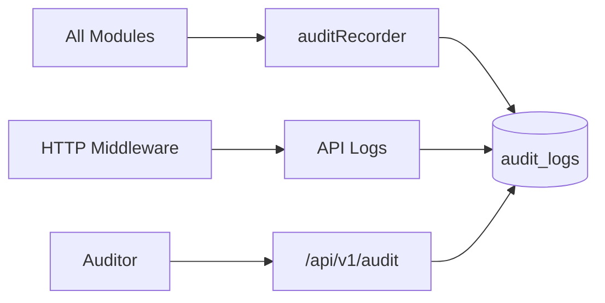
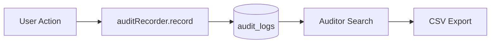

# Audit Module

> **Module documentation** for Merchant Pro v1.0.0-rc1. Cross-references: [PFS](../Product_Functional_Specification.md) · [Business Rules](../Business_Rules.md) · [Functional Requirements](../Functional_Requirements.md) · [User Journeys](../User_Journeys.md) · [Feature Matrix](../Feature_Matrix.md)

## Table of Contents

1. [Purpose](#1-purpose) · 2. [Business Objective](#2-business-objective) · 3. [Scope](#3-scope) · 4. [Primary Users](#4-primary-users) · 5. [Key Capabilities](#5-key-capabilities) · 6. [Dependencies](#6-dependencies) · 7. [Architecture Overview](#7-architecture-overview) · 8. [Inputs](#8-inputs) · 9. [Outputs](#9-outputs) · 10. [Business Rules](#10-business-rules) · 11. [Permissions and RBAC](#11-permissions-and-rbac) · 12. [API Reference](#12-api-reference) · 13. [Frontend Routes](#13-frontend-routes) · 14. [Data Model](#14-data-model) · 15. [Workflows and State Machines](#15-workflows-and-state-machines) · 16. [Integration Points](#16-integration-points) · 17. [Security Considerations](#17-security-considerations) · 18. [Success Criteria](#18-success-criteria) · 19. [Error Scenarios](#19-error-scenarios) · 20. [Operational Considerations](#20-operational-considerations) · 21. [Related Functional Requirements](#21-related-functional-requirements) · 22. [Related User Journeys](#22-related-user-journeys) · 23. [Feature Matrix Reference](#23-feature-matrix-reference) · 24. [Limitations and Status](#24-limitations-and-status) · 25. [Future Enhancements](#25-future-enhancements)

---

## 1. Purpose

Compliance and forensic audit logging capturing user actions, API calls, webhook deliveries, and system events with org-scoped search and export.

## 2. Business Objective

Provide immutable audit trail for regulatory compliance, security investigations, and operational forensics. Aligns with [PFS §7.19](../Product_Functional_Specification.md#719-audit).

## 3. Scope

Audit log search/filter, API request logs, webhook delivery logs, export, and automatic recording from `auditRecorder` across modules.

## 4. Primary Users

| Persona | Usage |
|---------|-------|
| Auditor | Search and export audit logs |
| Compliance Officer | Review sensitive actions |
| Platform Administrator | Investigate security events |

## 5. Key Capabilities

| Capability | Description |
|------------|-------------|
| Audit search | Filter by module, action, user, date |
| API logs | HTTP request/response audit |
| Webhook logs | Delivery attempt history |
| Export | CSV export with audit:export |
| Auto-recording | auditRecorder on key actions |
| Risk levels | low, medium, high classification |

## 6. Dependencies

| Dependency | Purpose |
|------------|---------|
| All modules | Emit audit events |
| Authorization | audit:read, audit:export |
| Organization context | Org-scoped queries |
| Request logging | HTTP audit middleware |

## 7. Architecture Overview

## 8. Inputs

| Input | Description |
|-------|-------------|
| module, action | Event classification |
| entityType, entityId | Target entity |
| userId | Acting user |
| metadata | JSON context |
| filters | Search query params |

## 9. Outputs

| Output | Description |
|--------|-------------|
| Audit record | Immutable log entry |
| Paginated search | Filtered results |
| Export file | CSV download |

## 10. Business Rules

See [Business Rules — Audit & Notifications](../Business_Rules.md#audit--notifications):

| Rule | Summary |
|------|---------|
| BR-AUD-001 | Persist organization_id from context |
| BR-AUD-002 | Reads filtered by organization |
| BR-AUD-003 | Sensitive fields masked in logs |

## 11. Permissions and RBAC

| Permission | Action |
|------------|--------|
| `audit:read` | Search and view audit logs |
| `audit:export` | Export audit data |

## 12. API Reference

Base path: `/api/v1/audit` — authenticated, org-scoped.

Search, detail view, API logs, webhook logs, and export endpoints per permissions.

## 13. Frontend Routes

| Route | Permission |
|-------|------------|
| `/audit` | `audit:read` |

## 14. Data Model

| Entity | Key Fields |
|--------|------------|
| `audit_logs` | id, organization_id, module, action_code, entity_type, user_id, risk_level, created_at |
| `api_logs` | method, path, status_code, duration_ms |
| `webhook_logs` | delivery_id, event_type, response_code |

## 15. Workflows and State Machines

Audit records are append-only (immutable):

## 16. Integration Points

| Module | Integration |
|--------|-------------|
| All modules | auditRecorder calls |
| Webhooks | Delivery audit trail |
| Background Jobs | Unknown job type audit |
| Activity Center | Recent activity subset |
| Search Center | Cross-module discovery |

## 17. Security Considerations

- Audit logs immutable after write
- PII masked (BR-AUD-003)
- Export requires elevated permission
- Org isolation on all reads
- High-risk events flagged

## 18. Success Criteria

| Criterion | Measure |
|-----------|---------|
| Coverage | Key actions recorded |
| Search | Sub-second filtered queries |
| Export | Complete data in CSV |
| Isolation | No cross-org leakage |

## 19. Error Scenarios

| Scenario | HTTP |
|----------|------|
| Missing export permission | 403 |
| Date range too large | 400 with limit |
| Audit write failure | Logged; non-blocking |

## 20. Operational Considerations

- Audit table partitioning for volume
- Retention policy per compliance requirements
- Monitor audit write error rate
- Regular export for long-term archival

## 21. Related Functional Requirements

FR-AUD-001, FR-AUD-002 in [Functional Requirements](../Functional_Requirements.md#audit--operations-fr-ops).

## 22. Related User Journeys

See [User Journeys](../User_Journeys.md) — compliance audit review.

## 23. Feature Matrix Reference

See [Feature Matrix](../Feature_Matrix.md) — Audit by role.

## 24. Limitations and Status

| Limitation | Notes |
|------------|-------|
| Real-time streaming | Polling/search based |
| **Status** | **Implemented** |

## 25. Future Enhancements

- SIEM integration (Splunk, Datadog)
- Audit log tamper-evidence (hash chain)
- ML anomaly detection on audit patterns
- Configurable retention per event type
