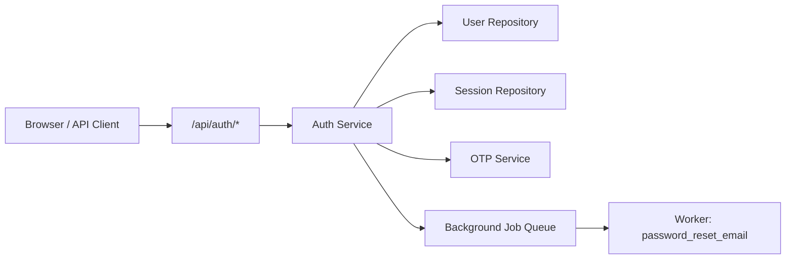
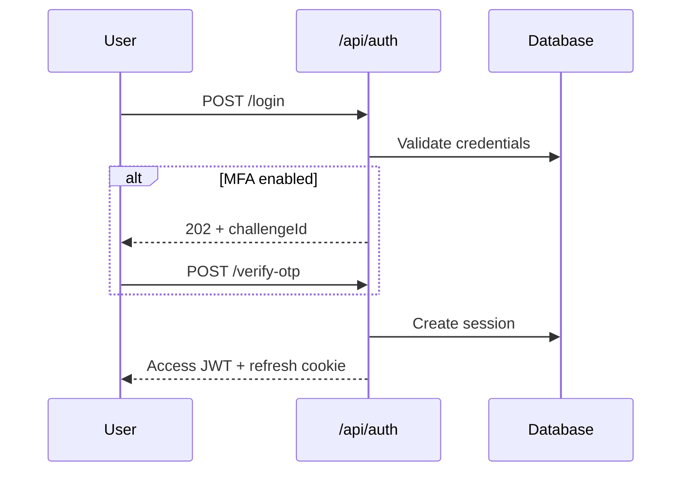

# Authentication Module

> **Module documentation** for Merchant Pro v1.0.0-rc1. Cross-references: [PFS](../Product_Functional_Specification.md) · [Business Rules](../Business_Rules.md) · [Functional Requirements](../Functional_Requirements.md) · [User Journeys](../User_Journeys.md) · [Feature Matrix](../Feature_Matrix.md)

## Table of Contents

1. [Purpose](#1-purpose)
2. [Business Objective](#2-business-objective)
3. [Scope](#3-scope)
4. [Primary Users](#4-primary-users)
5. [Key Capabilities](#5-key-capabilities)
6. [Dependencies](#6-dependencies)
7. [Architecture Overview](#7-architecture-overview)
8. [Inputs](#8-inputs)
9. [Outputs](#9-outputs)
10. [Business Rules](#10-business-rules)
11. [Permissions and RBAC](#11-permissions-and-rbac)
12. [API Reference](#12-api-reference)
13. [Frontend Routes](#13-frontend-routes)
14. [Data Model](#14-data-model)
15. [Workflows and State Machines](#15-workflows-and-state-machines)
16. [Integration Points](#16-integration-points)
17. [Security Considerations](#17-security-considerations)
18. [Success Criteria](#18-success-criteria)
19. [Error Scenarios](#19-error-scenarios)
20. [Operational Considerations](#20-operational-considerations)
21. [Related Functional Requirements](#21-related-functional-requirements)
22. [Related User Journeys](#22-related-user-journeys)
23. [Feature Matrix Reference](#23-feature-matrix-reference)
24. [Limitations and Status](#24-limitations-and-status)
25. [Future Enhancements](#25-future-enhancements)

---

## 1. Purpose

Secure user identity verification, session lifecycle management, and multi-factor authentication for the Merchant Pro platform.

## 2. Business Objective

Prevent unauthorized access while supporting multi-organization users, MFA, and secure token-based API access. Aligns with [PFS §7.1](../Product_Functional_Specification.md#71-authentication).

## 3. Scope

Covers login, MFA (OTP/TOTP), token refresh, logout, password reset, CSRF protection, session CRUD, organization selection, and MFA preferences. Excludes authorization enforcement (see [Authorization.md](./Authorization.md)).

## 4. Primary Users

| Persona | Usage |
|---------|-------|
| All platform users | Login, MFA, password management |
| API consumers | Bearer token via login or refresh |
| Platform Administrator | Session policy configuration via Settings |

## 5. Key Capabilities

| Capability | Description |
|------------|-------------|
| Email/password login | Validates credentials; returns JWT or MFA challenge |
| MFA challenge | 6-digit OTP with 59-second resend cooldown |
| Token refresh | Rotating refresh cookie scoped to `/api/auth` |
| CSRF protection | Token issuance; required on cookie-authenticated mutations |
| Session management | List, revoke single, revoke all others |
| Organization selection | Embeds active organization in JWT claims |
| Password reset | Forgot-password enqueues `password_reset_email` job |
| MFA preferences | Enable/disable TOTP subject to org enforcement |

## 6. Dependencies

| Dependency | Purpose |
|------------|---------|
| MySQL | `users`, `sessions`, `otp_challenges`, `password_reset_tokens` |
| Background Jobs | Password reset email delivery |
| Settings | Password policy, lockout thresholds, session limits |
| Authorization | JWT validation on protected routes |

## 7. Architecture Overview

Authentication routes mount at `/api/auth` without the `/api/v1` prefix. Cookie-based refresh tokens use path `/api/auth`.

## 8. Inputs

| Input | Source | Validation |
|-------|--------|------------|
| Email, password | Login form | Zod schema; BR-AUTH-001 |
| OTP code | MFA verify | 6 digits; expiry enforced |
| Refresh token | HttpOnly cookie | Rotation on reuse revokes all sessions |
| CSRF token | Header on mutations | Required for cookie auth |
| Organization ID | Select-org POST | Must be member org |

## 9. Outputs

| Output | Description |
|--------|-------------|
| Access JWT | 15-minute default expiry; contains user, org, permissions |
| Refresh cookie | HttpOnly; 7 or 30 days with remember device |
| User profile | `/me` returns identity and org list |
| MFA challenge ID | HTTP 202 on login when MFA required |
| Session list | Active sessions with device metadata |

## 10. Business Rules

See [Business Rules — Authentication & Session](../Business_Rules.md#authentication--session): **BR-AUTH-001** through **BR-AUTH-014**.

| Rule | Summary |
|------|---------|
| BR-AUTH-002 | Lockout after 5 failed attempts (30 min) |
| BR-AUTH-007 | Refresh token reuse revokes all sessions |
| BR-AUTH-010 | CSRF on cookie-authenticated mutations |
| BR-AUTH-011 | Bearer clients exempt from CSRF |

## 11. Permissions and RBAC

Authentication endpoints are **public** (except session management). No RBAC permission required for login or reset. Authenticated routes require valid JWT via `authenticate` middleware only.

## 12. API Reference

| Method | Path | Auth | Description |
|--------|------|------|-------------|
| GET | `/api/auth/csrf-token` | Public | Issue CSRF token |
| POST | `/api/auth/login` | Public | Login (rate limit 20/15min) |
| POST | `/api/auth/verify-otp` | Public | Complete MFA |
| POST | `/api/auth/resend-otp` | Public | Resend OTP |
| POST | `/api/auth/forgot-password` | Public | Enqueue reset email |
| POST | `/api/auth/reset-password` | Public | Set new password |
| POST | `/api/auth/refresh-token` | Cookie | Rotate access token |
| POST | `/api/auth/select-organization` | JWT | Set active org |
| POST | `/api/auth/logout` | JWT | Revoke session |
| GET | `/api/auth/me` | JWT | Current user profile |
| GET | `/api/auth/sessions` | JWT | List sessions |
| DELETE | `/api/auth/sessions/others` | JWT | Revoke other sessions |
| DELETE | `/api/auth/session/:id` | JWT | Revoke specific session |
| POST | `/api/auth/change-password` | JWT | Change password |
| PUT | `/api/auth/mfa-preferences` | JWT | Update MFA settings |
| GET | `/api/auth/session-settings` | JWT | Session policy info |

## 13. Frontend Routes

| Route | Purpose |
|-------|---------|
| `/login` | Primary login page |
| `/verify-otp` | MFA verification after 202 challenge |
| `/forgot-password` | Reset request (generic success message) |
| `/reset-password` | Password reset with email token |
| `/select-organization` | Multi-org user org picker |

## 14. Data Model

| Entity | Key Fields |
|--------|------------|
| `users` | id, email, password_hash, mfa_enabled, status |
| `sessions` | id, user_id, refresh_token_hash, device_info, expires_at |
| `otp_challenges` | id, user_id, code_hash, expires_at |
| `password_reset_tokens` | token_hash, user_id, expires_at |

## 15. Workflows and State Machines

## 16. Integration Points

| Integration | Direction | Notes |
|-------------|-----------|-------|
| Authorization | Downstream | JWT consumed by authenticate middleware |
| Background Jobs | Outbound | `password_reset_email` on forgot-password |
| Settings | Inbound | Password policy, lockout config |
| Notifications | Outbound | Reset email via worker |

## 17. Security Considerations

- Passwords hashed with bcrypt
- Refresh tokens stored as hashes
- Rate limiting: login 20/15min, forgot-password 10/15min
- Anti-enumeration on forgot-password (BR-AUTH-009)
- CSRF double-submit cookie pattern
- PII masked in audit logs

## 18. Success Criteria

| Criterion | Measure |
|-----------|---------|
| Valid login | HTTP 200; dashboard accessible |
| MFA completion | Session established within OTP window |
| Token refresh | Seamless without re-login |
| Lockout | Account blocked after threshold |
| Reset flow | Email delivered; token single-use |

## 19. Error Scenarios

| Scenario | HTTP | Response |
|----------|------|----------|
| Invalid credentials | 401 | Generic error message |
| Account locked | 423 | Lockout duration |
| Expired OTP | 400 | Re-request OTP |
| Invalid CSRF | 403 | CSRF validation failed |
| Refresh reuse | 401 | All sessions revoked |

## 20. Operational Considerations

- Monitor failed login rate and lockout counts
- Alert on refresh token reuse events (potential compromise)
- Verify SMTP delivery for password reset jobs
- Session count per user capped at 5 (configurable)

## 21. Related Functional Requirements

See [Functional Requirements — Authentication (FR-AUTH)](../Functional_Requirements.md#authentication-fr-auth): FR-AUTH-001 through FR-AUTH-010.

## 22. Related User Journeys

See [User Journeys](../User_Journeys.md) — login, MFA verification, password reset, and organization selection flows.

## 23. Feature Matrix Reference

See [Feature Matrix](../Feature_Matrix.md) — Authentication available to all personas at platform entry.

## 24. Limitations and Status

| Limitation | Notes |
|------------|-------|
| SSO | Not active in V1 |
| SMS MFA | TOTP primary; SMS optional per config |
| **Status** | **Implemented** |

## 25. Future Enhancements

- SAML/OIDC enterprise SSO
- WebAuthn/FIDO2 passwordless login
- Risk-based adaptive authentication
- Device fingerprinting and trusted device registry
