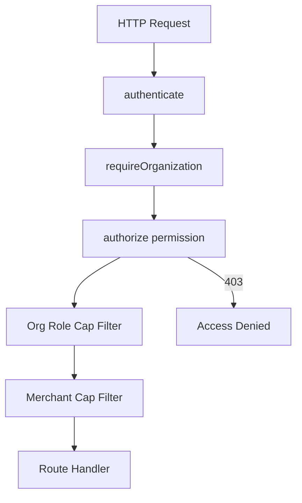
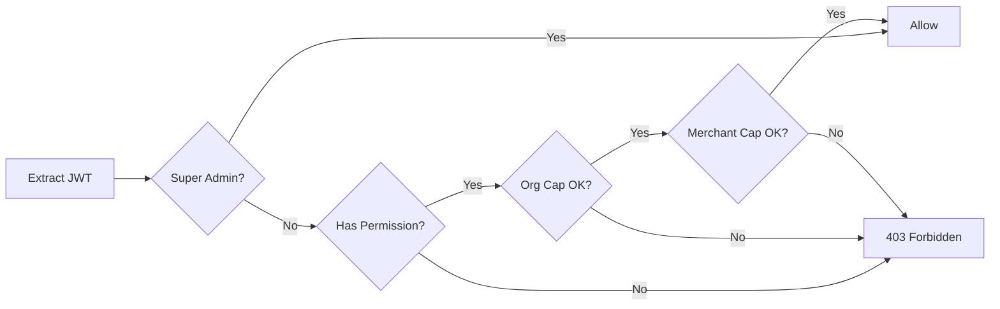

# Authorization Module

> **Module documentation** for Merchant Pro v1.0.0-rc1. Cross-references: [PFS](../Product_Functional_Specification.md) · [Business Rules](../Business_Rules.md) · [Functional Requirements](../Functional_Requirements.md) · [User Journeys](../User_Journeys.md) · [Feature Matrix](../Feature_Matrix.md)

## Table of Contents

1. [Purpose](#1-purpose)
2. [Business Objective](#2-business-objective)
3. [Scope](#3-scope)
4. [Primary Users](#4-primary-users)
5. [Key Capabilities](#5-key-capabilities)
6. [Dependencies](#6-dependencies)
7. [Architecture Overview](#7-architecture-overview)
8. [Inputs](#8-inputs)
9. [Outputs](#9-outputs)
10. [Business Rules](#10-business-rules)
11. [Permissions and RBAC](#11-permissions-and-rbac)
12. [API Reference](#12-api-reference)
13. [Frontend Routes](#13-frontend-routes)
14. [Data Model](#14-data-model)
15. [Workflows and State Machines](#15-workflows-and-state-machines)
16. [Integration Points](#16-integration-points)
17. [Security Considerations](#17-security-considerations)
18. [Success Criteria](#18-success-criteria)
19. [Error Scenarios](#19-error-scenarios)
20. [Operational Considerations](#20-operational-considerations)
21. [Related Functional Requirements](#21-related-functional-requirements)
22. [Related User Journeys](#22-related-user-journeys)
23. [Feature Matrix Reference](#23-feature-matrix-reference)
24. [Limitations and Status](#24-limitations-and-status)
25. [Future Enhancements](#25-future-enhancements)

---

## 1. Purpose

Enforce role-based access control (RBAC) on every authenticated API request and corresponding UI navigation, ensuring least-privilege access with tenant isolation.

## 2. Business Objective

Guarantee that users can only perform actions permitted by their global role, organization membership cap, and merchant context. Aligns with [PFS §7.2](../Product_Functional_Specification.md#72-authorization).

## 3. Scope

Covers permission evaluation, organization role caps, merchant portal caps, outlet scoping, super admin bypass, and UI route guards. Does not include authentication (see [Authentication.md](./Authentication.md)).

## 4. Primary Users

| Persona | Usage |
|---------|-------|
| System (middleware) | Evaluates every protected request |
| Platform Administrator | Assigns roles and permissions |
| All authenticated users | Subject to permission checks |

## 5. Key Capabilities

| Capability | Description |
|------------|-------------|
| Permission enforcement | `{resource}:{action}` format on routes |
| Organization role cap | Viewer/member caps intersect global permissions |
| Merchant context | `X-Merchant-Id` activates portal role cap |
| Outlet scoping | Branch managers limited to assigned outlets |
| Super admin bypass | `super_admin` role passes all checks |
| UI nav filtering | `nav.config.ts` hides items by permission |
| Permission catalog | 144 permissions in `permissions.ts` |

## 6. Dependencies

| Dependency | Purpose |
|------------|---------|
| Authentication | Valid JWT with user and org claims |
| MySQL | `roles`, `permissions`, `role_permissions`, `org_members` |
| Organization context | `requireOrganization()` middleware |
| Merchant middleware | Merchant portal cap filter |

## 7. Architecture Overview

Authorization middleware chain runs after authentication. The `authorize(PERMISSIONS.X)` factory attaches to individual routes.

## 8. Inputs

| Input | Source | Purpose |
|-------|--------|---------|
| JWT claims | Access token | User ID, org ID, role codes |
| `X-Organization-Id` | Header | Active tenant context |
| `X-Merchant-Id` | Header | Merchant portal scope |
| Required permission | Route definition | e.g. `payments:read` |

## 9. Outputs

| Output | Description |
|--------|-------------|
| Allow | Request proceeds to handler |
| HTTP 403 | Insufficient permission |
| HTTP 401 | Missing or invalid token |
| Filtered nav items | UI shows only permitted routes |

## 10. Business Rules

See [Business Rules — Authorization & Tenancy](../Business_Rules.md#authorization--tenancy): **BR-RBAC-001** through **BR-MER-003**.

| Rule | Summary |
|------|---------|
| BR-RBAC-001 | Super admin bypasses all checks |
| BR-RBAC-002 | Permission format `{resource}:{action}` |
| BR-RBAC-003 | Org viewer limited to read/export |
| BR-ORG-001 | Organization context required on org-scoped routes |

## 11. Permissions and RBAC

The platform defines **144 permissions** in `Backend_Fintech/src/app/shared/rbac/permissions.ts`.

| Category | Example Permissions |
|----------|---------------------|
| Dashboard | `dashboard:read`, `dashboard:export` |
| Merchants | `merchants:read`, `merchants:write`, `merchants:delete` |
| Payments | `payments:read`, `payments:capture`, `payments:refund` |
| Webhooks | `webhooks:read`, `webhooks:write`, `webhooks:manage` |
| Operations | `operations:read`, `operations:manage` |
| System | `system:view`, `platform_config:write` |

Organization membership roles cap effective permissions:

| Org Role | Cap |
|----------|-----|
| owner / admin | Full global permissions |
| viewer | Read and export only |
| member | Read/export; no write/approve/delete/manage |

## 12. API Reference

Authorization is middleware, not a standalone API. Related management endpoints:

| Method | Path | Permission | Description |
|--------|------|------------|-------------|
| GET | `/api/v1/permissions` | `permissions:read` | List all 144 permissions |
| GET | `/api/v1/roles` | `roles:read` | List roles |
| POST | `/api/v1/roles` | `roles:write` | Create role |
| PUT | `/api/v1/roles/:id/permissions` | `roles:write` | Assign permissions |
| GET | `/api/v1/users` | `users:read` | User role assignments |

## 13. Frontend Routes

| Route | Permission Gate |
|-------|---------------|
| `/roles` | `roles:read` |
| `/users` | `users:read` |
| All nav items | Per `NAV_ITEMS` in `nav.config.ts` |

The navigation service filters `NAV_ITEMS` by the user's effective permission set.

## 14. Data Model

| Entity | Key Fields |
|--------|------------|
| `permissions` | id, code, name, module |
| `roles` | id, code, name, organization_id |
| `role_permissions` | role_id, permission_id |
| `user_roles` | user_id, role_id |
| `org_members` | user_id, organization_id, role |

## 15. Workflows and State Machines

## 16. Integration Points

| Module | Integration |
|--------|-------------|
| Authentication | Consumes JWT claims |
| All `/api/v1/*` modules | `authorize()` on routes |
| Frontend | Permission guard on routes and nav |
| Feature Flags | Additional route blocking (BR-FF-001) |
| Audit | Logs denied access attempts |

## 17. Security Considerations

- Deny by default on missing permission
- Cross-tenant access returns 403/404 (BR-MER-003)
- Permission changes apply immediately (no cache on user session)
- Super admin role restricted to platform operators
- API key enforcement partial in V1

## 18. Success Criteria

| Criterion | Measure |
|-----------|---------|
| Unauthorized blocked | HTTP 403 on insufficient permission |
| Viewer cannot write | POST to write endpoints rejected |
| Org isolation | Cross-org data inaccessible |
| UI consistency | Hidden nav matches API denial |

## 19. Error Scenarios

| Scenario | HTTP | Cause |
|----------|------|-------|
| Missing token | 401 | Unauthenticated |
| Wrong permission | 403 | Role lacks permission |
| Missing org context | 403 | Org-scoped route without header |
| Cross-tenant access | 403/404 | Merchant not in active org |

## 20. Operational Considerations

- Review role-permission assignments during onboarding
- Audit super admin account usage
- Monitor 403 rate spikes for misconfiguration
- Validate new routes include `authorize()` middleware

## 21. Related Functional Requirements

See [Functional Requirements — Authorization (FR-RBAC)](../Functional_Requirements.md#authorization-fr-rbac): FR-RBAC-001 through FR-RBAC-004.

## 22. Related User Journeys

See [User Journeys](../User_Journeys.md) — role assignment and permission-restricted workflows.

## 23. Feature Matrix Reference

See [Feature Matrix](../Feature_Matrix.md) — module × role permission grid.

## 24. Limitations and Status

| Limitation | Notes |
|------------|-------|
| API key RBAC | Partial enforcement in V1 |
| Attribute-based access | Not supported; RBAC only |
| **Status** | **Implemented** |

## 25. Future Enhancements

- Full API key permission scoping
- Attribute-based access control (ABAC) for outlet-level policies
- Permission audit diff on role changes
- Just-in-time elevated access with approval workflow
