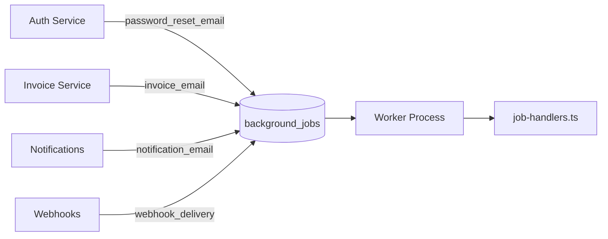
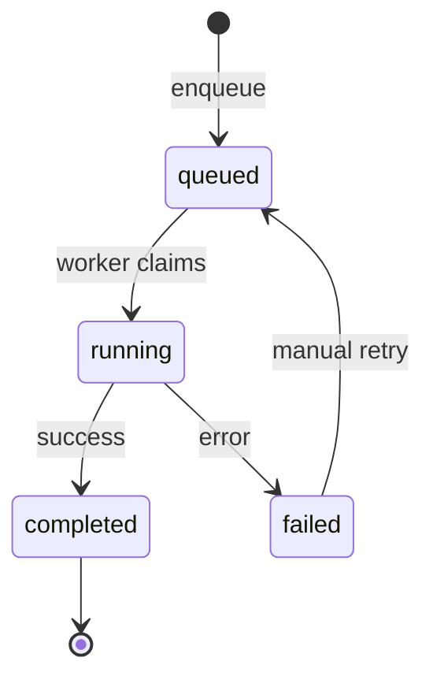

# Background Jobs Module

> **Module documentation** for Merchant Pro v1.0.0-rc1. Cross-references: [PFS](../Product_Functional_Specification.md) · [Business Rules](../Business_Rules.md) · [Functional Requirements](../Functional_Requirements.md) · [User Journeys](../User_Journeys.md) · [Feature Matrix](../Feature_Matrix.md)

## Table of Contents

1. [Purpose](#1-purpose) · 2. [Business Objective](#2-business-objective) · 3. [Scope](#3-scope) · 4. [Primary Users](#4-primary-users) · 5. [Key Capabilities](#5-key-capabilities) · 6. [Dependencies](#6-dependencies) · 7. [Architecture Overview](#7-architecture-overview) · 8. [Inputs](#8-inputs) · 9. [Outputs](#9-outputs) · 10. [Business Rules](#10-business-rules) · 11. [Permissions and RBAC](#11-permissions-and-rbac) · 12. [API Reference](#12-api-reference) · 13. [Frontend Routes](#13-frontend-routes) · 14. [Data Model](#14-data-model) · 15. [Workflows and State Machines](#15-workflows-and-state-machines) · 16. [Integration Points](#16-integration-points) · 17. [Security Considerations](#17-security-considerations) · 18. [Success Criteria](#18-success-criteria) · 19. [Error Scenarios](#19-error-scenarios) · 20. [Operational Considerations](#20-operational-considerations) · 21. [Related Functional Requirements](#21-related-functional-requirements) · 22. [Related User Journeys](#22-related-user-journeys) · 23. [Feature Matrix Reference](#23-feature-matrix-reference) · 24. [Limitations and Status](#24-limitations-and-status) · 25. [Future Enhancements](#25-future-enhancements)

---

## 1. Purpose

Asynchronous task queue for email delivery, webhook processing, and other deferred operations decoupled from HTTP request lifecycle.

## 2. Business Objective

Ensure reliable background processing of non-blocking operations with retry, audit, and operational visibility. Aligns with [PFS §7.22](../Product_Functional_Specification.md#722-background-jobs).

## 3. Scope

Job enqueue API, `background_jobs` table, four supported job types, job status lifecycle, and handler dispatch in `job-handlers.ts`. Worker polling covered in [Workers.md](./Workers.md).

## 4. Primary Users

| Persona | Usage |
|---------|-------|
| System | Enqueues jobs from services |
| Operations | Monitors job queue via Operations Center |
| Platform modules | Auth, Invoices, Notifications, Webhooks |

## 5. Key Capabilities

| Capability | Description |
|------------|-------------|
| Job enqueue | Insert into background_jobs |
| Four job types | See supported types below |
| Status tracking | queued → running → completed/failed |
| Payload storage | JSON job payload |
| Org context | organization_id on jobs |
| Unknown type handling | Failed + audited (BR-JOB-001) |

### Supported Job Types

| Job Type | Handler | Source Module |
|----------|---------|---------------|
| `invoice_email` | SMTP invoice delivery | Invoices |
| `password_reset_email` | Reset link email | Authentication |
| `notification_email` | Notification by delivery ID | Notifications |
| `webhook_delivery` | Delegates to webhook engine | Webhooks |

## 6. Dependencies

| Dependency | Purpose |
|------------|---------|
| Workers | Poll and process jobs |
| MySQL | background_jobs table |
| SMTP | Email job delivery |
| Webhook Engine | webhook_delivery processing |
| Audit | Unknown job type logging |

## 7. Architecture Overview

## 8. Inputs

| Input | Description |
|-------|-------------|
| jobType | One of four supported types |
| payload | JSON job-specific data |
| organizationId | Optional org context |

### Example Payloads

| Job Type | Payload Fields |
|----------|----------------|
| password_reset_email | recipient, resetUrl |
| invoice_email | invoiceId, recipient |
| notification_email | deliveryId |
| webhook_delivery | deliveryId or paymentDeliveryId |

## 9. Outputs

| Output | Description |
|--------|-------------|
| jobId | Enqueued job identifier |
| Status | queued, running, completed, failed |
| Error | Failure message if failed |

## 10. Business Rules

See [Business Rules — Webhooks & Workers](../Business_Rules.md#webhooks--workers):

| Rule | Summary |
|------|---------|
| BR-JOB-001 | Unknown job types marked failed and audited |
| BR-JOB-002 | Worker concurrency default 5 |
| BR-JOB-003 | Password reset auto-completed in test mode |

## 11. Permissions and RBAC

Jobs are system-internal. Operations visibility via `operations:read` on Operations Center jobs endpoint. No direct user-facing job enqueue API.

## 12. API Reference

Jobs enqueued internally via `backgroundJobService.enqueue()`. Operations monitoring:

| Method | Path | Permission |
|--------|------|------------|
| GET | `/api/v1/operations/jobs` | `operations:read` |
| POST | `/api/v1/operations/jobs/:id/retry` | `operations:manage` |

## 13. Frontend Routes

Job monitoring via `/operations` Operations Center (see [Operations_Center.md](./Operations_Center.md)).

## 14. Data Model

| Entity | Key Fields |
|--------|------------|
| `background_jobs` | id, job_type, payload, status, organization_id, started_at, completed_at, error |

## 15. Workflows and State Machines

## 16. Integration Points

| Module | Job Type |
|--------|----------|
| Authentication | password_reset_email |
| Invoices | invoice_email |
| Notifications | notification_email |
| Webhooks | webhook_delivery |
| Operations | Job monitoring and retry |

## 17. Security Considerations

- Payload may contain PII; masked in logs
- Jobs org-scoped where applicable
- Unknown types rejected and audited at high risk
- No user-triggered arbitrary job types

## 18. Success Criteria

| Criterion | Measure |
|-----------|---------|
| Delivery | Email/webhook jobs complete |
| Retry | Failed jobs retriable via ops |
| Audit | Unknown types logged |

## 19. Error Scenarios

| Scenario | Result |
|----------|--------|
| SMTP failure | Job failed; retry available |
| Unknown job type | Failed + audit (high risk) |
| Worker crash | Job remains running/queued |

## 20. Operational Considerations

- Monitor queue depth and age
- Alert on failed job rate spike
- Worker concurrency tuning (env, default 5)
- Dead job cleanup per retention policy

## 21. Related Functional Requirements

See [Functional Requirements](../Functional_Requirements.md) — FR-AUTH-006 (forgot password job), FR-INV-002 (invoice email).

## 22. Related User Journeys

See [User Journeys](../User_Journeys.md) — password reset and invoice email flows.

## 23. Feature Matrix Reference

See [Feature Matrix](../Feature_Matrix.md) — Background job visibility for operations roles.

## 24. Limitations and Status

| Limitation | Notes |
|------------|-------|
| Job types | Four types only in V1 |
| Priority queues | Single FIFO queue |
| **Status** | **Implemented** |

## 25. Future Enhancements

- Priority and delayed job scheduling
- Dead letter queue for background jobs
- Job type registry with plugin architecture
- Metrics dashboard for job throughput
