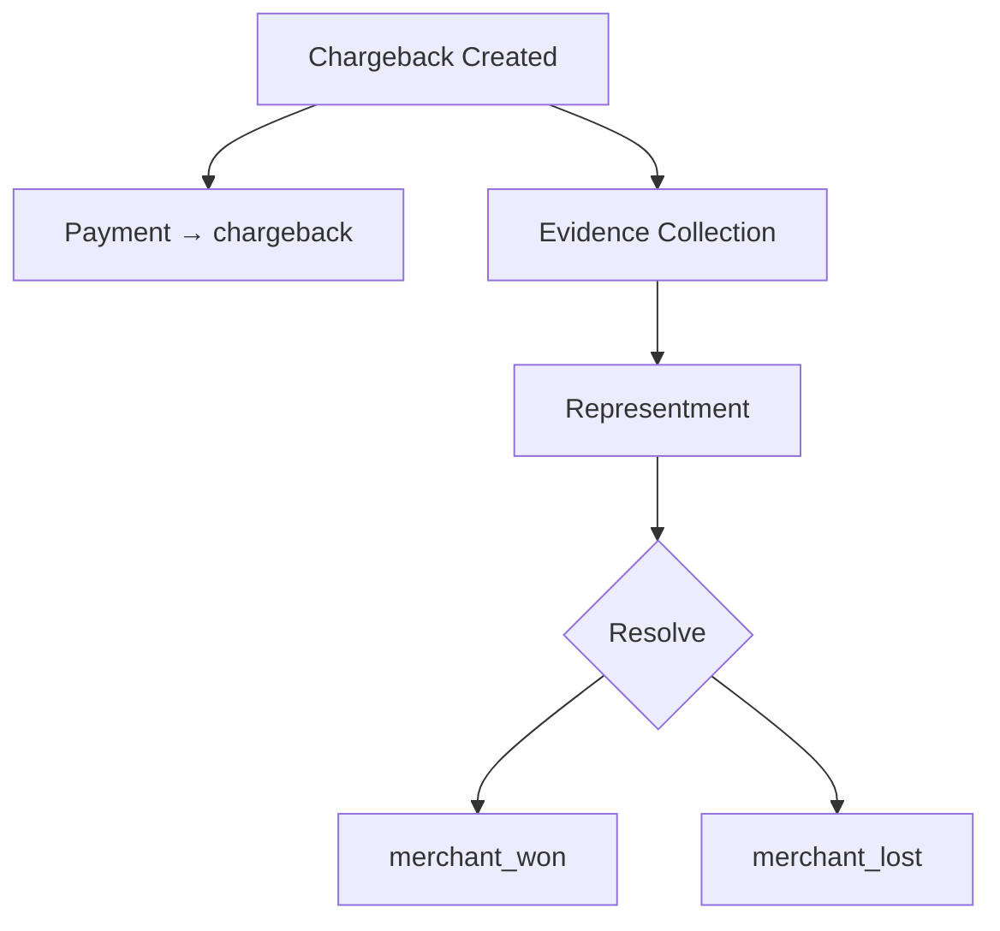
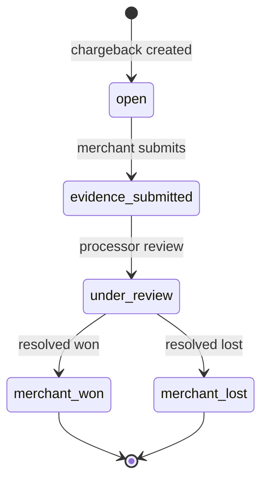

# Chargebacks Module

> **Module documentation** for Merchant Pro v1.0.0-rc1. Cross-references: [PFS](../Product_Functional_Specification.md) · [Business Rules](../Business_Rules.md) · [Functional Requirements](../Functional_Requirements.md) · [User Journeys](../User_Journeys.md) · [Feature Matrix](../Feature_Matrix.md)

## Table of Contents

1. [Purpose](#1-purpose) · 2. [Business Objective](#2-business-objective) · 3. [Scope](#3-scope) · 4. [Primary Users](#4-primary-users) · 5. [Key Capabilities](#5-key-capabilities) · 6. [Dependencies](#6-dependencies) · 7. [Architecture Overview](#7-architecture-overview) · 8. [Inputs](#8-inputs) · 9. [Outputs](#9-outputs) · 10. [Business Rules](#10-business-rules) · 11. [Permissions and RBAC](#11-permissions-and-rbac) · 12. [API Reference](#12-api-reference) · 13. [Frontend Routes](#13-frontend-routes) · 14. [Data Model](#14-data-model) · 15. [Workflows and State Machines](#15-workflows-and-state-machines) · 16. [Integration Points](#16-integration-points) · 17. [Security Considerations](#17-security-considerations) · 18. [Success Criteria](#18-success-criteria) · 19. [Error Scenarios](#19-error-scenarios) · 20. [Operational Considerations](#20-operational-considerations) · 21. [Related Functional Requirements](#21-related-functional-requirements) · 22. [Related User Journeys](#22-related-user-journeys) · 23. [Feature Matrix Reference](#23-feature-matrix-reference) · 24. [Limitations and Status](#24-limitations-and-status) · 25. [Future Enhancements](#25-future-enhancements)

---

## 1. Purpose

Manage payment disputes (chargebacks) including creation, evidence submission, representment tracking, and resolution outcomes.

## 2. Business Objective

Provide structured dispute management linking chargebacks to captured/settled payments with merchant won/lost resolution. Aligns with [PFS §7.11](../Product_Functional_Specification.md#711-chargebacks).

## 3. Scope

Chargeback CRUD, evidence upload, status tracking, and resolve workflow. Payment intent transitions to `chargeback` terminal state.

## 4. Primary Users

| Persona | Usage |
|---------|-------|
| Finance User | Create and manage chargebacks |
| Finance Manager | Resolve disputes |
| Compliance | Review evidence and outcomes |

## 5. Key Capabilities

| Capability | Description |
|------------|-------------|
| Create chargeback | Link to captured/settled payment |
| Evidence upload | Supporting documentation |
| Representment | Track merchant response |
| Resolve | merchant_won or merchant_lost |
| Listing | Filter by status, merchant, date |

## 6. Dependencies

| Dependency | Purpose |
|------------|---------|
| Payments | Source payment in captured/settled |
| Payment Lifecycle | chargeback terminal state |
| Merchants | Merchant scoping |
| Audit | Dispute actions logged |

## 7. Architecture Overview

## 8. Inputs

| Input | Description |
|-------|-------------|
| paymentId | Captured/settled payment |
| reason | Dispute reason code |
| amount | Disputed amount |
| evidence | Documents, notes |
| resolution | merchant_won / merchant_lost |

## 9. Outputs

| Output | Description |
|--------|-------------|
| Chargeback record | id, status, payment_id, outcome |
| Payment update | status → chargeback |
| Audit trail | Evidence and resolution history |

## 10. Business Rules

**BR-CB-001**: Chargeback links to captured/settled payment.
**BR-CB-002**: Resolve maps to merchant_won or merchant_lost.

## 11. Permissions and RBAC

| Permission | Action |
|------------|--------|
| `chargebacks:read` | List and view chargebacks |
| `chargebacks:write` | Create, add evidence |
| `chargebacks:resolve` | Resolve dispute outcome |

## 12. API Reference

Base path: `/api/v1/chargebacks` — authenticated, org-scoped.

| Method | Path | Permission |
|--------|------|------------|
| GET | `/api/v1/chargebacks` | `chargebacks:read` |
| POST | `/api/v1/chargebacks` | `chargebacks:write` |
| GET | `/api/v1/chargebacks/:id` | `chargebacks:read` |
| PUT | `/api/v1/chargebacks/:id` | `chargebacks:write` |
| POST | `/api/v1/chargebacks/:id/resolve` | `chargebacks:resolve` |

## 13. Frontend Routes

| Route | Permission |
|-------|------------|
| `/chargebacks` | `chargebacks:read` |

## 14. Data Model

| Entity | Key Fields |
|--------|------------|
| `chargebacks` | id, payment_id, amount, status, reason, outcome |
| `chargeback_evidence` | chargeback_id, document_path, notes |

## 15. Workflows and State Machines

Payment intent terminal state: `chargeback`.

## 16. Integration Points

| Module | Integration |
|--------|-------------|
| Payments | Status → chargeback |
| Settlements | Chargeback adjustments |
| Fraud | Risk signal on high chargeback rate |
| Reports | Chargeback ratio analytics |

## 17. Security Considerations

- Only captured/settled payments eligible
- Evidence documents org-scoped storage
- Resolve requires elevated permission
- Immutable audit on resolution

## 18. Success Criteria

| Criterion | Measure |
|-----------|---------|
| Valid linkage | Payment in correct state |
| Resolution | Outcome recorded with timestamp |
| Evidence trail | Complete documentation history |

## 19. Error Scenarios

| Scenario | HTTP |
|----------|------|
| Payment not captured | 400 |
| Duplicate chargeback | 409 |
| Resolve without permission | 403 |
| Invalid outcome | 400 |

## 20. Operational Considerations

- Monitor chargeback ratio per merchant
- SLA tracking for evidence submission deadlines
- Alert on chargeback rate thresholds

## 21. Related Functional Requirements

FR-CB-001, FR-CB-002 in [Functional Requirements](../Functional_Requirements.md#refunds--chargebacks-fr-ref).

## 22. Related User Journeys

See [User Journeys](../User_Journeys.md) — chargeback dispute handling.

## 23. Feature Matrix Reference

See [Feature Matrix](../Feature_Matrix.md) — Chargebacks by role.

## 24. Limitations and Status

| Limitation | Notes |
|------------|-------|
| Gateway integration | Manual chargeback entry in V1 |
| **Status** | **Implemented** |

## 25. Future Enhancements

- Automated chargeback ingestion from acquirer
- AI-assisted evidence package generation
- Chargeback prevention alerts pre-dispute
- Network reason code auto-mapping
