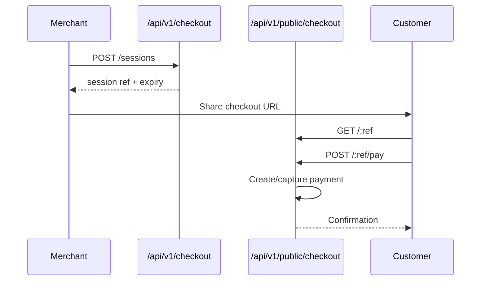
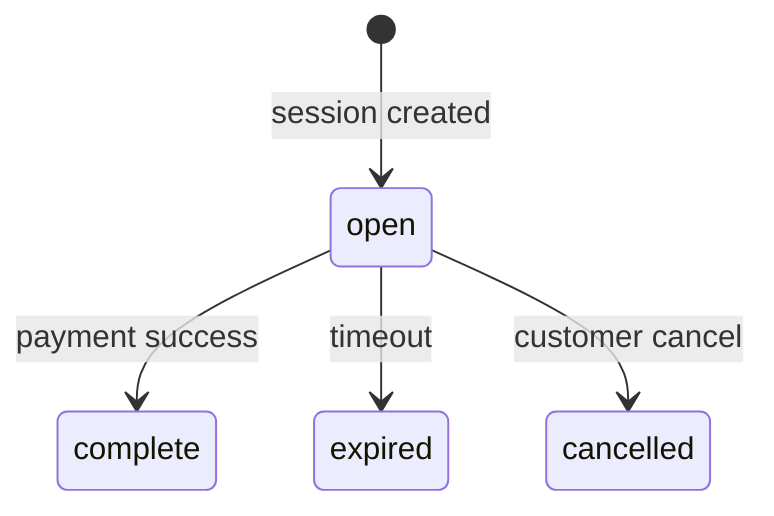

# Checkout Module

> **Module documentation** for Merchant Pro v1.0.0-rc1. Cross-references: [PFS](../Product_Functional_Specification.md) · [Business Rules](../Business_Rules.md) · [Functional Requirements](../Functional_Requirements.md) · [User Journeys](../User_Journeys.md) · [Feature Matrix](../Feature_Matrix.md)

## Table of Contents

1. [Purpose](#1-purpose) · 2. [Business Objective](#2-business-objective) · 3. [Scope](#3-scope) · 4. [Primary Users](#4-primary-users) · 5. [Key Capabilities](#5-key-capabilities) · 6. [Dependencies](#6-dependencies) · 7. [Architecture Overview](#7-architecture-overview) · 8. [Inputs](#8-inputs) · 9. [Outputs](#9-outputs) · 10. [Business Rules](#10-business-rules) · 11. [Permissions and RBAC](#11-permissions-and-rbac) · 12. [API Reference](#12-api-reference) · 13. [Frontend Routes](#13-frontend-routes) · 14. [Data Model](#14-data-model) · 15. [Workflows and State Machines](#15-workflows-and-state-machines) · 16. [Integration Points](#16-integration-points) · 17. [Security Considerations](#17-security-considerations) · 18. [Success Criteria](#18-success-criteria) · 19. [Error Scenarios](#19-error-scenarios) · 20. [Operational Considerations](#20-operational-considerations) · 21. [Related Functional Requirements](#21-related-functional-requirements) · 22. [Related User Journeys](#22-related-user-journeys) · 23. [Feature Matrix Reference](#23-feature-matrix-reference) · 24. [Limitations and Status](#24-limitations-and-status) · 25. [Future Enhancements](#25-future-enhancements)

---

## 1. Purpose

Hosted checkout sessions enabling merchants to create conversion-optimized payment pages for end customers, with branding, analytics, and public payment endpoints.

## 2. Business Objective

Maximize payment conversion through branded, secure hosted checkout with session expiry and recovery. Aligns with [PFS §7.7](../Product_Functional_Specification.md#77-checkout).

## 3. Scope

Authenticated checkout session management, merchant branding, analytics, and public checkout pay/retry/cancel/recover flows. Payment processing delegated to Payments module.

## 4. Primary Users

| Persona | Usage |
|---------|-------|
| Merchant Admin | Create sessions, configure branding |
| Finance / Analytics | Review checkout analytics |
| End Customer | Pay on public checkout page |

## 5. Key Capabilities

| Capability | Description |
|------------|-------------|
| Session create | Amount, merchant, expiry, return URL |
| Public pay | Unauthenticated customer payment |
| Branding | Merchant checkout theme customization |
| Analytics | Conversion and abandonment metrics |
| Recovery | Token-based session recovery |
| Retry / Cancel | Customer retry and cancel actions |
| Themes | Pre-built checkout theme listing |

## 6. Dependencies

| Dependency | Purpose |
|------------|---------|
| Payments | Payment intent on pay |
| Merchants | Merchant validation and branding |
| Webhooks | payment.captured on success |
| Authorization | checkout:* permissions |

## 7. Architecture Overview

## 8. Inputs

| Input | Source |
|-------|--------|
| amount, currency, merchantId | Session create |
| expiry, returnUrl | Session config |
| payment method details | Public pay body |
| branding config | Merchant branding PUT |

## 9. Outputs

| Output | Description |
|--------|-------------|
| Session ref | Public URL identifier |
| Public URL | `/pay/checkout/:ref` |
| Payment result | Success/failure on pay |
| Analytics metrics | Sessions, conversion rate |

## 10. Business Rules

**BR-PUB-001**: Public checkout accessible without authentication.
**BR-PAY-009**: Expired checkout/session rejects payment.
**BR-PUB-003**: Expired sessions reject payment.

## 11. Permissions and RBAC

| Permission | Action |
|------------|--------|
| `checkout:read` | List/view sessions, themes |
| `checkout:write` | Create sessions |
| `checkout:manage` | Advanced session management |
| `checkout:analytics` | Analytics dashboard |
| `checkout:branding` | Merchant branding CRUD |

Public routes require no authentication; rate limited.

## 12. API Reference

### Authenticated — `/api/v1/checkout`

| Method | Path | Permission |
|--------|------|------------|
| GET | `/themes` | `checkout:read` |
| GET | `/analytics` | `checkout:analytics` |
| GET | `/sessions` | `checkout:read` |
| POST | `/sessions` | `checkout:write` |
| GET | `/sessions/:id` | `checkout:read` |
| GET/PUT | `/branding/:merchantId` | `checkout:branding` |

### Public — `/api/v1/public/checkout`

| Method | Path | Rate Limit |
|--------|------|------------|
| GET | `/recover/:token` | 10/15min |
| GET | `/:ref` | 60/15min |
| POST | `/:ref/pay` | 20/15min |
| POST | `/:ref/retry` | 20/15min |
| POST | `/:ref/cancel` | 30/15min |

## 13. Frontend Routes

| Route | Permission |
|-------|------------|
| `/checkout/sessions` | `checkout:read` |
| `/checkout/analytics` | `checkout:analytics` |
| `/pay/checkout/:ref` | Public (customer) |

## 14. Data Model

| Entity | Key Fields |
|--------|------------|
| `checkout_sessions` | id, ref, merchant_id, amount, status, expires_at |
| `checkout_branding` | merchant_id, logo, colors, theme |
| `checkout_analytics` | Aggregated conversion metrics |

## 15. Workflows and State Machines

Session status follows `PaymentSessionStatus`: `open`, `complete`, `expired`, `cancelled`.

## 16. Integration Points

| Module | Integration |
|--------|-------------|
| Payments | Intent create/capture on pay |
| Webhooks | payment.captured event |
| Merchant Management | Branding per merchant |
| Sandbox | Test checkout flows |

## 17. Security Considerations

- Public endpoints rate limited
- Amount tampering rejected on pay
- Session ref is unguessable token
- CSRF not required on public API (no cookie auth)
- Expiry enforced server-side

## 18. Success Criteria

| Criterion | Measure |
|-----------|---------|
| Conversion | Customer completes pay before expiry |
| Branding | Merchant theme applied on public page |
| Analytics | Accurate session funnel metrics |

## 19. Error Scenarios

| Scenario | HTTP |
|----------|------|
| Expired session | 4xx |
| Invalid ref | 404 |
| Rate limited | 429 |
| Amount mismatch | 400 |

## 20. Operational Considerations

- Monitor checkout abandonment rate
- Review rate limit hits for abuse
- Checkout analytics for UX optimization

## 21. Related Functional Requirements

FR-CHK-001 through FR-CHK-003 in [Functional Requirements](../Functional_Requirements.md#checkout--public-pay-fr-chk).

## 22. Related User Journeys

See [User Journeys](../User_Journeys.md) — hosted checkout customer payment flow.

## 23. Feature Matrix Reference

See [Feature Matrix](../Feature_Matrix.md) — Checkout by role.

## 24. Limitations and Status

| Limitation | Notes |
|------------|-------|
| Embedded iframe | Hosted page only in V1 |
| **Status** | **Implemented** |

## 25. Future Enhancements

- Embeddable checkout widget (JS SDK)
- A/B testing for checkout themes
- Multi-language checkout pages
- Apple Pay / Google Pay express checkout
