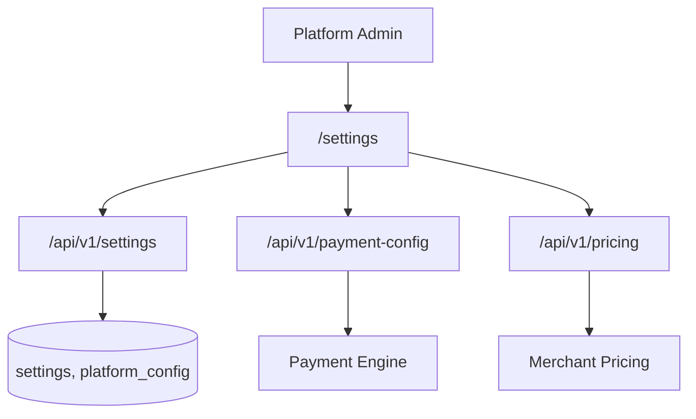
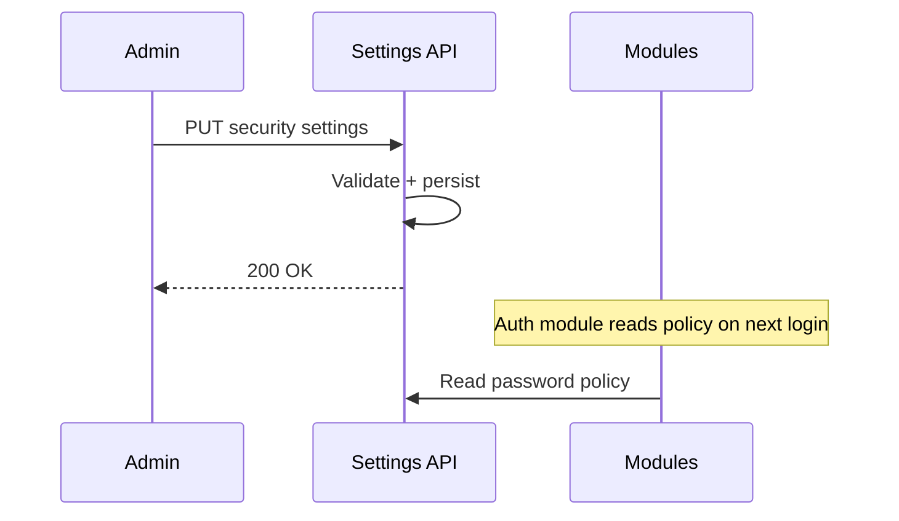

# Configuration Module

> **Module documentation** for Merchant Pro v1.0.0-rc1. Cross-references: [PFS](../Product_Functional_Specification.md) · [Business Rules](../Business_Rules.md) · [Functional Requirements](../Functional_Requirements.md) · [User Journeys](../User_Journeys.md) · [Feature Matrix](../Feature_Matrix.md)

## Table of Contents

1. [Purpose](#1-purpose) · 2. [Business Objective](#2-business-objective) · 3. [Scope](#3-scope) · 4. [Primary Users](#4-primary-users) · 5. [Key Capabilities](#5-key-capabilities) · 6. [Dependencies](#6-dependencies) · 7. [Architecture Overview](#7-architecture-overview) · 8. [Inputs](#8-inputs) · 9. [Outputs](#9-outputs) · 10. [Business Rules](#10-business-rules) · 11. [Permissions and RBAC](#11-permissions-and-rbac) · 12. [API Reference](#12-api-reference) · 13. [Frontend Routes](#13-frontend-routes) · 14. [Data Model](#14-data-model) · 15. [Workflows and State Machines](#15-workflows-and-state-machines) · 16. [Integration Points](#16-integration-points) · 17. [Security Considerations](#17-security-considerations) · 18. [Success Criteria](#18-success-criteria) · 19. [Error Scenarios](#19-error-scenarios) · 20. [Operational Considerations](#20-operational-considerations) · 21. [Related Functional Requirements](#21-related-functional-requirements) · 22. [Related User Journeys](#22-related-user-journeys) · 23. [Feature Matrix Reference](#23-feature-matrix-reference) · 24. [Limitations and Status](#24-limitations-and-status) · 25. [Future Enhancements](#25-future-enhancements)

---

## 1. Purpose

Centralized platform and payment configuration including branding, security policies, SMTP, password policy, payment config, pricing, and platform settings.

## 2. Business Objective

Provide administrators a single control plane for platform behavior without code changes. Aligns with [PFS §7.21](../Product_Functional_Specification.md#721-configuration-settings--payment-config).

## 3. Scope

Settings API (`/api/v1/settings`), payment config (`/api/v1/payment-config`), pricing (`/api/v1/pricing`), platform config, security settings, SMTP, and feature flags (see [Feature_Flags.md](./Feature_Flags.md)).

## 4. Primary Users

| Persona | Usage |
|---------|-------|
| Platform Administrator | Platform-wide settings |
| Finance Manager | Pricing configuration |
| Operations User | Payment config tuning |

## 5. Key Capabilities

| Capability | API Path |
|------------|----------|
| Organization settings | `/api/v1/settings` |
| Security settings | Password policy, session config |
| SMTP configuration | Encrypted secret storage |
| Feature flags | `/settings/feature-flags` |
| Payment config | `/api/v1/payment-config` |
| Pricing rules | `/api/v1/pricing` |
| Platform config | `platform_config:read/write` |
| Branding | Org and checkout branding |

## 6. Dependencies

| Dependency | Purpose |
|------------|---------|
| Authorization | settings:*, payment_config:*, pricing:* |
| Background Jobs | SMTP for email jobs |
| Authentication | Password policy enforcement |
| Payments | Payment config application |
| Feature Flags | Flag storage submodule |

## 7. Architecture Overview

## 8. Inputs

| Input | Module |
|-------|--------|
| passwordPolicy | Min length, complexity rules |
| smtpConfig | Host, port, credentials (encrypted) |
| sessionConfig | Timeout, max sessions |
| paymentMethods | Enabled methods per merchant |
| pricingTiers | Fee structures |

## 9. Outputs

| Output | Description |
|--------|-------------|
| Settings record | Persisted configuration |
| Enforced policy | Runtime validation |
| Public config | Non-sensitive settings |

## 10. Business Rules

Configuration changes apply immediately. SMTP secrets encrypted at rest. Password policy enforced via Zod schemas (BR-AUTH-001).

## 11. Permissions and RBAC

| Permission | Scope |
|------------|-------|
| `settings:read` / `settings:write` | Platform settings |
| `payment_config:read` / `payment_config:write` | Payment configuration |
| `pricing:read` / `pricing:write` | Pricing rules |
| `platform_config:read` / `platform_config:write` | Platform-wide config |

## 12. API Reference

| Base Path | Description |
|-----------|-------------|
| `/api/v1/settings` | General settings, security, SMTP, feature flags |
| `/api/v1/payment-config` | Payment method and gateway config |
| `/api/v1/pricing` | Fee and pricing tier management |

## 13. Frontend Routes

| Route | Permission |
|-------|------------|
| `/settings` | `settings:read` |
| `/settings/system-status` | `system:view` |

## 14. Data Model

| Entity | Key Fields |
|--------|------------|
| `platform_settings` | key, value, encrypted |
| `payment_config` | merchant_id, methods, gateway |
| `pricing_rules` | merchant_id, fee_type, rate |
| `smtp_config` | host, encrypted_credentials |

## 15. Workflows and State Machines

## 16. Integration Points

| Module | Integration |
|--------|-------------|
| Authentication | Password policy, session config |
| Notifications | SMTP delivery |
| Payments | Payment config, pricing |
| Feature Flags | Flag management |
| System Health | System status display |

## 17. Security Considerations

- Secrets encrypted at rest (resolveSecret/crypto)
- settings:write restricted to admins
- SMTP credentials never returned in GET
- Audit on configuration changes

## 18. Success Criteria

| Criterion | Measure |
|-----------|---------|
| Policy enforcement | Invalid passwords rejected |
| SMTP | Email jobs deliver successfully |
| Payment config | Methods reflect configuration |

## 19. Error Scenarios

| Scenario | HTTP |
|----------|------|
| Invalid policy values | 400 |
| Missing write permission | 403 |
| SMTP test failure | 502 with detail |

## 20. Operational Considerations

- Backup SMTP configuration documented
- Change management for payment config
- Validate SMTP after credential rotation
- Review pricing changes impact on settlements

## 21. Related Functional Requirements

FR-SET-001 through FR-SET-004 in [Functional Requirements](../Functional_Requirements.md#settings--system-fr-sys).

## 22. Related User Journeys

See [User Journeys](../User_Journeys.md) — platform configuration setup.

## 23. Feature Matrix Reference

See [Feature Matrix](../Feature_Matrix.md) — Settings and Configuration by role.

## 24. Limitations and Status

| Limitation | Notes |
|------------|-------|
| Config versioning | No rollback history in V1 |
| **Status** | **Implemented** |

## 25. Future Enhancements

- Configuration change history and rollback
- Environment-specific config profiles
- Config validation dry-run mode
- Terraform/export for infrastructure config
