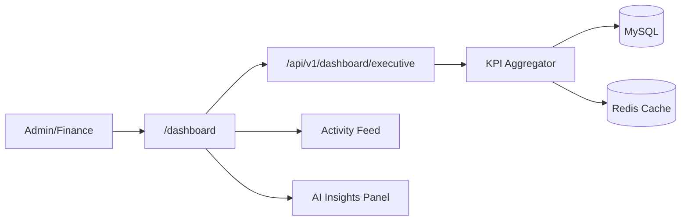
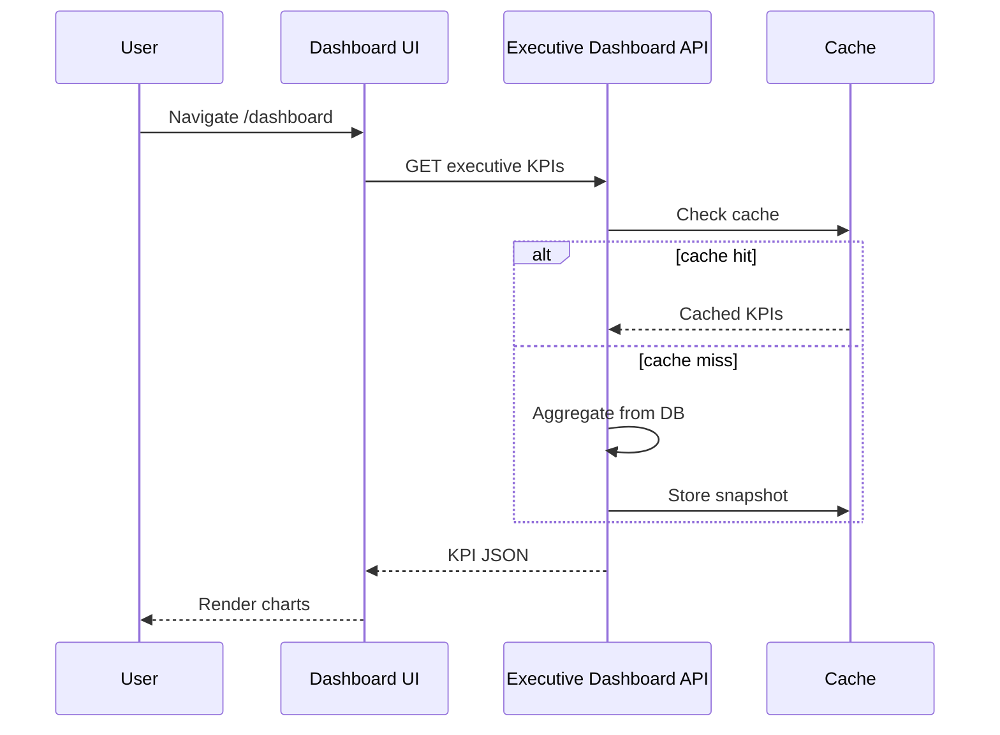

# Dashboard Module

> **Module documentation** for Merchant Pro v1.0.0-rc1. Cross-references: [PFS](../Product_Functional_Specification.md) · [Business Rules](../Business_Rules.md) · [Functional Requirements](../Functional_Requirements.md) · [User Journeys](../User_Journeys.md) · [Feature Matrix](../Feature_Matrix.md)

## Table of Contents

1. [Purpose](#1-purpose) · 2. [Business Objective](#2-business-objective) · 3. [Scope](#3-scope) · 4. [Primary Users](#4-primary-users) · 5. [Key Capabilities](#5-key-capabilities) · 6. [Dependencies](#6-dependencies) · 7. [Architecture Overview](#7-architecture-overview) · 8. [Inputs](#8-inputs) · 9. [Outputs](#9-outputs) · 10. [Business Rules](#10-business-rules) · 11. [Permissions and RBAC](#11-permissions-and-rbac) · 12. [API Reference](#12-api-reference) · 13. [Frontend Routes](#13-frontend-routes) · 14. [Data Model](#14-data-model) · 15. [Workflows and State Machines](#15-workflows-and-state-machines) · 16. [Integration Points](#16-integration-points) · 17. [Security Considerations](#17-security-considerations) · 18. [Success Criteria](#18-success-criteria) · 19. [Error Scenarios](#19-error-scenarios) · 20. [Operational Considerations](#20-operational-considerations) · 21. [Related Functional Requirements](#21-related-functional-requirements) · 22. [Related User Journeys](#22-related-user-journeys) · 23. [Feature Matrix Reference](#23-feature-matrix-reference) · 24. [Limitations and Status](#24-limitations-and-status) · 25. [Future Enhancements](#25-future-enhancements)

---

## 1. Purpose

Executive KPI dashboard providing at-a-glance platform metrics, charts, recent activity, AI insights panel, and export capabilities for leadership and operations.

## 2. Business Objective

Enable data-driven decision making with real-time business KPIs. Aligns with [PFS §7.25](../Product_Functional_Specification.md#725-dashboard).

## 3. Scope

Executive dashboard API and UI, KPI widgets, trend charts, activity feed snippet, AI panel integration, and dashboard export. Domain analytics covered in [Reports.md](./Reports.md).

## 4. Primary Users

| Persona | Usage |
|---------|-------|
| Platform Administrator | Executive overview |
| Finance Manager | Revenue and transaction KPIs |
| Operations User | Operational health metrics |

## 5. Key Capabilities

| Capability | Description |
|------------|-------------|
| Executive KPIs | Revenue, transactions, merchants, success rate |
| Trend charts | Time-series visualizations |
| Activity feed | Recent platform events |
| AI panel | AI insights (ai:view permission) |
| Export | dashboard:export for KPI data |
| Cached aggregates | Redis TTL 60–300s for performance |

## 6. Dependencies

| Dependency | Purpose |
|------------|---------|
| Payments | Transaction volume metrics |
| Merchants | Merchant count KPIs |
| Settlements | Financial aggregates |
| Activity | Recent activity feed |
| AI module | Insights panel |
| Authorization | dashboard:read, dashboard:export |

## 7. Architecture Overview

## 8. Inputs

| Input | Description |
|-------|-------------|
| dateRange | KPI time window |
| organizationId | From JWT org context |
| exportFormat | CSV for export |

## 9. Outputs

| Output | Description |
|--------|-------------|
| KPI JSON | Metrics and comparisons |
| Chart data | Time-series arrays |
| Export file | Downloadable KPI report |
| Activity items | Recent events subset |

## 10. Business Rules

Dashboard data org-scoped when organization context present. Cached snapshots safe for 60–300 second TTL.

## 11. Permissions and RBAC

| Permission | Action |
|------------|--------|
| `dashboard:read` | View executive dashboard |
| `dashboard:export` | Export KPI data |
| `ai:view` | AI insights panel |
| `activity_center:read` | Activity feed widget |

## 12. API Reference

Base path: `/api/v1/dashboard/executive`

| Operation | Permission |
|-----------|------------|
| GET KPIs | dashboard:read |
| GET charts | dashboard:read |
| Export | dashboard:export |

Mounted in `app.ts` at `/api/v1/dashboard/executive`.

## 13. Frontend Routes

| Route | Permission |
|-------|------------|
| `/dashboard` | `dashboard:read` |

Default landing page after login. Nav config uses `DASHBOARD_ROUTES.EXECUTIVE`.

## 14. Data Model

Dashboard reads aggregated data; no dedicated table. Sources:

| Source | Metrics |
|--------|---------|
| payment_intents | Volume, success rate |
| merchants | Active count |
| settlements | Settlement totals |
| audit_logs | Recent activity |

## 15. Workflows and State Machines

## 16. Integration Points

| Module | Integration |
|--------|-------------|
| Reports | Detailed analytics drill-down |
| Activity Center | Activity feed widget |
| AI | Insights panel |
| Operations | Link to ops dashboard |
| Search Center | Quick navigation |

## 17. Security Considerations

- Org-scoped KPI data
- Export requires dashboard:export
- No PII in aggregate KPIs
- Cache invalidation on org switch

## 18. Success Criteria

| Criterion | Measure |
|-----------|---------|
| Load time | Dashboard renders under 2s |
| Accuracy | KPIs match source data |
| Permission | Unauthorized widgets hidden |

## 19. Error Scenarios

| Scenario | HTTP |
|----------|------|
| Missing dashboard:read | 403 |
| Cache unavailable | Fallback to DB query |
| Export too large | Async export |

## 20. Operational Considerations

- Monitor cache hit rate
- Refresh aggregates after bulk data imports
- Dashboard load testing for peak usage
- KPI definition documentation for stakeholders

## 21. Related Functional Requirements

FR-RPT-004 in [Functional Requirements](../Functional_Requirements.md#reports--analytics-fr-rpt).

## 22. Related User Journeys

See [User Journeys](../User_Journeys.md) — daily operations review from dashboard.

## 23. Feature Matrix Reference

See [Feature Matrix](../Feature_Matrix.md) — Dashboard by role.

## 24. Limitations and Status

| Limitation | Notes |
|------------|-------|
| Custom widgets | Fixed KPI set in V1 |
| **Status** | **Implemented** |

## 25. Future Enhancements

- Customizable dashboard layouts
- Role-specific dashboard variants
- Real-time KPI streaming
- Benchmark comparisons across orgs
