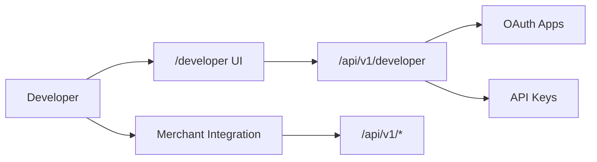
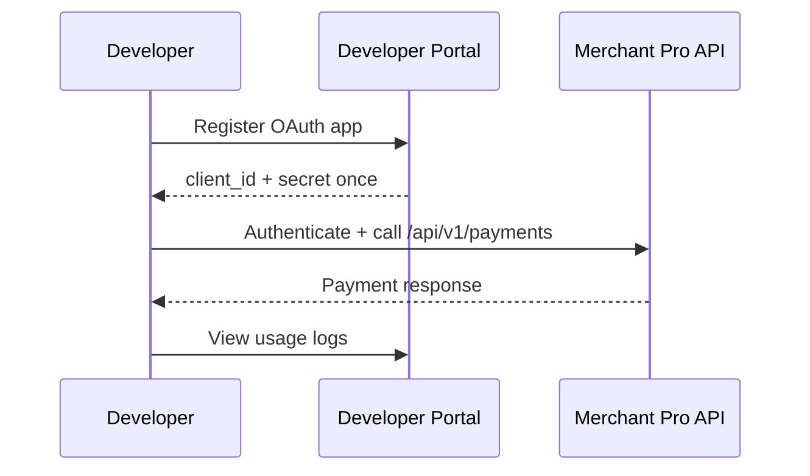

# Developer Portal Module

> **Module documentation** for Merchant Pro v1.0.0-rc1. Cross-references: [PFS](../Product_Functional_Specification.md) · [Business Rules](../Business_Rules.md) · [Functional Requirements](../Functional_Requirements.md) · [User Journeys](../User_Journeys.md) · [Feature Matrix](../Feature_Matrix.md)

## Table of Contents

1. [Purpose](#1-purpose) · 2. [Business Objective](#2-business-objective) · 3. [Scope](#3-scope) · 4. [Primary Users](#4-primary-users) · 5. [Key Capabilities](#5-key-capabilities) · 6. [Dependencies](#6-dependencies) · 7. [Architecture Overview](#7-architecture-overview) · 8. [Inputs](#8-inputs) · 9. [Outputs](#9-outputs) · 10. [Business Rules](#10-business-rules) · 11. [Permissions and RBAC](#11-permissions-and-rbac) · 12. [API Reference](#12-api-reference) · 13. [Frontend Routes](#13-frontend-routes) · 14. [Data Model](#14-data-model) · 15. [Workflows and State Machines](#15-workflows-and-state-machines) · 16. [Integration Points](#16-integration-points) · 17. [Security Considerations](#17-security-considerations) · 18. [Success Criteria](#18-success-criteria) · 19. [Error Scenarios](#19-error-scenarios) · 20. [Operational Considerations](#20-operational-considerations) · 21. [Related Functional Requirements](#21-related-functional-requirements) · 22. [Related User Journeys](#22-related-user-journeys) · 23. [Feature Matrix Reference](#23-feature-matrix-reference) · 24. [Limitations and Status](#24-limitations-and-status) · 25. [Future Enhancements](#25-future-enhancements)

---

## 1. Purpose

Developer self-service portal for API integration including developer profiles, OAuth applications, API key management, and usage logging.

## 2. Business Objective

Enable developers to integrate with Merchant Pro APIs securely without platform admin intervention. Aligns with [PFS §7.14](../Product_Functional_Specification.md#714-developer-portal).

## 3. Scope

Developer profile CRUD, OAuth app registration, API key listing (masked), usage logs, and integration documentation links. Org API keys also managed via Organization module.

## 4. Primary Users

| Persona | Usage |
|---------|-------|
| Developer | Register apps, manage keys |
| API Consumer | Integrate payment APIs |
| Platform Administrator | Oversee developer access |

## 5. Key Capabilities

| Capability | Description |
|------------|-------------|
| Developer profile | Org-scoped developer identity |
| OAuth apps | Client ID/secret (shown once) |
| API keys | List masked keys; create/revoke |
| Usage logs | API call history and metrics |
| Sandbox link | Test environment access |

## 6. Dependencies

| Dependency | Purpose |
|------------|---------|
| Authorization | developer:* permissions |
| Organization | Org-scoped credentials |
| Sandbox | Test environment |
| Webhooks | Event subscription setup |
| Swagger | API documentation at `/api-docs` |

## 7. Architecture Overview

## 8. Inputs

| Input | Description |
|-------|-------------|
| appName, redirectUris | OAuth app registration |
| keyName | API key label |
| scopes | Requested API scopes |

## 9. Outputs

| Output | Description |
|--------|-------------|
| OAuth client | client_id, client_secret (once) |
| API key | key prefix + secret (once) |
| Usage stats | Request counts, errors |

## 10. Business Rules

API key enforcement partial in V1 (see Authorization limitations). Secrets shown once on creation.

## 11. Permissions and RBAC

| Permission | Action |
|------------|--------|
| `developer:read` | View profile, keys, logs |
| `developer:write` | Create apps and keys |
| `developer:manage` | Revoke, delete |

## 12. API Reference

Base path: `/api/v1/developer` — authenticated, org-scoped.

| Method | Path | Permission | Description |
|--------|------|------------|-------------|
| GET | `/api/v1/developer/profile` | `developer:read` | Get developer profile |
| POST | `/api/v1/developer/profile` | `developer:write` | Create/update profile |
| GET | `/api/v1/developer/oauth-apps` | `developer:read` | List OAuth applications |
| POST | `/api/v1/developer/oauth-apps` | `developer:write` | Register OAuth app |
| GET | `/api/v1/developer/api-keys` | `developer:read` | List API keys (masked) |
| POST | `/api/v1/developer/api-keys` | `developer:write` | Create API key |
| DELETE | `/api/v1/developer/api-keys/:id` | `developer:manage` | Revoke API key |
| GET | `/api/v1/developer/usage-logs` | `developer:read` | API usage history |

## 13. Frontend Routes

| Route | Permission |
|-------|------------|
| `/developer` | `developer:read` |

## 14. Data Model

| Entity | Key Fields |
|--------|------------|
| `developer_profiles` | id, organization_id, name |
| `oauth_apps` | client_id, client_secret_hash, redirect_uris |
| `api_keys` | key_hash, prefix, name, scopes |

## 15. Workflows and State Machines

## 16. Integration Points

| Module | Integration |
|--------|-------------|
| Webhooks | Endpoint configuration |
| Sandbox | Test credentials |
| Payments | Primary integration target |
| Audit | Key creation/revocation logged |

## 17. Security Considerations

- Client secrets and API keys shown once; stored hashed
- Key revocation immediate
- OAuth redirect URI validation
- Rate limiting on API endpoints (300 req/min)

## 18. Success Criteria

| Criterion | Measure |
|-----------|---------|
| Integration | Developer completes test payment |
| Key security | Secrets never re-displayed |
| Usage visibility | Accurate API call logs |

## 19. Error Scenarios

| Scenario | HTTP |
|----------|------|
| Invalid redirect URI | 400 |
| Revoked key | 401 |
| Insufficient scope | 403 |

## 20. Operational Considerations

- Monitor API usage per org
- Review orphaned OAuth apps
- Key rotation reminders

## 21. Related Functional Requirements

FR-DEV-001 through FR-DEV-003 in [Functional Requirements](../Functional_Requirements.md#developer--webhooks-fr-dev).

## 22. Related User Journeys

See [User Journeys](../User_Journeys.md) — developer onboarding and API integration.

## 23. Feature Matrix Reference

See [Feature Matrix](../Feature_Matrix.md) — Developer Portal by role.

## 24. Limitations and Status

| Limitation | Notes |
|------------|-------|
| API key RBAC | Partial enforcement V1 |
| **Status** | **Implemented** |

## 25. Future Enhancements

- Interactive API explorer in portal
- Webhook testing sandbox tool
- SDK auto-generation (Node, Python, Java)
- API versioning and deprecation notices
