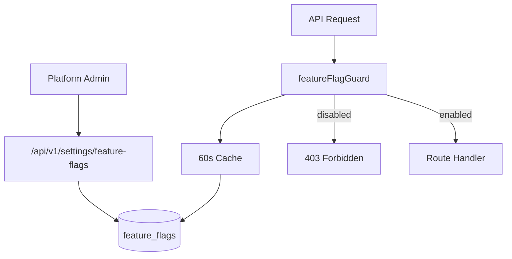
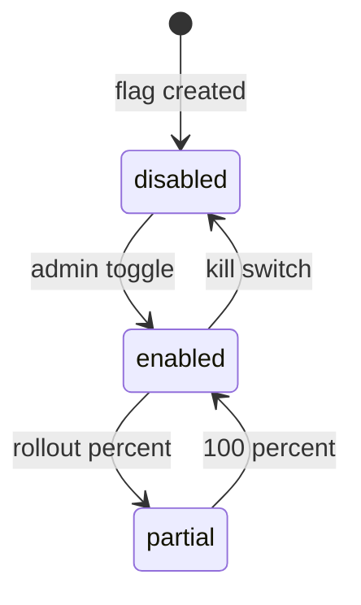

# Feature Flags Module

> **Module documentation** for Merchant Pro v1.0.0-rc1. Cross-references: [PFS](../Product_Functional_Specification.md) · [Business Rules](../Business_Rules.md) · [Functional Requirements](../Functional_Requirements.md) · [User Journeys](../User_Journeys.md) · [Feature Matrix](../Feature_Matrix.md)

## Table of Contents

1. [Purpose](#1-purpose) · 2. [Business Objective](#2-business-objective) · 3. [Scope](#3-scope) · 4. [Primary Users](#4-primary-users) · 5. [Key Capabilities](#5-key-capabilities) · 6. [Dependencies](#6-dependencies) · 7. [Architecture Overview](#7-architecture-overview) · 8. [Inputs](#8-inputs) · 9. [Outputs](#9-outputs) · 10. [Business Rules](#10-business-rules) · 11. [Permissions and RBAC](#11-permissions-and-rbac) · 12. [API Reference](#12-api-reference) · 13. [Frontend Routes](#13-frontend-routes) · 14. [Data Model](#14-data-model) · 15. [Workflows and State Machines](#15-workflows-and-state-machines) · 16. [Integration Points](#16-integration-points) · 17. [Security Considerations](#17-security-considerations) · 18. [Success Criteria](#18-success-criteria) · 19. [Error Scenarios](#19-error-scenarios) · 20. [Operational Considerations](#20-operational-considerations) · 21. [Related Functional Requirements](#21-related-functional-requirements) · 22. [Related User Journeys](#22-related-user-journeys) · 23. [Feature Matrix Reference](#23-feature-matrix-reference) · 24. [Limitations and Status](#24-limitations-and-status) · 25. [Future Enhancements](#25-future-enhancements)

---

## 1. Purpose

Toggle platform features without deployment through configurable feature flags with route mapping, rollout percentage, and middleware enforcement.

## 2. Business Objective

Enable safe gradual rollouts and emergency kill switches for features. Aligns with [PFS §7.20](../Product_Functional_Specification.md#720-feature-flags).

## 3. Scope

Feature flag CRUD via Settings, `featureFlagGuard` middleware on `/api/v1` routes, public enabled flags endpoint, and 60-second cache TTL.

## 4. Primary Users

| Persona | Usage |
|---------|-------|
| Platform Administrator | Create and toggle flags |
| System | Middleware enforcement |
| Frontend | Public flags for UI gating |

## 5. Key Capabilities

| Capability | Description |
|------------|-------------|
| Flag CRUD | Create, update, delete flags |
| Route mapping | Block routes when disabled |
| Rollout % | Gradual percentage rollout |
| Public endpoint | Enabled flags for frontend |
| Cache | 60-second TTL (BR-FF-002) |
| Guard middleware | 403 on blocked routes |

## 6. Dependencies

| Dependency | Purpose |
|------------|---------|
| Settings module | Flag storage and API |
| app.ts | featureFlagGuard on /api/v1 |
| Frontend | Public flags consumption |
| Authorization | settings:write for management |

## 7. Architecture Overview

## 8. Inputs

| Input | Description |
|-------|-------------|
| flagKey | Unique identifier |
| enabled | Boolean toggle |
| rolloutPercent | 0–100 percentage |
| routePatterns | Blocked route patterns |
| description | Admin documentation |

## 9. Outputs

| Output | Description |
|--------|-------------|
| Flag record | Stored configuration |
| Guard decision | Allow or 403 |
| Public flags | Enabled flag list for UI |

## 10. Business Rules

See [Business Rules — Rate Limiting & Feature Flags](../Business_Rules.md#rate-limiting--feature-flags):

| Rule | Summary |
|------|---------|
| BR-FF-001 | Disabled flag returns 403 on blocked routes |
| BR-FF-002 | Feature flag cache TTL 60 seconds |

## 11. Permissions and RBAC

| Permission | Action |
|------------|--------|
| `settings:read` | View feature flags |
| `settings:write` | Create, update, delete flags |

Public endpoint: `GET /api/v1/settings/feature-flags/public` (enabled flags only).

## 12. API Reference

Under `/api/v1/settings/feature-flags`:

| Method | Path | Permission |
|--------|------|------------|
| GET | `/feature-flags` | settings:read |
| POST | `/feature-flags` | settings:write |
| GET | `/feature-flags/:id` | settings:read |
| PUT | `/feature-flags/:id` | settings:write |
| DELETE | `/feature-flags/:id` | settings:write |
| GET | `/feature-flags/public` | Public |

## 13. Frontend Routes

Feature flags managed under `/settings`. Frontend consumes public flags endpoint for UI route gating.

## 14. Data Model

| Entity | Key Fields |
|--------|------------|
| `feature_flags` | id, key, enabled, rollout_percent, route_patterns |

## 15. Workflows and State Machines

## 16. Integration Points

| Module | Integration |
|--------|-------------|
| Settings | Flag CRUD API |
| All /api/v1 routes | featureFlagGuard |
| Frontend | Public flags for nav gating |
| Audit | Flag changes logged |

## 17. Security Considerations

- Only settings:write can modify flags
- Public endpoint exposes keys only (no secrets)
- Cache prevents DB hammering
- Kill switch immediate after cache TTL

## 18. Success Criteria

| Criterion | Measure |
|-----------|---------|
| Disabled route | HTTP 403 within cache window |
| Toggle | Effect within 60 seconds |
| Rollout | Percentage-based access |

## 19. Error Scenarios

| Scenario | HTTP |
|----------|------|
| Disabled feature | 403 |
| Invalid rollout % | 400 |
| Duplicate flag key | 409 |

## 20. Operational Considerations

- Document flag keys and purpose
- Remove stale flags after full rollout
- Monitor 403 rate after flag changes
- Coordinate flag toggles with deployments

## 21. Related Functional Requirements

FR-SET-002 in [Functional Requirements](../Functional_Requirements.md#settings--system-fr-sys).

## 22. Related User Journeys

See [User Journeys](../User_Journeys.md) — feature rollout scenarios.

## 23. Feature Matrix Reference

See [Feature Matrix](../Feature_Matrix.md) — Feature flag management restricted to admin roles.

## 24. Limitations and Status

| Limitation | Notes |
|------------|-------|
| User-level flags | Global/org flags only |
| **Status** | **Implemented** |

## 25. Future Enhancements

- Per-organization feature flags
- A/B test variant assignment
- Flag change approval workflow
- Real-time flag sync via WebSocket
