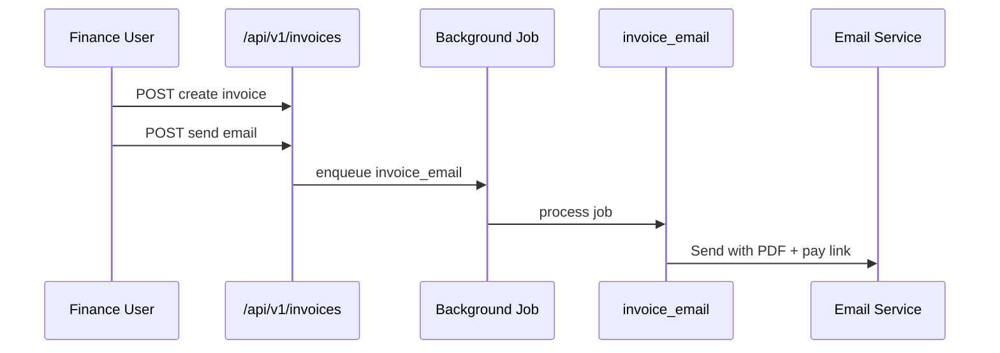
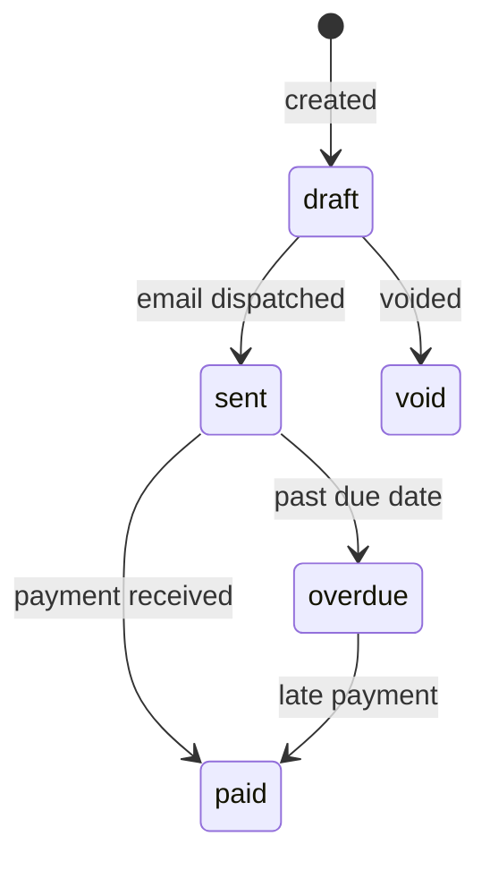

# Invoices Module

> **Module documentation** for Merchant Pro v1.0.0-rc1. Cross-references: [PFS](../Product_Functional_Specification.md) · [Business Rules](../Business_Rules.md) · [Functional Requirements](../Functional_Requirements.md) · [User Journeys](../User_Journeys.md) · [Feature Matrix](../Feature_Matrix.md)

## Table of Contents

1. [Purpose](#1-purpose) · 2. [Business Objective](#2-business-objective) · 3. [Scope](#3-scope) · 4. [Primary Users](#4-primary-users) · 5. [Key Capabilities](#5-key-capabilities) · 6. [Dependencies](#6-dependencies) · 7. [Architecture Overview](#7-architecture-overview) · 8. [Inputs](#8-inputs) · 9. [Outputs](#9-outputs) · 10. [Business Rules](#10-business-rules) · 11. [Permissions and RBAC](#11-permissions-and-rbac) · 12. [API Reference](#12-api-reference) · 13. [Frontend Routes](#13-frontend-routes) · 14. [Data Model](#14-data-model) · 15. [Workflows and State Machines](#15-workflows-and-state-machines) · 16. [Integration Points](#16-integration-points) · 17. [Security Considerations](#17-security-considerations) · 18. [Success Criteria](#18-success-criteria) · 19. [Error Scenarios](#19-error-scenarios) · 20. [Operational Considerations](#20-operational-considerations) · 21. [Related Functional Requirements](#21-related-functional-requirements) · 22. [Related User Journeys](#22-related-user-journeys) · 23. [Feature Matrix Reference](#23-feature-matrix-reference) · 24. [Limitations and Status](#24-limitations-and-status) · 25. [Future Enhancements](#25-future-enhancements)

---

## 1. Purpose

Customer invoicing with line items, PDF generation, email delivery, and optional embedded payment links for invoice collection.

## 2. Business Objective

Streamline B2B and B2C billing with automated delivery and payment collection. Aligns with [PFS §7.13](../Product_Functional_Specification.md#713-invoices).

## 3. Scope

Invoice CRUD, line items, PDF generation, email dispatch via `invoice_email` background job, and payment link embedding.

## 4. Primary Users

| Persona | Usage |
|---------|-------|
| Finance User | Create and send invoices |
| Merchant Admin | Manage invoice templates |
| End Customer | Receive and pay invoice |

## 5. Key Capabilities

| Capability | Description |
|------------|-------------|
| Invoice create | Line items, tax, due date |
| PDF generation | On-demand PDF (BR-INV-002) |
| Email delivery | `invoice_email` background job |
| Payment link | Embedded pay URL |
| Status tracking | draft, sent, paid, overdue |
| Listing | Search and filter invoices |

## 6. Dependencies

| Dependency | Purpose |
|------------|---------|
| Background Jobs | `invoice_email` worker handler |
| Payment Links | Pay URL in invoice |
| Customers | Bill-to customer record |
| SMTP Settings | Email delivery config |

## 7. Architecture Overview

## 8. Inputs

| Input | Description |
|-------|-------------|
| customerId | Bill-to customer |
| lineItems | description, quantity, unitPrice |
| dueDate | Payment due date |
| merchantId | Issuing merchant |

## 9. Outputs

| Output | Description |
|--------|-------------|
| Invoice record | id, number, status, total |
| PDF | Generated document |
| Email | Delivered to customer |
| Payment link | Optional embedded URL |

## 10. Business Rules

**BR-INV-001**: Invoice email dispatched via background job (`invoice_email`).
**BR-INV-002**: Invoice PDF generated on demand.

## 11. Permissions and RBAC

| Permission | Action |
|------------|--------|
| `invoices:read` | List and view invoices |
| `invoices:write` | Create and update |
| `invoices:manage` | Send, void, delete |

## 12. API Reference

Base path: `/api/v1/invoices` — authenticated, org-scoped.

| Operation | Permission |
|-----------|------------|
| CRUD | invoices:read/write |
| Send email | invoices:manage |
| PDF download | invoices:read |

## 13. Frontend Routes

| Route | Permission |
|-------|------------|
| `/invoices` | `invoices:read` |

## 14. Data Model

| Entity | Key Fields |
|--------|------------|
| `invoices` | id, number, customer_id, status, total, due_date |
| `invoice_line_items` | invoice_id, description, quantity, unit_price |

## 15. Workflows and State Machines

## 16. Integration Points

| Module | Integration |
|--------|-------------|
| Background Jobs | invoice_email handler |
| Payment Links | Pay URL in email |
| Customers | Bill-to address |
| Subscriptions | Cycle invoice generation |

## 17. Security Considerations

- Invoice PDF access requires permission or public token
- Email contains payment link with unguessable token
- PII in invoice masked in logs
- Org-scoped invoice queries

## 18. Success Criteria

| Criterion | Measure |
|-----------|---------|
| Email delivery | Job completes; customer receives |
| PDF accuracy | Line items match record |
| Payment | Invoice marked paid on collection |

## 19. Error Scenarios

| Scenario | HTTP |
|----------|------|
| SMTP failure | Job retry/fail |
| Invalid customer | 400 |
| Void paid invoice | 400 |

## 20. Operational Considerations

- Monitor invoice_email job success rate
- Overdue invoice reporting
- SMTP configuration validation

## 21. Related Functional Requirements

FR-INV-001, FR-INV-002 in [Functional Requirements](../Functional_Requirements.md#subscriptions--invoices-fr-sub).

## 22. Related User Journeys

See [User Journeys](../User_Journeys.md) — invoice creation and customer payment.

## 23. Feature Matrix Reference

See [Feature Matrix](../Feature_Matrix.md) — Invoices by role.

## 24. Limitations and Status

| Limitation | Notes |
|------------|-------|
| Multi-currency tax | Basic tax support |
| **Status** | **Implemented** |

## 25. Future Enhancements

- Recurring invoice schedules
- Multi-currency with FX conversion
- Invoice approval workflow
- Accounting system sync (QuickBooks, Xero)
