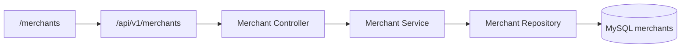
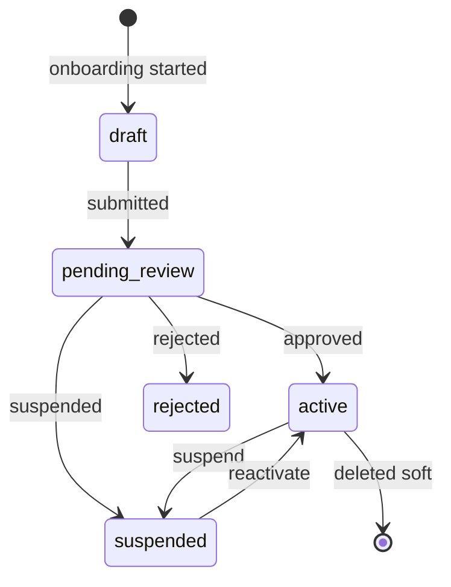

# Merchant Management Module

> **Module documentation** for Merchant Pro v1.0.0-rc1. Cross-references: [PFS](../Product_Functional_Specification.md) · [Business Rules](../Business_Rules.md) · [Functional Requirements](../Functional_Requirements.md) · [User Journeys](../User_Journeys.md) · [Feature Matrix](../Feature_Matrix.md)

## Table of Contents

1. [Purpose](#1-purpose) · 2. [Business Objective](#2-business-objective) · 3. [Scope](#3-scope) · 4. [Primary Users](#4-primary-users) · 5. [Key Capabilities](#5-key-capabilities) · 6. [Dependencies](#6-dependencies) · 7. [Architecture Overview](#7-architecture-overview) · 8. [Inputs](#8-inputs) · 9. [Outputs](#9-outputs) · 10. [Business Rules](#10-business-rules) · 11. [Permissions and RBAC](#11-permissions-and-rbac) · 12. [API Reference](#12-api-reference) · 13. [Frontend Routes](#13-frontend-routes) · 14. [Data Model](#14-data-model) · 15. [Workflows and State Machines](#15-workflows-and-state-machines) · 16. [Integration Points](#16-integration-points) · 17. [Security Considerations](#17-security-considerations) · 18. [Success Criteria](#18-success-criteria) · 19. [Error Scenarios](#19-error-scenarios) · 20. [Operational Considerations](#20-operational-considerations) · 21. [Related Functional Requirements](#21-related-functional-requirements) · 22. [Related User Journeys](#22-related-user-journeys) · 23. [Feature Matrix Reference](#23-feature-matrix-reference) · 24. [Limitations and Status](#24-limitations-and-status) · 25. [Future Enhancements](#25-future-enhancements)

---

## 1. Purpose

CRUD and lifecycle management for merchant entities within an organization, including profile data, status transitions, KYC documents, and merchant-scoped reporting.

## 2. Business Objective

Provide centralized merchant portfolio management with strict tenant isolation. Aligns with [PFS §7.4](../Product_Functional_Specification.md#74-merchant-management).

## 3. Scope

Merchant CRUD, search, statistics, status updates, document management, and linked transaction/settlement views. Onboarding workflow covered separately under Merchant Onboarding in PFS.

## 4. Primary Users

| Persona | Usage |
|---------|-------|
| Operations User | Create, update, search merchants |
| Merchant Administrator | Manage assigned merchant profile |
| Finance User | View transactions and settlements |
| Compliance | Review KYC documents |

## 5. Key Capabilities

| Capability | Description |
|------------|-------------|
| Merchant CRUD | Create, read, update, soft-delete |
| Search & pagination | Full-text search with filters |
| Status management | draft → active → suspended lifecycle |
| KYC documents | Upload and manage compliance documents |
| Statistics | Merchant-level KPIs |
| Transaction history | Scoped transaction listing |
| Settlement history | Linked settlement records |

## 6. Dependencies

| Dependency | Purpose |
|------------|---------|
| Authorization | `merchants:*` permissions |
| Organization context | Tenant scoping via `organization_id` |
| Merchant Onboarding | Initial merchant creation workflow |
| Payments | Merchant ID on payment intents |

## 7. Architecture Overview

All queries filter by active organization context (BR-ORG-003).

## 8. Inputs

| Input | Validation |
|-------|------------|
| Merchant profile | Name, region, contact, MCC |
| Status patch | Valid status enum |
| Document upload | File metadata, document type |
| Search query | page, pageSize, search term |

## 9. Outputs

| Output | Description |
|--------|-------------|
| Merchant record | Scoped to organization |
| Paginated list | Search results with metadata |
| Document list | KYC attachments |
| Statistics | Counts and volume metrics |

## 10. Business Rules

See [Business Rules](../Business_Rules.md): **BR-MER-001** through **BR-MER-003**, **BR-ORG-003**.

## 11. Permissions and RBAC

| Permission | Action |
|------------|--------|
| `merchants:read` | List, search, view, documents |
| `merchants:write` | Create, update, status, documents |
| `merchants:delete` | Soft-delete merchant |

## 12. API Reference

| Method | Path | Permission |
|--------|------|------------|
| GET | `/api/v1/merchants` | `merchants:read` |
| GET | `/api/v1/merchants/search` | `merchants:read` |
| GET | `/api/v1/merchants/statistics` | `merchants:read` |
| POST | `/api/v1/merchants` | `merchants:write` |
| GET | `/api/v1/merchants/:id` | `merchants:read` |
| PUT | `/api/v1/merchants/:id` | `merchants:write` |
| PATCH | `/api/v1/merchants/:id/status` | `merchants:write` |
| DELETE | `/api/v1/merchants/:id` | `merchants:delete` |
| GET | `/api/v1/merchants/:id/transactions` | `merchants:read` |
| GET | `/api/v1/merchants/:id/settlements` | `merchants:read` |
| GET/POST/DELETE | `/api/v1/merchants/:id/documents` | `merchants:read/write` |

## 13. Frontend Routes

| Route | Permission |
|-------|------------|
| `/merchants` | `merchants:read` |
| `/merchants/:id` | `merchants:read` |

## 14. Data Model

| Entity | Key Fields |
|--------|------------|
| `merchants` | id, organization_id, name, status, region, mcc |
| `merchant_documents` | merchant_id, type, file_path, uploaded_at |

## 15. Workflows and State Machines

## 16. Integration Points

| Module | Integration |
|--------|-------------|
| Payments | `merchantId` on intents |
| Outlets | Child outlet records |
| Merchant Users | Portal user assignments |
| Webhooks | Merchant-scoped delivery queue |
| Onboarding | Status transitions from approval |

## 17. Security Considerations

- Cross-org merchant access denied (BR-MER-003)
- Document uploads validated and org-scoped
- PII in merchant profile masked in logs
- Delete is soft-delete preserving audit trail

## 18. Success Criteria

| Criterion | Measure |
|-----------|---------|
| Org isolation | Merchants visible only in owning org |
| Search performance | Paginated results under 500ms |
| Status integrity | Valid transitions only |

## 19. Error Scenarios

| Scenario | HTTP |
|----------|------|
| Cross-org access | 403/404 |
| Invalid status | 400 |
| Duplicate merchant code | 409 |
| Missing permission | 403 |

## 20. Operational Considerations

- Monitor merchant count per org for capacity
- Review suspended merchants periodically
- KYC document storage backup policy

## 21. Related Functional Requirements

See [Functional Requirements — Merchants (FR-MER)](../Functional_Requirements.md#merchants--onboarding-fr-mer): FR-MER-001 through FR-MER-006.

## 22. Related User Journeys

See [User Journeys](../User_Journeys.md) — merchant onboarding and management flows.

## 23. Feature Matrix Reference

See [Feature Matrix](../Feature_Matrix.md) — Merchants module by role.

## 24. Limitations and Status

| Limitation | Notes |
|------------|-------|
| Bulk import | Not in V1 |
| **Status** | **Implemented** |

## 25. Future Enhancements

- Bulk merchant import/export
- Merchant risk scoring dashboard
- Automated KYC document expiry alerts
- Multi-currency merchant profiles
