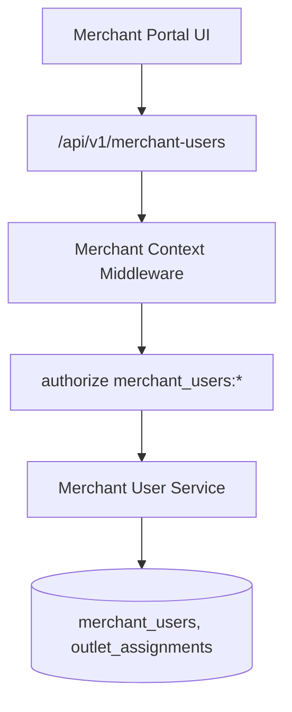
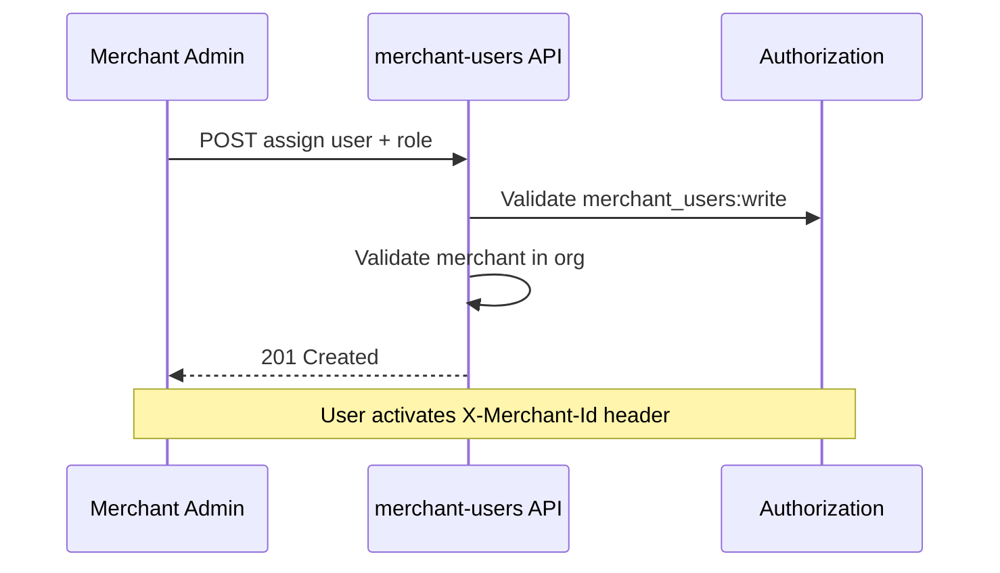

# Merchant Users Module

> **Module documentation** for Merchant Pro v1.0.0-rc1. Cross-references: [PFS](../Product_Functional_Specification.md) · [Business Rules](../Business_Rules.md) · [Functional Requirements](../Functional_Requirements.md) · [User Journeys](../User_Journeys.md) · [Feature Matrix](../Feature_Matrix.md)

## Table of Contents

1. [Purpose](#1-purpose) · 2. [Business Objective](#2-business-objective) · 3. [Scope](#3-scope) · 4. [Primary Users](#4-primary-users) · 5. [Key Capabilities](#5-key-capabilities) · 6. [Dependencies](#6-dependencies) · 7. [Architecture Overview](#7-architecture-overview) · 8. [Inputs](#8-inputs) · 9. [Outputs](#9-outputs) · 10. [Business Rules](#10-business-rules) · 11. [Permissions and RBAC](#11-permissions-and-rbac) · 12. [API Reference](#12-api-reference) · 13. [Frontend Routes](#13-frontend-routes) · 14. [Data Model](#14-data-model) · 15. [Workflows and State Machines](#15-workflows-and-state-machines) · 16. [Integration Points](#16-integration-points) · 17. [Security Considerations](#17-security-considerations) · 18. [Success Criteria](#18-success-criteria) · 19. [Error Scenarios](#19-error-scenarios) · 20. [Operational Considerations](#20-operational-considerations) · 21. [Related Functional Requirements](#21-related-functional-requirements) · 22. [Related User Journeys](#22-related-user-journeys) · 23. [Feature Matrix Reference](#23-feature-matrix-reference) · 24. [Limitations and Status](#24-limitations-and-status) · 25. [Future Enhancements](#25-future-enhancements)

---

## 1. Purpose

Manage users operating within the merchant portal context, including role assignment, outlet-level access, and merchant-scoped permission caps.

## 2. Business Objective

Enable merchant administrators to delegate operational access without granting full organization privileges. Aligns with [PFS §7.5](../Product_Functional_Specification.md#75-merchant-users).

## 3. Scope

CRUD for merchant portal users, role assignment, outlet access mapping, and activation/deactivation. Platform users module handles org-level users separately.

## 4. Primary Users

| Persona | Usage |
|---------|-------|
| Merchant Administrator | Assign portal users and roles |
| Branch Manager | Operates with outlet-scoped access |
| Operations User | Oversees merchant user assignments |

## 5. Key Capabilities

| Capability | Description |
|------------|-------------|
| User assignment | Link platform user to merchant |
| Role assignment | Merchant-specific roles |
| Outlet scoping | Limit branch managers to assigned outlets |
| Activation control | Enable/disable merchant portal access |
| Listing & search | Paginated merchant user directory |

## 6. Dependencies

| Dependency | Purpose |
|------------|---------|
| Merchant Management | Parent merchant must exist |
| Authorization | Merchant cap middleware (BR-RBAC-005) |
| Users module | Underlying user records |
| Outlets | Outlet assignment targets |

## 7. Architecture Overview

## 8. Inputs

| Input | Description |
|-------|-------------|
| user_id | Platform user reference |
| merchant_id | Target merchant |
| role | Merchant portal role |
| outlet_ids | Optional outlet scope list |

## 9. Outputs

| Output | Description |
|--------|-------------|
| Merchant user record | Assignment with role and outlets |
| Paginated list | Filtered by merchant/org |

## 10. Business Rules

**BR-RBAC-005**: Merchant role caps intersect global permissions.
**BR-RBAC-006**: Branch managers limited to assigned outlets.
**BR-MER-001**: Merchant must belong to active organization.

## 11. Permissions and RBAC

| Permission | Action |
|------------|--------|
| `merchant_users:read` | List and view assignments |
| `merchant_users:write` | Create and update |
| `merchant_users:manage` | Delete, bulk operations |

## 12. API Reference

Base path: `/api/v1/merchant-users` — requires authentication, organization context, and merchant user permissions.

| Method | Path | Permission |
|--------|------|------------|
| GET | `/api/v1/merchant-users` | `merchant_users:read` |
| POST | `/api/v1/merchant-users` | `merchant_users:write` |
| GET | `/api/v1/merchant-users/:id` | `merchant_users:read` |
| PUT | `/api/v1/merchant-users/:id` | `merchant_users:write` |
| DELETE | `/api/v1/merchant-users/:id` | `merchant_users:manage` |

## 13. Frontend Routes

| Route | Permission |
|-------|------------|
| `/merchant-users` | `merchant_users:read` |

## 14. Data Model

| Entity | Key Fields |
|--------|------------|
| `merchant_users` | id, user_id, merchant_id, role, status |
| `merchant_user_outlets` | merchant_user_id, outlet_id |

## 15. Workflows and State Machines

## 16. Integration Points

| Module | Integration |
|--------|-------------|
| Authorization | Merchant cap on API calls |
| Outlets | Outlet assignment validation |
| Merchant Portal | `/merchant-portal` UI context |
| Audit | Assignment changes logged |

## 17. Security Considerations

- Cannot assign users to merchants outside active org
- Outlet scope enforced on data queries
- Role caps prevent privilege escalation beyond global role
- Deactivation preserves audit history

## 18. Success Criteria

| Criterion | Measure |
|-----------|---------|
| Scoped access | Branch manager sees only assigned outlets |
| Assignment integrity | User linked to single merchant context per session |
| Permission cap | Write blocked for capped roles |

## 19. Error Scenarios

| Scenario | HTTP |
|----------|------|
| Merchant not in org | 403/404 |
| Duplicate assignment | 409 |
| Invalid outlet | 400 |
| Insufficient permission | 403 |

## 20. Operational Considerations

- Review merchant user assignments during merchant offboarding
- Audit outlet reassignments on branch restructuring
- Monitor inactive merchant users for cleanup
- Validate merchant portal role caps after global role changes
- Coordinate with Merchant Management on merchant suspension (disable portal access)

### Merchant Portal Roles

| Role | Typical Capabilities |
|------|---------------------|
| merchant_admin | Full merchant portal access |
| branch_manager | Outlet-scoped read/write |
| cashier | Payment acceptance only |
| viewer | Read-only merchant data |

## 21. Related Functional Requirements

See [Functional Requirements](../Functional_Requirements.md) — merchant user management under FR-MER and FR-USR.

## 22. Related User Journeys

See [User Journeys](../User_Journeys.md) — merchant portal access delegation.

## 23. Feature Matrix Reference

See [Feature Matrix](../Feature_Matrix.md) — Merchant Users by role.

## 24. Limitations and Status

| Limitation | Notes |
|------------|-------|
| Self-service invite | Admin-initiated only in V1 |
| **Status** | **Implemented** |

## 25. Future Enhancements

- Email invitation workflow for merchant users
- Time-limited access grants
- Merchant user activity audit dashboard
- SSO mapping for merchant portal users
