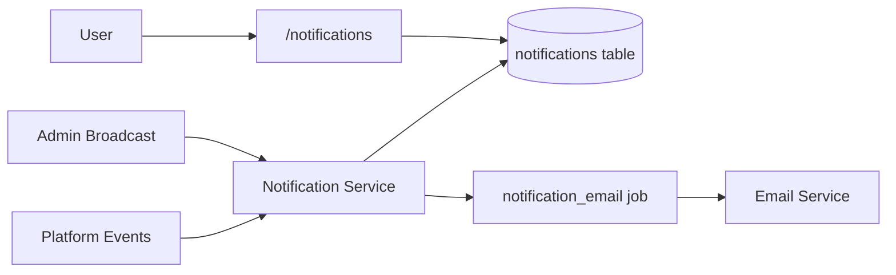
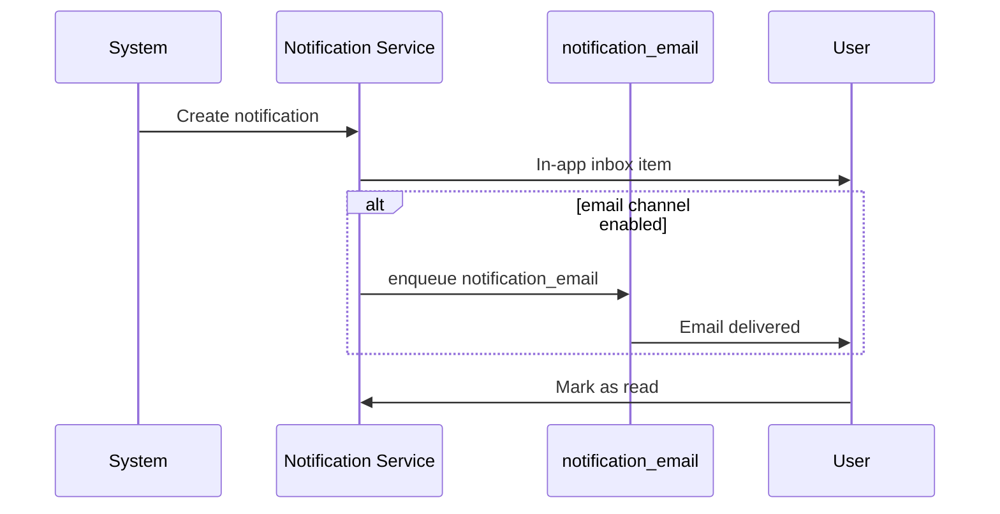

# Notifications Module

> **Module documentation** for Merchant Pro v1.0.0-rc1. Cross-references: [PFS](../Product_Functional_Specification.md) · [Business Rules](../Business_Rules.md) · [Functional Requirements](../Functional_Requirements.md) · [User Journeys](../User_Journeys.md) · [Feature Matrix](../Feature_Matrix.md)

## Table of Contents

1. [Purpose](#1-purpose) · 2. [Business Objective](#2-business-objective) · 3. [Scope](#3-scope) · 4. [Primary Users](#4-primary-users) · 5. [Key Capabilities](#5-key-capabilities) · 6. [Dependencies](#6-dependencies) · 7. [Architecture Overview](#7-architecture-overview) · 8. [Inputs](#8-inputs) · 9. [Outputs](#9-outputs) · 10. [Business Rules](#10-business-rules) · 11. [Permissions and RBAC](#11-permissions-and-rbac) · 12. [API Reference](#12-api-reference) · 13. [Frontend Routes](#13-frontend-routes) · 14. [Data Model](#14-data-model) · 15. [Workflows and State Machines](#15-workflows-and-state-machines) · 16. [Integration Points](#16-integration-points) · 17. [Security Considerations](#17-security-considerations) · 18. [Success Criteria](#18-success-criteria) · 19. [Error Scenarios](#19-error-scenarios) · 20. [Operational Considerations](#20-operational-considerations) · 21. [Related Functional Requirements](#21-related-functional-requirements) · 22. [Related User Journeys](#22-related-user-journeys) · 23. [Feature Matrix Reference](#23-feature-matrix-reference) · 24. [Limitations and Status](#24-limitations-and-status) · 25. [Future Enhancements](#25-future-enhancements)

---

## 1. Purpose

Deliver in-app and email notifications to platform users including inbox management, templates, admin broadcast, and preference-controlled channels.

## 2. Business Objective

Keep users informed of platform events, approvals, and alerts through configurable channels. Aligns with [PFS §7.17](../Product_Functional_Specification.md#717-notifications).

## 3. Scope

Notification inbox, read/unread status, templates, broadcast to users, email delivery via `notification_email` background job, and user preference mapping.

## 4. Primary Users

| Persona | Usage |
|---------|-------|
| All users | View inbox notifications |
| Platform Administrator | Broadcast announcements |
| System | Auto-notify on events |

## 5. Key Capabilities

| Capability | Description |
|------------|-------------|
| Inbox | User notification list |
| Read/unread | Mark notifications read |
| Templates | Reusable notification templates |
| Broadcast | Admin sends to user groups |
| Email delivery | notification_email job |
| Preferences | Channel control per user |

## 6. Dependencies

| Dependency | Purpose |
|------------|---------|
| Background Jobs | notification_email handler |
| SMTP Settings | Email channel delivery |
| Users | Recipient targeting |
| Authorization | notifications:* permissions |

## 7. Architecture Overview

## 8. Inputs

| Input | Description |
|-------|-------------|
| title, body | Notification content |
| recipientIds | Target users |
| channel | in_app, email |
| templateId | Optional template reference |

## 9. Outputs

| Output | Description |
|--------|-------------|
| Inbox item | User notification record |
| Email | Delivered via worker |
| Read status | Updated on user action |

## 10. Business Rules

**BR-NOT-001**: Notification delivery via email background job.
**BR-NOT-002**: User preferences control notification channels.

## 11. Permissions and RBAC

| Permission | Action |
|------------|--------|
| `notifications:read` | View inbox |
| `notifications:write` | Create notifications |
| `notifications:broadcast` | Send to user groups |
| `notifications:manage` | Templates, admin operations |

## 12. API Reference

Base path: `/api/v1/notifications` — authenticated, org-scoped.

Standard inbox CRUD, mark read, broadcast, and template management per permissions.

## 13. Frontend Routes

| Route | Permission |
|-------|------------|
| `/notifications` | `notifications:read` |

Nav label: **Communications**.

## 14. Data Model

| Entity | Key Fields |
|--------|------------|
| `notifications` | id, user_id, title, body, read_at, channel |
| `notification_templates` | id, code, subject, body_template |
| `notification_preferences` | user_id, channel, enabled |

## 15. Workflows and State Machines

## 16. Integration Points

| Module | Integration |
|--------|-------------|
| Background Jobs | notification_email |
| Settings | SMTP configuration |
| Refunds | Approval notification |
| Onboarding | Status change alerts |

## 17. Security Considerations

- Users see only own notifications
- Broadcast requires elevated permission
- Email content sanitized
- Org-scoped admin broadcasts

## 18. Success Criteria

| Criterion | Measure |
|-----------|---------|
| Delivery | In-app visible immediately |
| Email | Job completes successfully |
| Preferences | Disabled channels skipped |

## 19. Error Scenarios

| Scenario | Result |
|----------|--------|
| SMTP failure | Job retry/fail |
| Invalid recipient | Skipped |
| Missing broadcast permission | 403 |

## 20. Operational Considerations

- Monitor notification_email job queue
- Review broadcast usage audit
- Template maintenance for consistency

## 21. Related Functional Requirements

FR-NOT-001, FR-NOT-002 in [Functional Requirements](../Functional_Requirements.md#notifications--support-fr-sup).

## 22. Related User Journeys

See [User Journeys](../User_Journeys.md) — notification inbox and broadcast.

## 23. Feature Matrix Reference

See [Feature Matrix](../Feature_Matrix.md) — Notifications by role.

## 24. Limitations and Status

| Limitation | Notes |
|------------|-------|
| Push notifications | Not in V1 |
| SMS | Email and in-app only |
| **Status** | **Implemented** |

## 25. Future Enhancements

- Mobile push notifications
- SMS channel integration
- Notification grouping and digests
- Real-time WebSocket delivery
