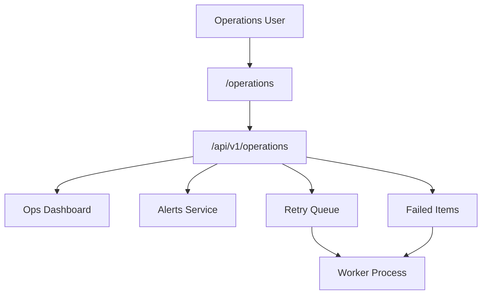
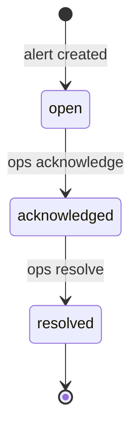
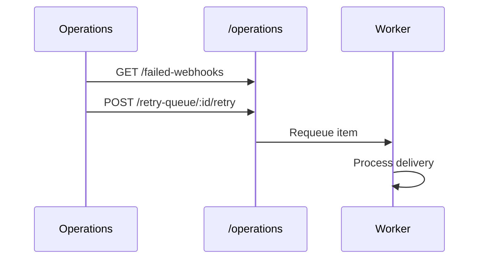

# Operations Center Module

> **Module documentation** for Merchant Pro v1.0.0-rc1. Cross-references: [PFS](../Product_Functional_Specification.md) · [Business Rules](../Business_Rules.md) · [Functional Requirements](../Functional_Requirements.md) · [User Journeys](../User_Journeys.md) · [Feature Matrix](../Feature_Matrix.md)

## Table of Contents

1. [Purpose](#1-purpose) · 2. [Business Objective](#2-business-objective) · 3. [Scope](#3-scope) · 4. [Primary Users](#4-primary-users) · 5. [Key Capabilities](#5-key-capabilities) · 6. [Dependencies](#6-dependencies) · 7. [Architecture Overview](#7-architecture-overview) · 8. [Inputs](#8-inputs) · 9. [Outputs](#9-outputs) · 10. [Business Rules](#10-business-rules) · 11. [Permissions and RBAC](#11-permissions-and-rbac) · 12. [API Reference](#12-api-reference) · 13. [Frontend Routes](#13-frontend-routes) · 14. [Data Model](#14-data-model) · 15. [Workflows and State Machines](#15-workflows-and-state-machines) · 16. [Integration Points](#16-integration-points) · 17. [Security Considerations](#17-security-considerations) · 18. [Success Criteria](#18-success-criteria) · 19. [Error Scenarios](#19-error-scenarios) · 20. [Operational Considerations](#20-operational-considerations) · 21. [Related Functional Requirements](#21-related-functional-requirements) · 22. [Related User Journeys](#22-related-user-journeys) · 23. [Feature Matrix Reference](#23-feature-matrix-reference) · 24. [Limitations and Status](#24-limitations-and-status) · 25. [Future Enhancements](#25-future-enhancements)

---

## 1. Purpose

Operational incident and queue management dashboard for monitoring alerts, failed payments/payouts/webhooks, background jobs, retry queues, and maintenance mode.

## 2. Business Objective

Provide operations teams centralized visibility and remediation tools for platform health issues. Aligns with [PFS §7.27](../Product_Functional_Specification.md#727-operations-center).

## 3. Scope

Operations dashboard, alerts/incidents, retry queue, failed item queues, job monitoring, maintenance mode, deployment history, and queue dashboards. Worker details in [Workers.md](./Workers.md).

## 4. Primary Users

| Persona | Usage |
|---------|-------|
| Operations User | Monitor and resolve incidents |
| Platform Administrator | Maintenance mode, job retry |
| DevOps | Deployment and health monitoring |

## 5. Key Capabilities

| Capability | Description |
|------------|-------------|
| Dashboard | Ops KPIs and queue summaries |
| Alerts | Acknowledge and resolve alerts |
| Incidents | Incident tracking and history |
| Retry queue | Requeue failed operations |
| Failed payments | Stuck/failed payment list |
| Failed webhooks | Dead letter webhook queue |
| Failed payouts | Payout failure queue |
| Job monitoring | Background job status |
| Maintenance mode | Platform maintenance toggle |
| Deployment history | Recent deployment records |

## 6. Dependencies

| Dependency | Purpose |
|------------|---------|
| Workers | Queue processing |
| Webhooks | Failed webhook data |
| Payments | Failed payment records |
| Payouts | Failed payout records |
| Background Jobs | Job queue status |
| Authorization | operations:* permissions |

## 7. Architecture Overview

## 8. Inputs

| Input | Description |
|-------|-------------|
| alertId | Acknowledge/resolve target |
| retryQueueItemId | Retry queue item |
| jobId | Background job retry |
| maintenanceFlag | Enable/disable maintenance |

## 9. Outputs

| Output | Description |
|--------|-------------|
| Dashboard metrics | Queue depths, failure counts |
| Alert list | Active and resolved alerts |
| Retry result | Item requeued confirmation |
| Maintenance status | Current mode state |

## 10. Business Rules

Retry operations require operations:manage permission. Maintenance mode blocks non-admin API access when enabled.

## 11. Permissions and RBAC

| Permission | Action |
|------------|--------|
| `operations:read` | Dashboard, alerts, queues, jobs |
| `operations:write` | Acknowledge/resolve alerts |
| `operations:manage` | Retry queue, jobs, maintenance mode |

## 12. API Reference

Base path: `/api/v1/operations`

| Method | Path | Permission |
|--------|------|------------|
| GET | `/dashboard` | operations:read |
| GET | `/queues` | operations:read |
| GET | `/dead-letter-queue` | operations:read |
| GET | `/maintenance` | operations:read |
| PUT | `/maintenance` | operations:manage |
| GET | `/deployments` | operations:read |
| GET | `/pending-tasks` | operations:read |
| GET | `/health` | operations:read |
| GET | `/alerts` | operations:read |
| GET | `/incidents` | operations:read |
| GET | `/retry-queue` | operations:read |
| GET | `/jobs` | operations:read |
| GET | `/failed-payments` | operations:read |
| GET | `/failed-payouts` | operations:read |
| GET | `/failed-webhooks` | operations:read |
| POST | `/alerts/:id/acknowledge` | operations:write |
| POST | `/alerts/:id/resolve` | operations:write |
| POST | `/retry-queue/:id/retry` | operations:manage |
| POST | `/jobs/:id/retry` | operations:manage |

## 13. Frontend Routes

| Route | Permission |
|-------|------------|
| `/operations` | `operations:read` |

Nav label: **Operations**.

## 14. Data Model

| Entity | Purpose |
|--------|---------|
| `operations_alerts` | Alert records |
| `operations_incidents` | Incident tracking |
| `retry_queue` | Failed operation retry items |
| `webhook_delivery_queue` | Webhook dead letter items |
| `background_jobs` | Job status monitoring |

## 15. Workflows and State Machines

Retry workflow:

## 16. Integration Points

| Module | Integration |
|--------|-------------|
| Workers | Job and webhook retry |
| Webhooks | Failed webhook queue |
| Payments | Failed payment list |
| Payouts | Failed payout list |
| System Health | Health endpoint overlap |
| Audit | Alert and retry actions logged |

## 17. Security Considerations

- Maintenance mode restricted to operations:manage
- Retry actions audited
- Org-scoped where applicable
- Alert data may contain sensitive context

## 18. Success Criteria

| Criterion | Measure |
|-----------|---------|
| Alert response | Acknowledged within SLA |
| Retry success | Requeued items process |
| Visibility | All failed queues accessible |

## 19. Error Scenarios

| Scenario | HTTP |
|----------|------|
| Retry on completed item | 400 |
| Missing manage permission | 403 |
| Maintenance already active | 409 |

## 20. Operational Considerations

- Define alert SLAs and escalation paths
- Regular dead letter queue review
- Maintenance mode runbook documented
- Monitor retry success rate

## 21. Related Functional Requirements

FR-OPS-001, FR-OPS-002 in [Functional Requirements](../Functional_Requirements.md#audit--operations-fr-ops).

## 22. Related User Journeys

See [User Journeys](../User_Journeys.md) — incident response workflows.

## 23. Feature Matrix Reference

See [Feature Matrix](../Feature_Matrix.md) — Operations by role.

## 24. Limitations and Status

| Limitation | Notes |
|------------|-------|
| Pager integration | Manual alert review in V1 |
| **Status** | **Implemented** |

## 25. Future Enhancements

- PagerDuty/Opsgenie integration
- Automated retry policies
- Runbook links on alerts
- Incident post-mortem templates
