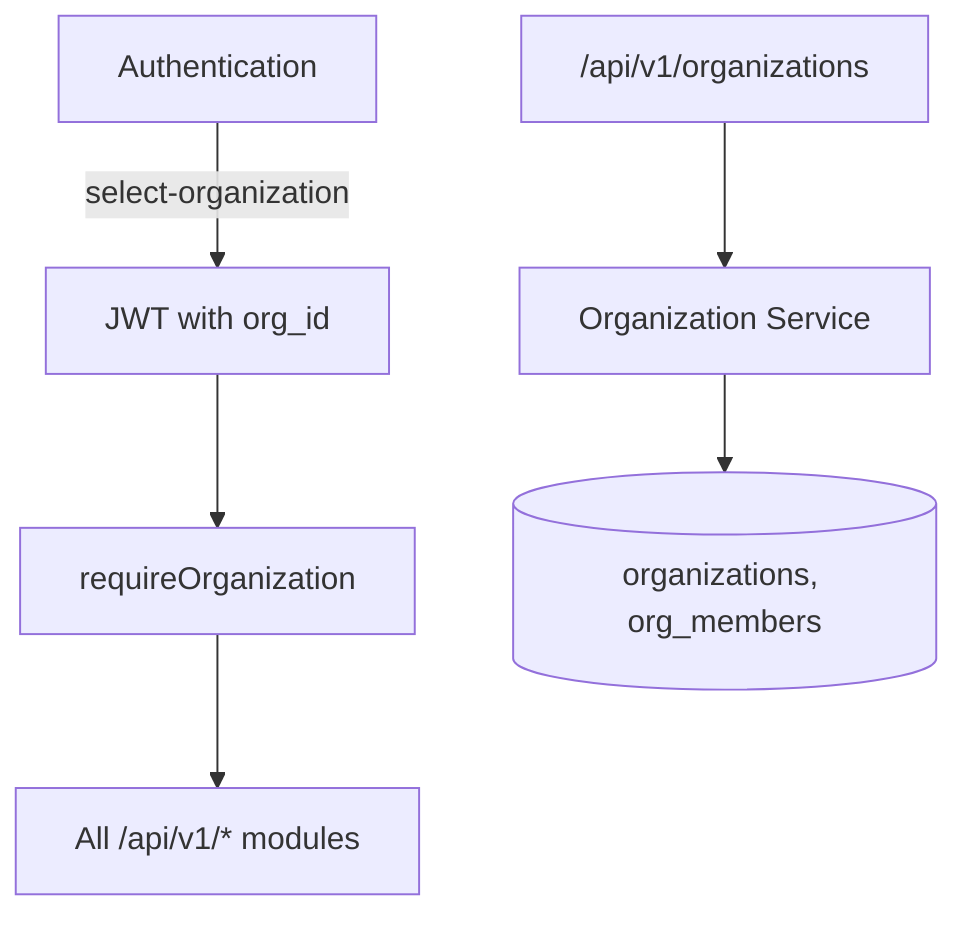
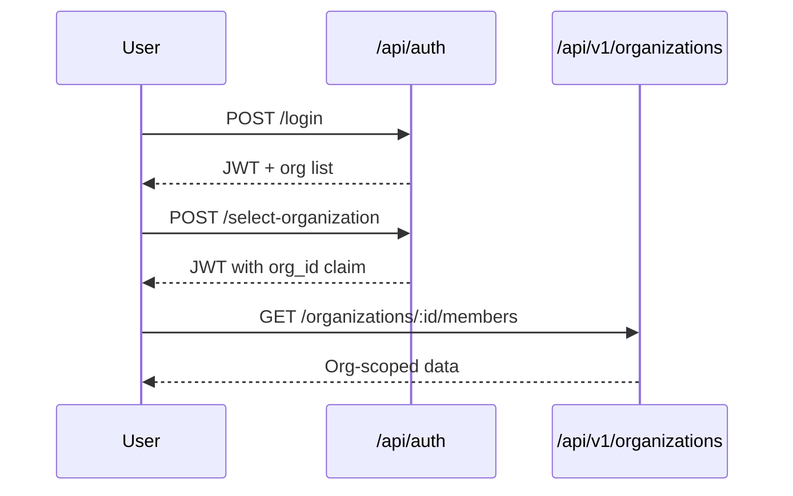

# Organization Management Module

> **Module documentation** for Merchant Pro v1.0.0-rc1. Cross-references: [PFS](../Product_Functional_Specification.md) · [Business Rules](../Business_Rules.md) · [Functional Requirements](../Functional_Requirements.md) · [User Journeys](../User_Journeys.md) · [Feature Matrix](../Feature_Matrix.md)

## Table of Contents

1. [Purpose](#1-purpose) · 2. [Business Objective](#2-business-objective) · 3. [Scope](#3-scope) · 4. [Primary Users](#4-primary-users) · 5. [Key Capabilities](#5-key-capabilities) · 6. [Dependencies](#6-dependencies) · 7. [Architecture Overview](#7-architecture-overview) · 8. [Inputs](#8-inputs) · 9. [Outputs](#9-outputs) · 10. [Business Rules](#10-business-rules) · 11. [Permissions and RBAC](#11-permissions-and-rbac) · 12. [API Reference](#12-api-reference) · 13. [Frontend Routes](#13-frontend-routes) · 14. [Data Model](#14-data-model) · 15. [Workflows and State Machines](#15-workflows-and-state-machines) · 16. [Integration Points](#16-integration-points) · 17. [Security Considerations](#17-security-considerations) · 18. [Success Criteria](#18-success-criteria) · 19. [Error Scenarios](#19-error-scenarios) · 20. [Operational Considerations](#20-operational-considerations) · 21. [Related Functional Requirements](#21-related-functional-requirements) · 22. [Related User Journeys](#22-related-user-journeys) · 23. [Feature Matrix Reference](#23-feature-matrix-reference) · 24. [Limitations and Status](#24-limitations-and-status) · 25. [Future Enhancements](#25-future-enhancements)

---

## 1. Purpose

Manage tenant organizations, membership, domains, branding, billing settings, and organization-scoped API keys for multi-tenant SaaS isolation.

## 2. Business Objective

Provide secure multi-tenant isolation where every data query respects organization boundaries. Aligns with [PFS §7.3](../Product_Functional_Specification.md#73-organization-management).

## 3. Scope

Organization CRUD, member management, custom domains, branding, preferences, billing, API keys, archive/restore. User authentication org selection handled by Authentication module.

## 4. Primary Users

| Persona | Usage |
|---------|-------|
| Platform Administrator | Create and manage organizations |
| Organization Owner | Manage members, branding, billing |
| Developer | Manage org API keys |

## 5. Key Capabilities

| Capability | Description |
|------------|-------------|
| Org CRUD | Create, update, archive, restore |
| Member management | Add, update role, remove members |
| Custom domains | Domain verification and mapping |
| Branding | Logo, colors, portal customization |
| Preferences | Org-level settings and MFA enforcement |
| Billing settings | Billing profile configuration |
| API keys | Create and revoke org-scoped keys |
| My organizations | List orgs for current user |

## 6. Dependencies

| Dependency | Purpose |
|------------|---------|
| Authorization | `organizations:*` permissions |
| Authentication | Org selection embeds org in JWT |
| All org-scoped modules | Filter by `organization_id` |

## 7. Architecture Overview

## 8. Inputs

| Input | Description |
|-------|-------------|
| Org profile | Name, slug, status |
| Member | user_id, org role (owner/admin/member/viewer) |
| Domain | hostname, verification token |
| Branding | logo URL, primary color |
| API key | name, scopes (displayed once on create) |

## 9. Outputs

| Output | Description |
|--------|-------------|
| Organization record | Tenant entity |
| Membership list | Users with org roles |
| API key (once) | Secret shown on creation only |

## 10. Business Rules

See [Business Rules — Authorization & Tenancy](../Business_Rules.md#authorization--tenancy): **BR-ORG-001** through **BR-ORG-003**, **BR-RBAC-003/004**.

## 11. Permissions and RBAC

| Permission | Action |
|------------|--------|
| `organizations:read` | List, view, members, domains, branding |
| `organizations:write` | Update profile, branding, preferences |
| `organizations:delete` | Archive organization |
| `organizations:manage` | Members, domains, API keys, billing |

## 12. API Reference

| Method | Path | Permission |
|--------|------|------------|
| GET | `/api/v1/organizations/mine` | Authenticated |
| GET | `/api/v1/organizations` | `organizations:read` |
| POST | `/api/v1/organizations` | `organizations:write` |
| GET/PUT | `/api/v1/organizations/:id` | read/write |
| PATCH | `/api/v1/organizations/:id/status` | `organizations:write` |
| POST | `/api/v1/organizations/:id/archive` | `organizations:delete` |
| POST | `/api/v1/organizations/:id/restore` | `organizations:write` |
| GET/POST/PUT/DELETE | `/api/v1/organizations/:id/members` | read/manage |
| GET/POST/PUT/DELETE | `/api/v1/organizations/:id/domains` | read/manage |
| GET/PUT | `/api/v1/organizations/:id/branding` | read/write |
| GET/PUT | `/api/v1/organizations/:id/preferences` | read/write |
| GET/POST/DELETE | `/api/v1/organizations/:id/api-keys` | manage |
| GET/PUT | `/api/v1/organizations/:id/billing` | manage |

## 13. Frontend Routes

| Route | Permission |
|-------|------------|
| `/organizations` | `organizations:read` |
| `/select-organization` | Authenticated (Auth module) |

## 14. Data Model

| Entity | Key Fields |
|--------|------------|
| `organizations` | id, name, slug, status, settings |
| `org_members` | organization_id, user_id, role |
| `org_domains` | organization_id, domain, verified |
| `org_api_keys` | organization_id, key_hash, name |

## 15. Workflows and State Machines

## 16. Integration Points

| Module | Integration |
|--------|-------------|
| Authentication | Org selection, MFA enforcement per org |
| All modules | `organization_id` filter |
| Developer Portal | Org-scoped API keys |
| Settings | Org preferences overlap |

## 17. Security Considerations

- User must be member of requested org (BR-ORG-002)
- API key secrets shown once; stored hashed
- Archive prevents new operations but preserves data
- Cross-org queries return 403/404

## 18. Success Criteria

| Criterion | Measure |
|-----------|---------|
| Tenant isolation | Zero cross-org data leakage |
| Member role caps | Viewer cannot write |
| Domain verification | Unverified domains inactive |

## 19. Error Scenarios

| Scenario | HTTP |
|----------|------|
| Not org member | 403 |
| Duplicate slug/domain | 409 |
| Archive active org with merchants | 400 |

## 20. Operational Considerations

- Monitor org count and member growth
- Review archived orgs for data retention policy
- API key rotation procedures

## 21. Related Functional Requirements

See [Functional Requirements — Settings (FR-SET)](../Functional_Requirements.md#settings--system-fr-sys): FR-SET-001 and org-related FR-USR items.

## 22. Related User Journeys

See [User Journeys](../User_Journeys.md) — organization setup and member invitation.

## 23. Feature Matrix Reference

See [Feature Matrix](../Feature_Matrix.md) — Organizations by role.

## 24. Limitations and Status

| Limitation | Notes |
|------------|-------|
| Sub-org hierarchy | Flat tenant model in V1 |
| **Status** | **Implemented** |

## 25. Future Enhancements

- Organization hierarchy (parent/child tenants)
- Self-service org signup with trial provisioning
- Usage-based billing integration
- Org-level data residency selection
