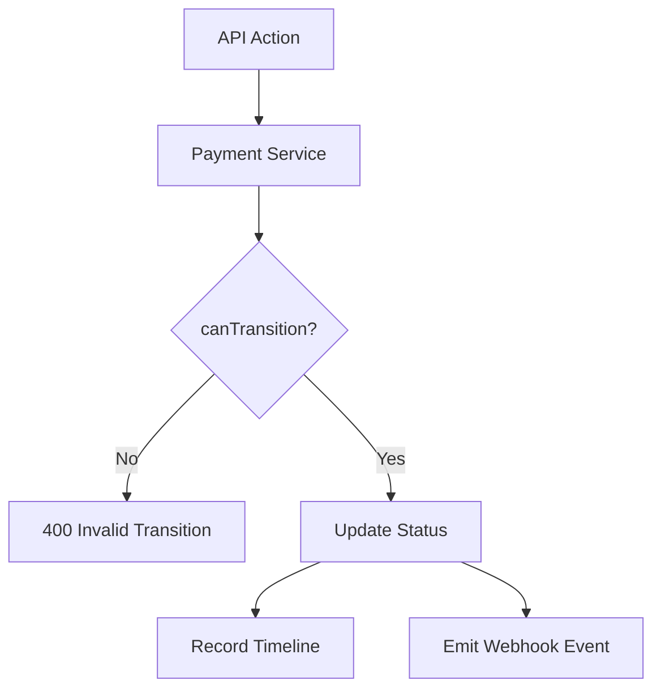
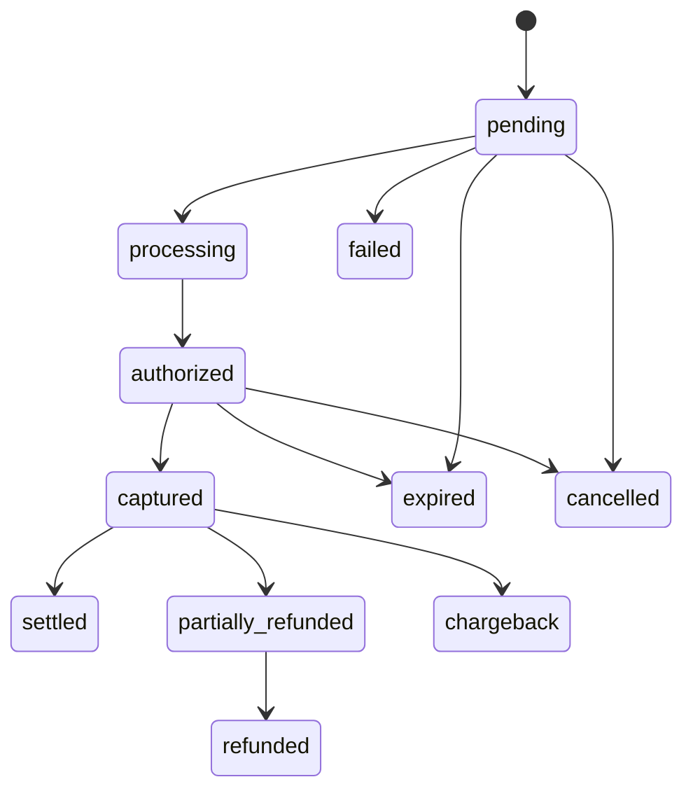

# Payment Lifecycle Module

> **Module documentation** for Merchant Pro v1.0.0-rc1. Cross-references: [PFS](../Product_Functional_Specification.md) · [Business Rules](../Business_Rules.md) · [Functional Requirements](../Functional_Requirements.md) · [User Journeys](../User_Journeys.md) · [Feature Matrix](../Feature_Matrix.md)

## Table of Contents

1. [Purpose](#1-purpose) · 2. [Business Objective](#2-business-objective) · 3. [Scope](#3-scope) · 4. [Primary Users](#4-primary-users) · 5. [Key Capabilities](#5-key-capabilities) · 6. [Dependencies](#6-dependencies) · 7. [Architecture Overview](#7-architecture-overview) · 8. [Inputs](#8-inputs) · 9. [Outputs](#9-outputs) · 10. [Business Rules](#10-business-rules) · 11. [Permissions and RBAC](#11-permissions-and-rbac) · 12. [API Reference](#12-api-reference) · 13. [Frontend Routes](#13-frontend-routes) · 14. [Data Model](#14-data-model) · 15. [Workflows and State Machines](#15-workflows-and-state-machines) · 16. [Integration Points](#16-integration-points) · 17. [Security Considerations](#17-security-considerations) · 18. [Success Criteria](#18-success-criteria) · 19. [Error Scenarios](#19-error-scenarios) · 20. [Operational Considerations](#20-operational-considerations) · 21. [Related Functional Requirements](#21-related-functional-requirements) · 22. [Related User Journeys](#22-related-user-journeys) · 23. [Feature Matrix Reference](#23-feature-matrix-reference) · 24. [Limitations and Status](#24-limitations-and-status) · 25. [Future Enhancements](#25-future-enhancements)

---

## 1. Purpose

Define and enforce the payment intent state machine, order/session lifecycles, transition validation, timeline recording, and webhook event mapping.

## 2. Business Objective

Ensure every payment follows a deterministic, auditable lifecycle with no illegal state mutations. Complements [Payments.md](./Payments.md) with lifecycle-specific detail.

## 3. Scope

Payment intent statuses and transitions (`payment-status.ts`), order statuses, session statuses, `canTransition()` guard, timeline events, and webhook event types. API operations documented in Payments module.

## 4. Primary Users

| Persona | Usage |
|---------|-------|
| Developer | Understand integration state handling |
| Finance User | Interpret payment statuses |
| Operations | Investigate stuck or failed transitions |
| System | Enforces transitions programmatically |

## 5. Key Capabilities

| Capability | Description |
|------------|-------------|
| State machine | `PAYMENT_STATUS_TRANSITIONS` map |
| Transition guard | `canTransition(from, to)` function |
| Timeline | Records each transition with timestamp |
| Terminal states | failed, expired, refunded, chargeback, cancelled |
| Order lifecycle | draft → pending → paid → refunded |
| Session lifecycle | open → complete/expired/cancelled |
| Webhook mapping | Status change triggers event type |

## 6. Dependencies

| Dependency | Purpose |
|------------|---------|
| Payments module | Invokes lifecycle on API actions |
| Webhooks | Emits events on transitions |
| Audit | Timeline persisted for compliance |

## 7. Architecture Overview

Source: `Backend_Fintech/src/app/modules/payments/constants/payment-status.ts`

## 8. Inputs

| Input | Description |
|-------|-------------|
| Current status | Payment intent current state |
| Target status | Requested transition |
| Action type | authorize, capture, cancel, refund, expire |

## 9. Outputs

| Output | Description |
|--------|-------------|
| Updated status | New payment intent state |
| Timeline entry | from_status, to_status, metadata |
| Webhook event | One of WEBHOOK_EVENTS constants |

## 10. Business Rules

**BR-PAY-002**: Only valid state transitions allowed via `canTransition()`.
**BR-PAY-003**: Terminal states cannot transition further.
**BR-PAY-004**: Capture requires prior `authorized` state.
**BR-PAY-006**: Partial refund → `partially_refunded`.
**BR-PAY-007**: Events emit webhooks on key transitions.

## 11. Permissions and RBAC

Lifecycle transitions inherit permissions from [Payments.md](./Payments.md):

| Transition | Permission |
|------------|------------|
| authorize/capture | `payments:capture` |
| cancel/expire/retry | `payments:manage` |
| refund | `payments:refund` |

## 12. API Reference

Lifecycle triggered via [Payments API](./Payments.md#12-api-reference):

| Action | Endpoint | Resulting Status |
|--------|----------|------------------|
| Create | POST `/api/v1/payments` | `pending` |
| Authorize | POST `/:id/authorize` | `authorized` |
| Capture | POST `/:id/capture` | `captured` |
| Cancel | POST `/:id/cancel` | `cancelled` |
| Refund | POST `/:id/refund` | `refunded` / `partially_refunded` |
| Expire | POST `/:id/expire` | `expired` |

## 13. Frontend Routes

Payment timeline visible on transaction detail views at `/transactions`.

## 14. Data Model

### Payment Intent Statuses

| Status | Terminal | Description |
|--------|----------|-------------|
| `pending` | No | Created, awaiting action |
| `processing` | No | Gateway processing |
| `authorized` | No | Funds held |
| `captured` | No | Funds captured |
| `settled` | No | Settlement complete |
| `failed` | Yes | Payment failed |
| `expired` | Yes | Intent expired |
| `refunded` | Yes | Fully refunded |
| `partially_refunded` | No | Partial refund applied |
| `chargeback` | Yes | Dispute recorded |
| `cancelled` | Yes | Cancelled before capture |

### Transition Map

| From | Allowed To |
|------|------------|
| pending | processing, authorized, failed, expired, cancelled |
| processing | authorized, failed, cancelled |
| authorized | captured, cancelled, failed, expired |
| captured | settled, refunded, partially_refunded, chargeback |
| settled | refunded, partially_refunded, chargeback |
| partially_refunded | refunded, chargeback |

### Webhook Events

`payment.created`, `payment.authorized`, `payment.captured`, `payment.failed`, `payment.refunded`, `payment.settled`

## 15. Workflows and State Machines

### Order Status Lifecycle

| Status | Description |
|--------|-------------|
| draft | Order created, not submitted |
| pending | Awaiting payment |
| paid | Fully paid |
| partial_paid | Partial payment received |
| expired | Order expired |
| cancelled | Order cancelled |
| refunded | Order refunded |

### Session Status Lifecycle

| Status | Description |
|--------|-------------|
| open | Session active |
| complete | Payment completed |
| expired | Session timed out |
| cancelled | Session cancelled |

## 16. Integration Points

| Module | Event |
|--------|-------|
| Webhooks | Status → event type mapping |
| Refunds | captured/settled → refunded |
| Chargebacks | captured/settled → chargeback |
| Checkout | Session complete → payment captured |
| Operations | Failed payment investigation |

## 17. Security Considerations

- Transition guard prevents state manipulation via API
- Timeline immutable after write
- Terminal states reject further mutations
- Refund amount capped at captured total

## 18. Success Criteria

| Criterion | Measure |
|-----------|---------|
| No illegal transitions | 100% rejected at guard |
| Timeline completeness | Every transition logged |
| Webhook accuracy | Correct event per transition |

## 19. Error Scenarios

| Scenario | Result |
|----------|--------|
| Capture on pending | Rejected — must authorize first |
| Refund on authorized | Rejected — must capture first |
| Transition from terminal | Rejected — no outgoing edges |
| Partial refund over limit | Rejected — amount guard |

## 20. Operational Considerations

- Monitor payments stuck in `processing`
- Alert on high `expired` rate (checkout UX issue)
- Dead letter review for webhook delivery failures post-transition

## 21. Related Functional Requirements

FR-PAY-002 through FR-PAY-006 in [Functional Requirements](../Functional_Requirements.md#payments-fr-pay).

## 22. Related User Journeys

See [User Journeys](../User_Journeys.md) — end-to-end payment completion flows.

## 23. Feature Matrix Reference

See [Feature Matrix](../Feature_Matrix.md) — payment operations by role.

## 24. Limitations and Status

| Limitation | Notes |
|------------|-------|
| Async processing | Gateway callbacks may delay processing→authorized |
| **Status** | **Implemented** |

## 25. Future Enhancements

- Visual lifecycle debugger in Operations Center
- Configurable auto-expire durations per merchant
- State machine versioning for gateway migrations
- Predictive alerts for anomalous transition patterns
