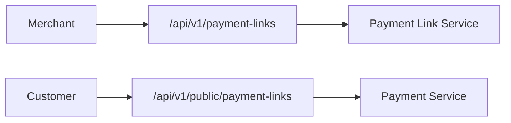
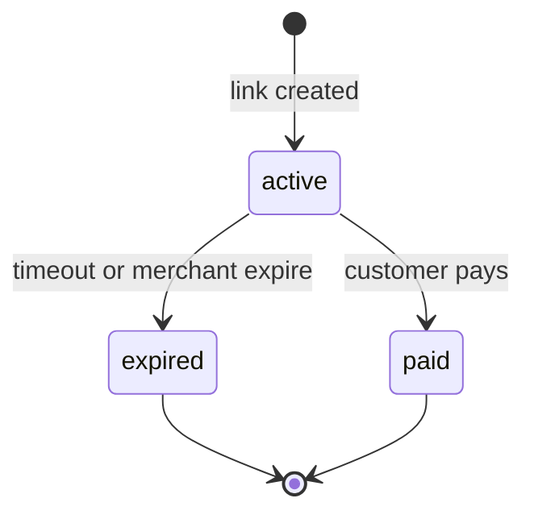

# Payment Links Module

> **Module documentation** for Merchant Pro v1.0.0-rc1. Cross-references: [PFS](../Product_Functional_Specification.md) · [Business Rules](../Business_Rules.md) · [Functional Requirements](../Functional_Requirements.md) · [User Journeys](../User_Journeys.md) · [Feature Matrix](../Feature_Matrix.md)

## Table of Contents

1. [Purpose](#1-purpose) · 2. [Business Objective](#2-business-objective) · 3. [Scope](#3-scope) · 4. [Primary Users](#4-primary-users) · 5. [Key Capabilities](#5-key-capabilities) · 6. [Dependencies](#6-dependencies) · 7. [Architecture Overview](#7-architecture-overview) · 8. [Inputs](#8-inputs) · 9. [Outputs](#9-outputs) · 10. [Business Rules](#10-business-rules) · 11. [Permissions and RBAC](#11-permissions-and-rbac) · 12. [API Reference](#12-api-reference) · 13. [Frontend Routes](#13-frontend-routes) · 14. [Data Model](#14-data-model) · 15. [Workflows and State Machines](#15-workflows-and-state-machines) · 16. [Integration Points](#16-integration-points) · 17. [Security Considerations](#17-security-considerations) · 18. [Success Criteria](#18-success-criteria) · 19. [Error Scenarios](#19-error-scenarios) · 20. [Operational Considerations](#20-operational-considerations) · 21. [Related Functional Requirements](#21-related-functional-requirements) · 22. [Related User Journeys](#22-related-user-journeys) · 23. [Feature Matrix Reference](#23-feature-matrix-reference) · 24. [Limitations and Status](#24-limitations-and-status) · 25. [Future Enhancements](#25-future-enhancements)

---

## 1. Purpose

Create shareable payment URLs enabling merchants to collect payments via email, SMS, or social channels without a full checkout integration.

## 2. Business Objective

Provide lightweight payment collection with merchant-controlled expiry and deactivation. Aligns with [PFS §7.9](../Product_Functional_Specification.md#79-payment-links).

## 3. Scope

Payment link CRUD, expire/disable, public pay page, and link analytics. Distinct from hosted checkout sessions.

## 4. Primary Users

| Persona | Usage |
|---------|-------|
| Merchant Admin | Create and share payment links |
| Finance User | Track link payments |
| End Customer | Pay via shared URL |

## 5. Key Capabilities

| Capability | Description |
|------------|-------------|
| Link create | Amount, description, expiry |
| Public pay | Token-based payment page |
| Expire | Merchant-initiated deactivation |
| Listing | Active and expired links |
| Share URL | `/pay/:token` public route |

## 6. Dependencies

| Dependency | Purpose |
|------------|---------|
| Payments | Payment intent on pay |
| Merchants | Merchant scoping |
| Invoices | Optional invoice linkage |
| Authorization | payment_links:* permissions |

## 7. Architecture Overview

## 8. Inputs

| Input | Description |
|-------|-------------|
| amount, currency | Payment amount |
| merchantId | Target merchant |
| description | Customer-facing label |
| expiry | Optional expiration datetime |
| customerEmail | Optional pre-fill |

## 9. Outputs

| Output | Description |
|--------|-------------|
| Payment link | id, token, status, URL |
| Payment record | On successful public pay |

## 10. Business Rules

**BR-PUB-002**: Validates token and amount on pay.
**BR-PUB-003**: Expired links reject payment.

## 11. Permissions and RBAC

| Permission | Action |
|------------|--------|
| `payment_links:read` | List and view links |
| `payment_links:write` | Create links |
| `payment_links:manage` | Expire, delete |

## 12. API Reference

### Authenticated — `/api/v1/payment-links`

| Method | Path | Permission | Description |
|--------|------|------------|-------------|
| GET | `/api/v1/payment-links` | `payment_links:read` | List payment links |
| POST | `/api/v1/payment-links` | `payment_links:write` | Create link |
| GET | `/api/v1/payment-links/:id` | `payment_links:read` | Get link detail |
| POST | `/api/v1/payment-links/:id/expire` | `payment_links:manage` | Expire active link |
| DELETE | `/api/v1/payment-links/:id` | `payment_links:manage` | Delete link |

### Public — `/api/v1/public/payment-links`

| Method | Path | Auth | Description |
|--------|------|------|-------------|
| GET | `/api/v1/public/payment-links/:token` | Public | Get link details for pay page |
| POST | `/api/v1/public/payment-links/:token/pay` | Public | Process customer payment |

| Public Frontend | `/pay/:token` |

## 13. Frontend Routes

| Route | Permission |
|-------|------------|
| `/payment-links` | `payment_links:read` |
| `/pay/:token` | Public |

## 14. Data Model

| Entity | Key Fields |
|--------|------------|
| `payment_links` | id, merchant_id, token, amount, status, expires_at |

## 15. Workflows and State Machines

## 16. Integration Points

| Module | Integration |
|--------|-------------|
| Payments | Intent create on pay |
| Invoices | Link embedded in invoice emails |
| Webhooks | payment.captured |
| Notifications | Link sharing via email |

## 17. Security Considerations

- Unguessable public tokens
- Expired links immediately reject pay
- Amount fixed at creation (tampering rejected)
- Rate limiting on public pay

## 18. Success Criteria

| Criterion | Measure |
|-----------|---------|
| Pay before expiry | Customer completes payment |
| Expire action | Immediate pay rejection |
| Org isolation | Links scoped to merchant org |

## 19. Error Scenarios

| Scenario | HTTP |
|----------|------|
| Expired link | 4xx |
| Already paid (single-use) | 4xx |
| Invalid token | 404 |

## 20. Operational Considerations

- Track link conversion rates
- Clean up expired links per retention policy
- Monitor public pay rate limits

## 21. Related Functional Requirements

FR-PL-001, FR-PL-002 in [Functional Requirements](../Functional_Requirements.md#checkout--public-pay-fr-chk).

## 22. Related User Journeys

See [User Journeys](../User_Journeys.md) — payment link sharing and customer pay.

## 23. Feature Matrix Reference

See [Feature Matrix](../Feature_Matrix.md) — Payment Links by role.

## 24. Limitations and Status

| Limitation | Notes |
|------------|-------|
| Recurring links | Single-use default in V1 |
| **Status** | **Implemented** |

## 25. Future Enhancements

- Multi-use payment links with usage limits
- Custom link slugs (vanity URLs)
- Link performance A/B testing
- WhatsApp/SMS direct share integration
