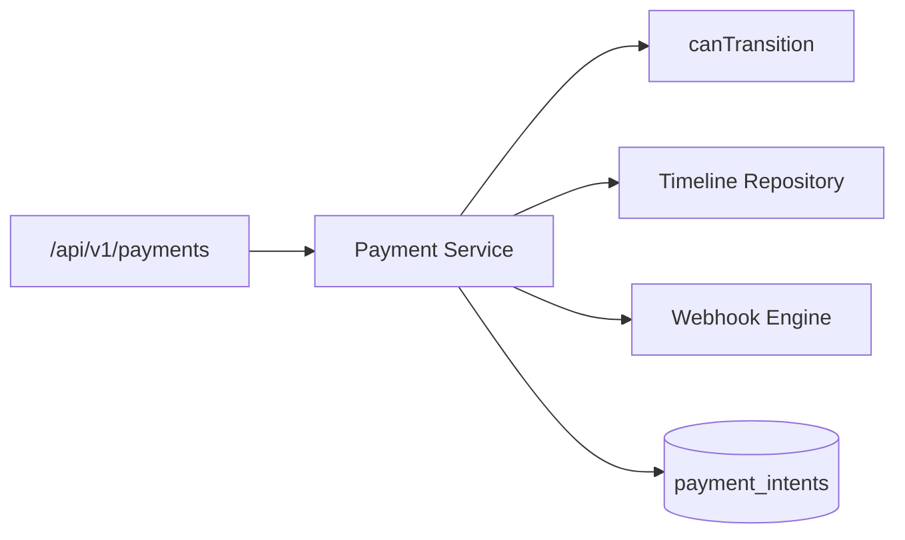
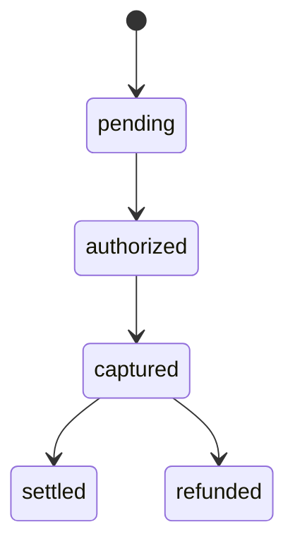

# Payments Module

> **Module documentation** for Merchant Pro v1.0.0-rc1. Cross-references: [PFS](../Product_Functional_Specification.md) · [Business Rules](../Business_Rules.md) · [Functional Requirements](../Functional_Requirements.md) · [User Journeys](../User_Journeys.md) · [Feature Matrix](../Feature_Matrix.md)

## Table of Contents

1. [Purpose](#1-purpose) · 2. [Business Objective](#2-business-objective) · 3. [Scope](#3-scope) · 4. [Primary Users](#4-primary-users) · 5. [Key Capabilities](#5-key-capabilities) · 6. [Dependencies](#6-dependencies) · 7. [Architecture Overview](#7-architecture-overview) · 8. [Inputs](#8-inputs) · 9. [Outputs](#9-outputs) · 10. [Business Rules](#10-business-rules) · 11. [Permissions and RBAC](#11-permissions-and-rbac) · 12. [API Reference](#12-api-reference) · 13. [Frontend Routes](#13-frontend-routes) · 14. [Data Model](#14-data-model) · 15. [Workflows and State Machines](#15-workflows-and-state-machines) · 16. [Integration Points](#16-integration-points) · 17. [Security Considerations](#17-security-considerations) · 18. [Success Criteria](#18-success-criteria) · 19. [Error Scenarios](#19-error-scenarios) · 20. [Operational Considerations](#20-operational-considerations) · 21. [Related Functional Requirements](#21-related-functional-requirements) · 22. [Related User Journeys](#22-related-user-journeys) · 23. [Feature Matrix Reference](#23-feature-matrix-reference) · 24. [Limitations and Status](#24-limitations-and-status) · 25. [Future Enhancements](#25-future-enhancements)

---

## 1. Purpose

Core payment intent processing including create, authorize, capture, cancel, refund, timeline tracking, and idempotent payment creation.

## 2. Business Objective

Reliable payment state management with strict lifecycle enforcement and webhook event emission. Aligns with [PFS §7.6](../Product_Functional_Specification.md#76-payments--payment-lifecycle).

## 3. Scope

Payment intents, orders, sessions, merchant config, customer profile for payments, and payment webhook delivery listing. State machine details in [Payment_Lifecycle.md](./Payment_Lifecycle.md).

## 4. Primary Users

| Persona | Usage |
|---------|-------|
| Finance User | View and manage payments |
| Operations User | Retry, expire, investigate failures |
| Developer | API integration for payment flows |
| End Customer | Indirect via checkout/QR/links |

## 5. Key Capabilities

| Capability | Description |
|------------|-------------|
| Create payment | Amount, currency, merchant, idempotency key |
| Authorize | Move intent to `authorized` |
| Capture | Capture authorized funds |
| Cancel | Cancel non-terminal intent |
| Refund | Full or partial refund on captured payment |
| Timeline | Audit trail of state transitions |
| Retry / Expire | Operational recovery actions |
| Orders & sessions | Payment order and session management |

## 6. Dependencies

| Dependency | Purpose |
|------------|---------|
| Merchants | `merchantId` validation |
| Customers | Customer profile linkage |
| Webhooks | Event emission on transitions |
| Authorization | `payments:*` permissions |
| Payment Lifecycle | `canTransition()` state machine |

## 7. Architecture Overview

## 8. Inputs

| Input | Description |
|-------|-------------|
| amount, currency | Payment amount in minor units |
| merchantId | Target merchant |
| idempotencyKey | Duplicate prevention |
| captureAmount | Partial capture value |
| refundAmount | Partial refund value |
| cancelReason | Cancellation metadata |

## 9. Outputs

| Output | Description |
|--------|-------------|
| Payment intent | id, status, amount, timeline |
| Order record | Aggregated order status |
| Session record | Payment session state |
| Webhook events | created, authorized, captured, etc. |

## 10. Business Rules

See [Business Rules — Payments](../Business_Rules.md#payments): **BR-PAY-001** through **BR-PAY-009**.

Payment intent statuses: `pending`, `processing`, `authorized`, `captured`, `settled`, `failed`, `expired`, `refunded`, `partially_refunded`, `chargeback`, `cancelled`.

## 11. Permissions and RBAC

| Permission | Action |
|------------|--------|
| `payments:read` | List, view, timeline, orders, sessions |
| `payments:write` | Create payment, create session |
| `payments:capture` | Authorize and capture |
| `payments:refund` | Refund captured payment |
| `payments:manage` | Cancel, retry, expire |

## 12. API Reference

Base path: `/api/v1/payments`

| Method | Path | Permission |
|--------|------|------------|
| GET | `/api/v1/payments` | `payments:read` |
| POST | `/api/v1/payments` | `payments:write` |
| GET | `/api/v1/payments/:id` | `payments:read` |
| GET | `/api/v1/payments/:id/timeline` | `payments:read` |
| POST | `/api/v1/payments/:id/authorize` | `payments:capture` |
| POST | `/api/v1/payments/:id/capture` | `payments:capture` |
| POST | `/api/v1/payments/:id/cancel` | `payments:manage` |
| POST | `/api/v1/payments/:id/refund` | `payments:refund` |
| POST | `/api/v1/payments/:id/retry` | `payments:manage` |
| POST | `/api/v1/payments/:id/expire` | `payments:manage` |
| GET | `/api/v1/payments/orders` | `payments:read` |
| POST | `/api/v1/payments/sessions` | `payments:write` |
| GET | `/api/v1/payments/webhooks/deliveries` | `payments:read` |

## 13. Frontend Routes

| Route | Permission |
|-------|------------|
| `/transactions` | `transactions:read` |

Payment operations accessible via Transactions UI and Developer API.

## 14. Data Model

| Entity | Key Fields |
|--------|------------|
| `payment_intents` | id, status, amount, currency, merchant_id, idempotency_key |
| `payment_timeline` | payment_id, from_status, to_status, event_at |
| `payment_orders` | id, status (draft/pending/paid/etc.) |
| `payment_sessions` | id, status (open/complete/expired/cancelled) |

## 15. Workflows and State Machines

See [Payment_Lifecycle.md](./Payment_Lifecycle.md) for full state diagram. Summary:

## 16. Integration Points

| Module | Integration |
|--------|-------------|
| Checkout | Creates payment on public pay |
| Refunds | Dedicated refund module + inline refund |
| Webhooks | Events: payment.created, authorized, captured, failed, refunded, settled |
| Chargebacks | Links to captured/settled payments |
| Sandbox | Simulated gateway responses |

## 17. Security Considerations

- Idempotency key prevents duplicate charges (BR-PAY-008)
- Amount validation on capture/refund
- Org and merchant scoping on all queries
- Invalid transitions rejected (BR-PAY-002)

## 18. Success Criteria

| Criterion | Measure |
|-----------|---------|
| Valid transitions only | Illegal state change returns 400/422 |
| Idempotency | Same key returns same intent |
| Webhook delivery | Events emitted on transitions |

## 19. Error Scenarios

| Scenario | HTTP |
|----------|------|
| Invalid transition | 400/422 |
| Capture on pending | 400 |
| Refund exceeds capture | 400 |
| Duplicate idempotency mismatch | 409 |

## 20. Operational Considerations

- Monitor failed/expired payment rates
- Operations Center failed payments queue
- Retry queue for transient gateway errors

## 21. Related Functional Requirements

See [Functional Requirements — Payments (FR-PAY)](../Functional_Requirements.md#payments-fr-pay): FR-PAY-001 through FR-PAY-007.

## 22. Related User Journeys

See [User Journeys](../User_Journeys.md) — payment creation, capture, and refund flows.

## 23. Feature Matrix Reference

See [Feature Matrix](../Feature_Matrix.md) — Payments by role.

## 24. Limitations and Status

| Limitation | Notes |
|------------|-------|
| Gateway | Simulated in sandbox; production gateway configurable |
| **Status** | **Implemented** |

## 25. Future Enhancements

- Multi-capture (incremental authorization)
- Payment method tokenization vault
- Real-time 3DS flow integration
- Payment routing rules engine
