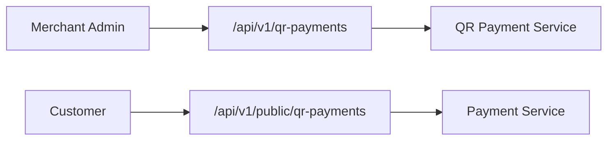
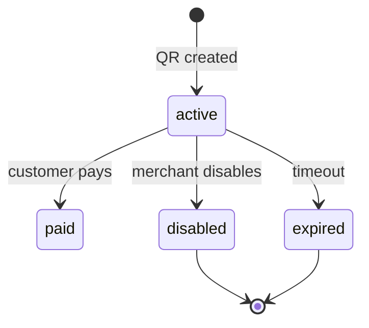

# QR Payments Module

> **Module documentation** for Merchant Pro v1.0.0-rc1. Cross-references: [PFS](../Product_Functional_Specification.md) · [Business Rules](../Business_Rules.md) · [Functional Requirements](../Functional_Requirements.md) · [User Journeys](../User_Journeys.md) · [Feature Matrix](../Feature_Matrix.md)

## Table of Contents

1. [Purpose](#1-purpose) · 2. [Business Objective](#2-business-objective) · 3. [Scope](#3-scope) · 4. [Primary Users](#4-primary-users) · 5. [Key Capabilities](#5-key-capabilities) · 6. [Dependencies](#6-dependencies) · 7. [Architecture Overview](#7-architecture-overview) · 8. [Inputs](#8-inputs) · 9. [Outputs](#9-outputs) · 10. [Business Rules](#10-business-rules) · 11. [Permissions and RBAC](#11-permissions-and-rbac) · 12. [API Reference](#12-api-reference) · 13. [Frontend Routes](#13-frontend-routes) · 14. [Data Model](#14-data-model) · 15. [Workflows and State Machines](#15-workflows-and-state-machines) · 16. [Integration Points](#16-integration-points) · 17. [Security Considerations](#17-security-considerations) · 18. [Success Criteria](#18-success-criteria) · 19. [Error Scenarios](#19-error-scenarios) · 20. [Operational Considerations](#20-operational-considerations) · 21. [Related Functional Requirements](#21-related-functional-requirements) · 22. [Related User Journeys](#22-related-user-journeys) · 23. [Feature Matrix Reference](#23-feature-matrix-reference) · 24. [Limitations and Status](#24-limitations-and-status) · 25. [Future Enhancements](#25-future-enhancements)

---

## 1. Purpose

Generate and manage QR code-based payment requests enabling customers to scan-to-pay at physical or digital points of sale.

## 2. Business Objective

Enable fast in-person and remote QR-initiated payments with merchant-controlled activation and disable. Aligns with [PFS §7.8](../Product_Functional_Specification.md#78-qr-payments).

## 3. Scope

Static and dynamic QR payment creation, listing, disable, and public pay endpoint. QR image generation and display.

## 4. Primary Users

| Persona | Usage |
|---------|-------|
| Merchant Admin | Create and manage QR payments |
| Outlet Staff | Display QR at point of sale |
| End Customer | Scan and pay via mobile |

## 5. Key Capabilities

| Capability | Description |
|------------|-------------|
| QR create | Static (fixed amount) or dynamic QR |
| Public pay | Token-based unauthenticated payment |
| Disable | Deactivate active QR codes |
| Listing | Paginated QR payment directory |
| Token URL | Public pay at `/qr/:token` |

## 6. Dependencies

| Dependency | Purpose |
|------------|---------|
| Payments | Payment on scan-to-pay |
| Merchants | Merchant scoping |
| Authorization | qr_payments:* permissions |

## 7. Architecture Overview

## 8. Inputs

| Input | Description |
|-------|-------------|
| merchantId | Target merchant |
| amount | Fixed or customer-entered |
| type | static / dynamic |
| description | Payment label |
| expiry | Optional expiration |

## 9. Outputs

| Output | Description |
|--------|-------------|
| QR record | id, token, status |
| Public URL | `/qr/:token` |
| QR image | Encoded payment link |

## 10. Business Rules

**BR-PUB-002**: Payment link/QR pay validates token and amount.
**BR-PUB-003**: Expired/disabled QR rejects payment.

## 11. Permissions and RBAC

| Permission | Action |
|------------|--------|
| `qr_payments:read` | List and view QR payments |
| `qr_payments:write` | Create QR payments |
| `qr_payments:manage` | Disable, delete |

## 12. API Reference

### Authenticated — `/api/v1/qr-payments`

| Method | Path | Permission | Description |
|--------|------|------------|-------------|
| GET | `/api/v1/qr-payments` | `qr_payments:read` | List QR payments |
| POST | `/api/v1/qr-payments` | `qr_payments:write` | Create QR payment |
| GET | `/api/v1/qr-payments/:id` | `qr_payments:read` | Get QR detail |
| POST | `/api/v1/qr-payments/:id/disable` | `qr_payments:manage` | Disable active QR |

### Public — `/api/v1/public/qr-payments`

| Method | Path | Auth | Description |
|--------|------|------|-------------|
| GET | `/api/v1/public/qr-payments/:token` | Public | QR payment page data |
| POST | `/api/v1/public/qr-payments/:token/pay` | Public | Process scan-to-pay |

| Frontend Public Route | Description |
|-----------------------|-------------|
| `/qr/:token` | Customer payment page |

## 13. Frontend Routes

| Route | Permission |
|-------|------------|
| `/qr-payments` | `qr_payments:read` |
| `/qr/:token` | Public |

## 14. Data Model

| Entity | Key Fields |
|--------|------------|
| `qr_payments` | id, merchant_id, token, amount, type, status, expires_at |

## 15. Workflows and State Machines

## 16. Integration Points

| Module | Integration |
|--------|-------------|
| Payments | Intent on public pay |
| Webhooks | payment.captured |
| Outlets | QR assigned to outlet (optional) |
| Devices | Terminal QR display |

## 17. Security Considerations

- Token is cryptographically unguessable
- Disabled QR returns payment rejected
- Amount validation on pay
- Rate limiting on public endpoint

## 18. Success Criteria

| Criterion | Measure |
|-----------|---------|
| Scan-to-pay | Customer completes payment |
| Disable | Public pay rejected immediately |
| Org scope | QR visible only in merchant org |

## 19. Error Scenarios

| Scenario | HTTP |
|----------|------|
| Disabled QR | 4xx payment rejected |
| Expired QR | 4xx |
| Invalid token | 404 |
| Amount mismatch | 400 |

## 20. Operational Considerations

- Monitor QR conversion rates by merchant
- Review expired active QRs for cleanup
- Outlet-level QR usage analytics

## 21. Related Functional Requirements

FR-QR-001, FR-QR-002 in [Functional Requirements](../Functional_Requirements.md#checkout--public-pay-fr-chk).

## 22. Related User Journeys

See [User Journeys](../User_Journeys.md) — QR scan-to-pay flow.

## 23. Feature Matrix Reference

See [Feature Matrix](../Feature_Matrix.md) — QR Payments by role.

## 24. Limitations and Status

| Limitation | Notes |
|------------|-------|
| UPI deep link | Standard HTTPS QR only in V1 |
| **Status** | **Implemented** |

## 25. Future Enhancements

- UPI intent QR standard support
- Bulk QR generation for outlets
- Real-time QR payment notifications
- Dynamic amount entry on scan page
