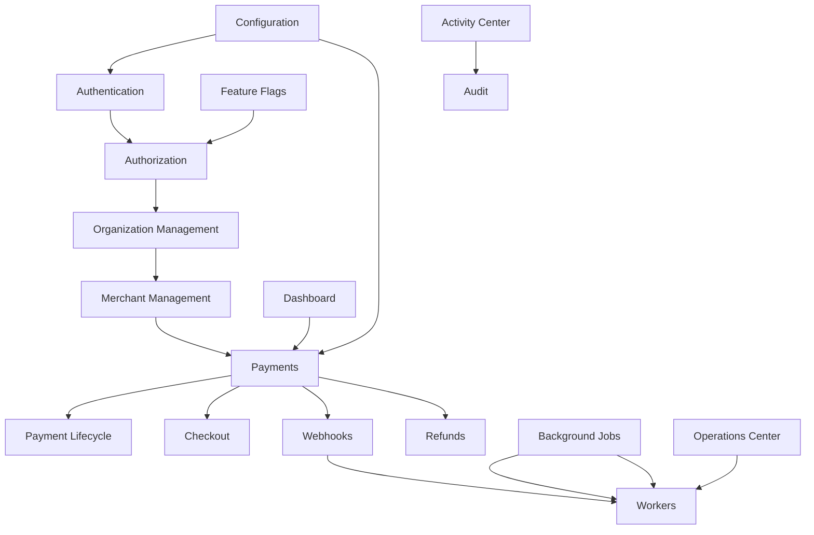

# Module Documentation Index

Enterprise module documentation for **Merchant Pro v1.0.0-rc1**. Each module document contains 25 sections (Purpose through Future Enhancements) with cross-references to parent product documents.

## Parent Documents

| Document | Description |
|----------|-------------|
| [Product_Functional_Specification.md](../Product_Functional_Specification.md) | Master PFS — complete product definition |
| [Business_Rules.md](../Business_Rules.md) | Numbered business rules (BR-) |
| [Functional_Requirements.md](../Functional_Requirements.md) | Numbered requirements (FR-) |
| [User_Journeys.md](../User_Journeys.md) | End-to-end user flows |
| [Feature_Matrix.md](../Feature_Matrix.md) | Module × role × status matrix |

## Module Catalog

### Identity & Access

| Module | Description | API Base |
|--------|-------------|----------|
| [Authentication.md](./Authentication.md) | Login, MFA, sessions, CSRF, password reset | `/api/auth/*` |
| [Authorization.md](./Authorization.md) | RBAC, 144 permissions, org/merchant caps | Middleware |
| [Organization_Management.md](./Organization_Management.md) | Tenant orgs, members, domains, API keys | `/api/v1/organizations` |

### Merchant Domain

| Module | Description | API Base |
|--------|-------------|----------|
| [Merchant_Management.md](./Merchant_Management.md) | Merchant CRUD, KYC, status lifecycle | `/api/v1/merchants` |
| [Merchant_Users.md](./Merchant_Users.md) | Portal users, outlet scoping | `/api/v1/merchant-users` |

### Payments

| Module | Description | API Base |
|--------|-------------|----------|
| [Payments.md](./Payments.md) | Payment intents — authorize/capture/cancel/refund | `/api/v1/payments` |
| [Payment_Lifecycle.md](./Payment_Lifecycle.md) | State machine, transitions, webhook events | (see Payments) |
| [Checkout.md](./Checkout.md) | Hosted checkout sessions + public pay | `/api/v1/checkout`, `/api/v1/public/checkout` |
| [QR_Payments.md](./QR_Payments.md) | QR scan-to-pay | `/api/v1/qr-payments` |
| [Payment_Links.md](./Payment_Links.md) | Shareable payment URLs | `/api/v1/payment-links` |
| [Refunds.md](./Refunds.md) | Full/partial refunds, approval workflow | `/api/v1/refunds` |
| [Chargebacks.md](./Chargebacks.md) | Dispute management | `/api/v1/chargebacks` |
| [Subscriptions.md](./Subscriptions.md) | Recurring billing plans | `/api/v1/subscriptions` |
| [Invoices.md](./Invoices.md) | Customer invoicing, PDF, email | `/api/v1/invoices` |

### Developer & Integration

| Module | Description | API Base |
|--------|-------------|----------|
| [Developer_Portal.md](./Developer_Portal.md) | OAuth apps, API keys, usage logs | `/api/v1/developer` |
| [Sandbox.md](./Sandbox.md) | Test environment, payment simulation | `/api/v1/sandbox` |
| [Webhooks.md](./Webhooks.md) | HMAC SHA256 delivery, retry backoff | `/api/v1/webhooks` |

### Platform Services

| Module | Description | API Base |
|--------|-------------|----------|
| [Notifications.md](./Notifications.md) | Inbox, broadcast, email delivery | `/api/v1/notifications` |
| [Reports.md](./Reports.md) | Templates, analytics, scheduled reports | `/api/v1/reports`, `/api/v1/analytics` |
| [Audit.md](./Audit.md) | Compliance audit logs, export | `/api/v1/audit` |
| [Feature_Flags.md](./Feature_Flags.md) | Feature toggles, route gating | `/api/v1/settings/feature-flags` |
| [Configuration.md](./Configuration.md) | Settings, payment config, pricing | `/api/v1/settings`, `/api/v1/payment-config` |

### Infrastructure

| Module | Description | Process |
|--------|-------------|---------|
| [Background_Jobs.md](./Background_Jobs.md) | Async job queue (4 job types) | `background_jobs` table |
| [Workers.md](./Workers.md) | Queue polling, webhook delivery | `worker.ts` process |

### Operations & Visibility

| Module | Description | API Base |
|--------|-------------|----------|
| [Dashboard.md](./Dashboard.md) | Executive KPI dashboard | `/api/v1/dashboard/executive` |
| [Search_Center.md](./Search_Center.md) | Cross-module global search | `/api/v1/search` |
| [Operations_Center.md](./Operations_Center.md) | Alerts, retry queue, failed items | `/api/v1/operations` |
| [Activity_Center.md](./Activity_Center.md) | Recent activity feed | `/api/v1/activity` |
| [System_Health.md](./System_Health.md) | Liveness, readiness, health probes | `/api/live`, `/api/ready`, `/api/health` |

## Module Dependency Overview

## Key Platform Facts

| Fact | Value |
|------|-------|
| Permissions | 144 in `permissions.ts` |
| Payment statuses | pending, processing, authorized, captured, settled, failed, expired, refunded, partially_refunded, chargeback, cancelled |
| Background job types | invoice_email, password_reset_email, notification_email, webhook_delivery |
| Webhook signing | HMAC-SHA256 — `t={timestamp},v1={hex}` |
| Webhook retry | Exponential backoff, max 3 attempts, max 3600s delay |

## Document Structure

Each module document follows this 25-section structure:

1. Purpose · 2. Business Objective · 3. Scope · 4. Primary Users · 5. Key Capabilities · 6. Dependencies · 7. Architecture Overview · 8. Inputs · 9. Outputs · 10. Business Rules · 11. Permissions and RBAC · 12. API Reference · 13. Frontend Routes · 14. Data Model · 15. Workflows and State Machines · 16. Integration Points · 17. Security Considerations · 18. Success Criteria · 19. Error Scenarios · 20. Operational Considerations · 21. Related Functional Requirements · 22. Related User Journeys · 23. Feature Matrix Reference · 24. Limitations and Status · 25. Future Enhancements

## Version

| Field | Value |
|-------|-------|
| Product | Merchant Pro — Merchant Management Portal |
| Release | v1.0.0-rc1 |
| Module docs | 29 modules |
| Last updated | 29 July 2026 |
