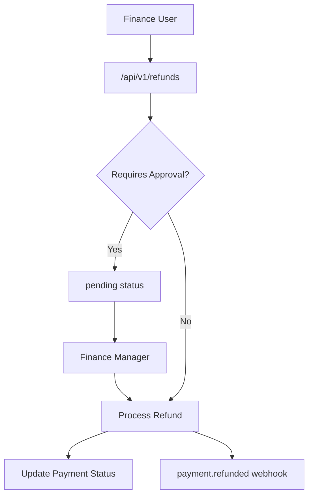
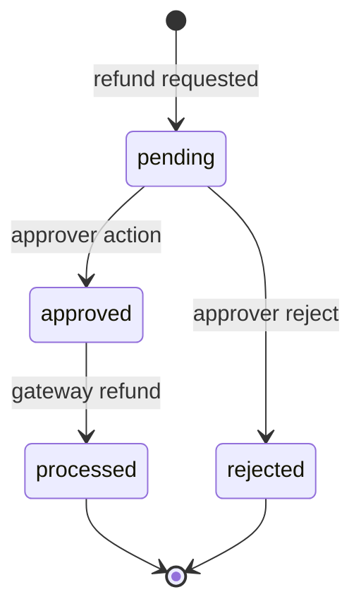

# Refunds Module

> **Module documentation** for Merchant Pro v1.0.0-rc1. Cross-references: [PFS](../Product_Functional_Specification.md) · [Business Rules](../Business_Rules.md) · [Functional Requirements](../Functional_Requirements.md) · [User Journeys](../User_Journeys.md) · [Feature Matrix](../Feature_Matrix.md)

## Table of Contents

1. [Purpose](#1-purpose) · 2. [Business Objective](#2-business-objective) · 3. [Scope](#3-scope) · 4. [Primary Users](#4-primary-users) · 5. [Key Capabilities](#5-key-capabilities) · 6. [Dependencies](#6-dependencies) · 7. [Architecture Overview](#7-architecture-overview) · 8. [Inputs](#8-inputs) · 9. [Outputs](#9-outputs) · 10. [Business Rules](#10-business-rules) · 11. [Permissions and RBAC](#11-permissions-and-rbac) · 12. [API Reference](#12-api-reference) · 13. [Frontend Routes](#13-frontend-routes) · 14. [Data Model](#14-data-model) · 15. [Workflows and State Machines](#15-workflows-and-state-machines) · 16. [Integration Points](#16-integration-points) · 17. [Security Considerations](#17-security-considerations) · 18. [Success Criteria](#18-success-criteria) · 19. [Error Scenarios](#19-error-scenarios) · 20. [Operational Considerations](#20-operational-considerations) · 21. [Related Functional Requirements](#21-related-functional-requirements) · 22. [Related User Journeys](#22-related-user-journeys) · 23. [Feature Matrix Reference](#23-feature-matrix-reference) · 24. [Limitations and Status](#24-limitations-and-status) · 25. [Future Enhancements](#25-future-enhancements)

---

## 1. Purpose

Process full and partial refunds on captured payments with optional approval workflow, linking refund records to payment intents and settlement adjustments.

## 2. Business Objective

Enable compliant fund return with approval gates for high-value or policy-required refunds. Aligns with [PFS §7.10](../Product_Functional_Specification.md#710-refunds).

## 3. Scope

Dedicated refund module CRUD plus inline refund via Payments API (`POST /api/v1/payments/:id/refund`). Approval workflow for pending refunds.

## 4. Primary Users

| Persona | Usage |
|---------|-------|
| Finance User | Initiate and view refunds |
| Finance Manager | Approve pending refunds |
| Operations | Investigate failed refunds |

## 5. Key Capabilities

| Capability | Description |
|------------|-------------|
| Full refund | Return entire captured amount |
| Partial refund | Return portion; status `partially_refunded` |
| Approval workflow | Pending → approved → processed |
| Refund listing | Search and filter refunds |
| Payment linkage | Refund tied to payment intent |
| Inline refund | Via payments API endpoint |

## 6. Dependencies

| Dependency | Purpose |
|------------|---------|
| Payments | Source payment must be captured/settled |
| Payment Lifecycle | Status transition to refunded |
| Webhooks | payment.refunded event |
| Settlements | Settlement adjustment |

## 7. Architecture Overview

## 8. Inputs

| Input | Description |
|-------|-------------|
| paymentId | Target captured payment |
| amount | Refund amount (≤ captured) |
| reason | Refund justification |
| approvalNote | Approver comment |

## 9. Outputs

| Output | Description |
|--------|-------------|
| Refund record | id, status, amount, payment_id |
| Updated payment | refunded or partially_refunded |
| Webhook event | payment.refunded |

## 10. Business Rules

**BR-REF-001**: Requires `payments:refund` or module approve workflow.
**BR-REF-002**: Pending refunds require approval before processing.
**BR-PAY-005**: Refund amount cannot exceed captured amount.
**BR-PAY-006**: Partial refund → `partially_refunded`.

## 11. Permissions and RBAC

| Permission | Action |
|------------|--------|
| `refunds:read` | List and view refunds |
| `refunds:write` | Create refund requests |
| `refunds:approve` | Approve pending refunds |
| `payments:refund` | Inline refund via payments API |

## 12. API Reference

Base path: `/api/v1/refunds` — authenticated, org-scoped.

| Method | Path | Permission |
|--------|------|------------|
| GET | `/api/v1/refunds` | `refunds:read` |
| POST | `/api/v1/refunds` | `refunds:write` |
| GET | `/api/v1/refunds/:id` | `refunds:read` |
| POST | `/api/v1/refunds/:id/approve` | `refunds:approve` |

Inline: `POST /api/v1/payments/:id/refund` with `payments:refund`.

## 13. Frontend Routes

| Route | Permission |
|-------|------------|
| `/refunds` | `refunds:read` |

## 14. Data Model

| Entity | Key Fields |
|--------|------------|
| `refunds` | id, payment_id, amount, status, reason, approved_by |
| `payment_intents` | status updated on refund |

## 15. Workflows and State Machines

Payment intent: `captured` → `partially_refunded` → `refunded`.

## 16. Integration Points

| Module | Integration |
|--------|-------------|
| Payments | Status update, inline refund |
| Webhooks | payment.refunded |
| Settlements | Adjustment entries |
| Audit | Refund actions logged |

## 17. Security Considerations

- Amount capped at captured total
- Approval required for policy-configured thresholds
- Org-scoped refund queries
- Dual permission paths (write vs approve)

## 18. Success Criteria

| Criterion | Measure |
|-----------|---------|
| Full refund | Payment status `refunded` |
| Partial refund | Status `partially_refunded` |
| Approval gate | Pending until approved |

## 19. Error Scenarios

| Scenario | HTTP |
|----------|------|
| Refund exceeds capture | 400 |
| Payment not captured | 400 |
| Unauthorized approval | 403 |
| Already fully refunded | 400 |

## 20. Operational Considerations

- Monitor pending refund queue age
- Failed refund retry via Operations Center
- Reconciliation of refund vs settlement

## 21. Related Functional Requirements

FR-REF-001 through FR-REF-003 in [Functional Requirements](../Functional_Requirements.md#refunds--chargebacks-fr-ref).

## 22. Related User Journeys

See [User Journeys](../User_Journeys.md) — refund initiation and approval.

## 23. Feature Matrix Reference

See [Feature Matrix](../Feature_Matrix.md) — Refunds by role.

## 24. Limitations and Status

| Limitation | Notes |
|------------|-------|
| Instant refund | Gateway timing varies |
| **Status** | **Implemented** |

## 25. Future Enhancements

- Automated refund rules (e.g., cancellation window)
- Bulk refund processing
- Customer-initiated refund requests portal
- Refund reason code taxonomy
