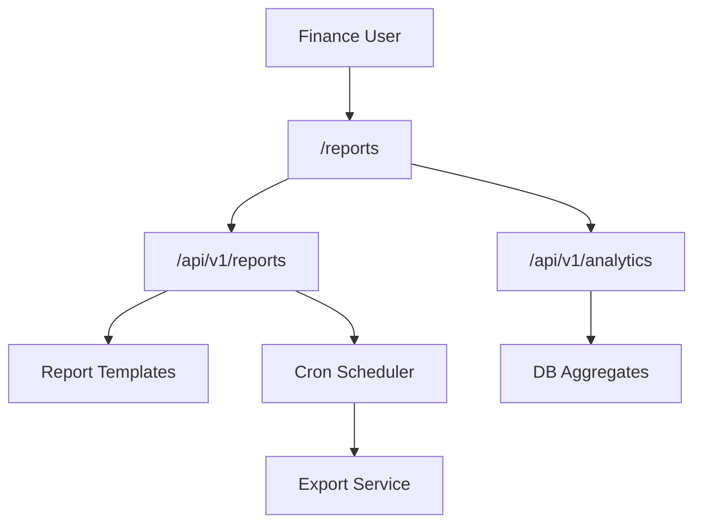
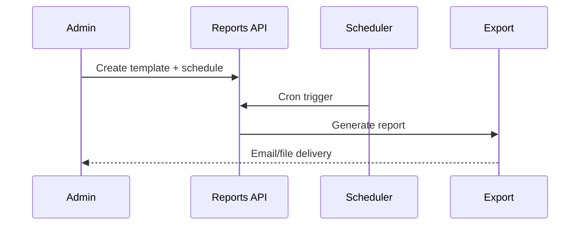

# Reports Module

> **Module documentation** for Merchant Pro v1.0.0-rc1. Cross-references: [PFS](../Product_Functional_Specification.md) · [Business Rules](../Business_Rules.md) · [Functional Requirements](../Functional_Requirements.md) · [User Journeys](../User_Journeys.md) · [Feature Matrix](../Feature_Matrix.md)

## Table of Contents

1. [Purpose](#1-purpose) · 2. [Business Objective](#2-business-objective) · 3. [Scope](#3-scope) · 4. [Primary Users](#4-primary-users) · 5. [Key Capabilities](#5-key-capabilities) · 6. [Dependencies](#6-dependencies) · 7. [Architecture Overview](#7-architecture-overview) · 8. [Inputs](#8-inputs) · 9. [Outputs](#9-outputs) · 10. [Business Rules](#10-business-rules) · 11. [Permissions and RBAC](#11-permissions-and-rbac) · 12. [API Reference](#12-api-reference) · 13. [Frontend Routes](#13-frontend-routes) · 14. [Data Model](#14-data-model) · 15. [Workflows and State Machines](#15-workflows-and-state-machines) · 16. [Integration Points](#16-integration-points) · 17. [Security Considerations](#17-security-considerations) · 18. [Success Criteria](#18-success-criteria) · 19. [Error Scenarios](#19-error-scenarios) · 20. [Operational Considerations](#20-operational-considerations) · 21. [Related Functional Requirements](#21-related-functional-requirements) · 22. [Related User Journeys](#22-related-user-journeys) · 23. [Feature Matrix Reference](#23-feature-matrix-reference) · 24. [Limitations and Status](#24-limitations-and-status) · 25. [Future Enhancements](#25-future-enhancements)

---

## 1. Purpose

Business reporting and analytics including report templates, scheduled delivery, domain analytics endpoints, and data export for finance and operations teams.

## 2. Business Objective

Provide actionable business intelligence across payments, merchants, and platform operations. Aligns with [PFS §7.18](../Product_Functional_Specification.md#718-reports--analytics).

## 3. Scope

Report template CRUD, scheduled reports (cron), 16 analytics endpoints at `/api/v1/analytics`, report generation, and export. Executive dashboard covered in [Dashboard.md](./Dashboard.md).

## 4. Primary Users

| Persona | Usage |
|---------|-------|
| Finance User | Financial reports and exports |
| Platform Administrator | Scheduled report configuration |
| Operations User | Operational analytics |

## 5. Key Capabilities

| Capability | Description |
|------------|-------------|
| Report templates | Reusable report definitions |
| Scheduled reports | Cron-based delivery |
| Analytics API | 16 domain analytics endpoints |
| Report Center | Unified report access UI |
| Export | CSV/PDF generation |
| Permission-gated | Per-domain analytics access |

## 6. Dependencies

| Dependency | Purpose |
|------------|---------|
| Payments | Transaction analytics source |
| Merchants | Merchant performance data |
| Settlements | Financial reporting |
| Exports | `/api/v1/exports` file generation |
| Authorization | reports:*, analytics:* permissions |

## 7. Architecture Overview

## 8. Inputs

| Input | Description |
|-------|-------------|
| templateConfig | Columns, filters, date range |
| cronExpression | Schedule frequency |
| analyticsParams | Domain, date range, merchantId |
| exportFormat | csv, pdf, xlsx |

## 9. Outputs

| Output | Description |
|--------|-------------|
| Report file | Generated export |
| Analytics JSON | Metrics and time series |
| Schedule record | Next run timestamp |

## 10. Business Rules

Reports filtered by organization context. Analytics endpoints permission-gated per domain.

## 11. Permissions and RBAC

| Permission | Action |
|------------|--------|
| `reports:read` | View reports and templates |
| `reports:write` | Create templates, schedules |
| `reports:export` | Download exports |
| `analytics:read` | Analytics endpoints |
| `analytics:export` | Analytics export |

## 12. API Reference

| Base Path | Description |
|-----------|-------------|
| `/api/v1/reports` | Templates, schedules, generation |
| `/api/v1/analytics` | 16 domain analytics endpoints |
| `/api/v1/exports` | File export service |

## 13. Frontend Routes

| Route | Permission |
|-------|------------|
| `/reports` | `reports:read` |
| `/reports/center` | `reports:read` |
| `/acceptance/analytics` | `acceptance_analytics:read` |
| `/checkout/analytics` | `checkout:analytics` |

## 14. Data Model

| Entity | Key Fields |
|--------|------------|
| `report_templates` | id, name, config, organization_id |
| `scheduled_reports` | template_id, cron, recipients |
| `report_runs` | schedule_id, status, file_path |

## 15. Workflows and State Machines

## 16. Integration Points

| Module | Integration |
|--------|-------------|
| Dashboard | KPI data source |
| Payments | Transaction metrics |
| Settlements | Financial reports |
| Background Jobs | Scheduled generation |
| Notifications | Report delivery alert |

## 17. Security Considerations

- Org-scoped report data
- Export permission separate from read
- PII masked in report outputs
- Scheduled report recipients validated

## 18. Success Criteria

| Criterion | Measure |
|-----------|---------|
| Accuracy | Report matches source data |
| Schedule | Cron runs on time |
| Analytics | Endpoints return within SLA |

## 19. Error Scenarios

| Scenario | HTTP |
|----------|------|
| Invalid cron | 400 |
| Export too large | 413/async |
| Missing analytics permission | 403 |

## 20. Operational Considerations

- Monitor scheduled report job failures
- Cache analytics aggregates (Redis TTL 60–300s)
- Archive old report files per retention policy

## 21. Related Functional Requirements

FR-RPT-001 through FR-RPT-004 in [Functional Requirements](../Functional_Requirements.md#reports--analytics-fr-rpt).

## 22. Related User Journeys

See [User Journeys](../User_Journeys.md) — report generation and scheduled delivery.

## 23. Feature Matrix Reference

See [Feature Matrix](../Feature_Matrix.md) — Reports and Analytics by role.

## 24. Limitations and Status

| Limitation | Notes |
|------------|-------|
| Custom SQL reports | Template-based only |
| **Status** | **Implemented** |

## 25. Future Enhancements

- Drag-and-drop report builder
- Real-time streaming analytics
- BI tool connectors (Tableau, Power BI)
- Anomaly detection on report metrics
