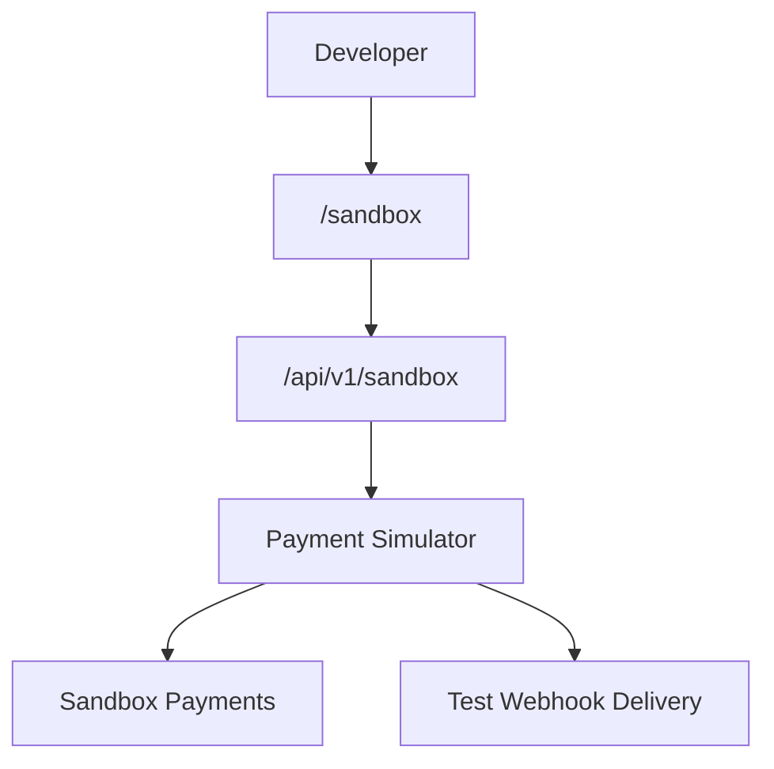
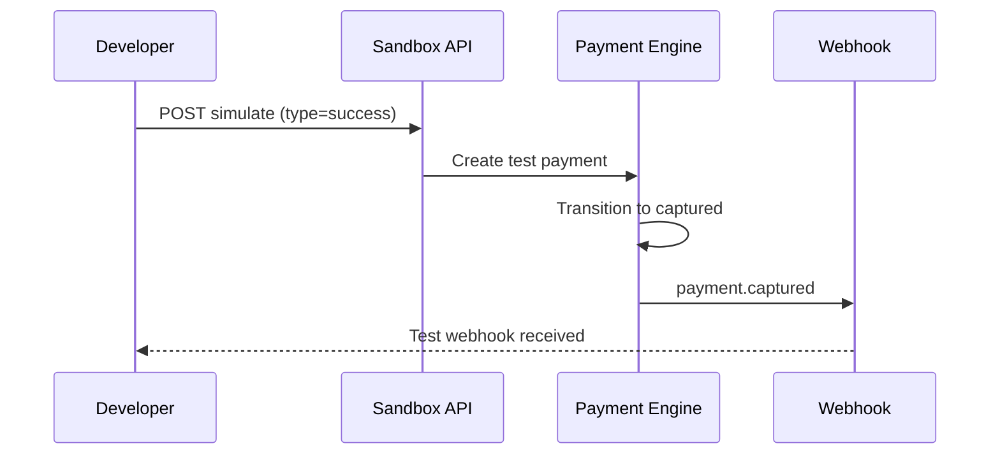

# Sandbox Module

> **Module documentation** for Merchant Pro v1.0.0-rc1. Cross-references: [PFS](../Product_Functional_Specification.md) · [Business Rules](../Business_Rules.md) · [Functional Requirements](../Functional_Requirements.md) · [User Journeys](../User_Journeys.md) · [Feature Matrix](../Feature_Matrix.md)

## Table of Contents

1. [Purpose](#1-purpose) · 2. [Business Objective](#2-business-objective) · 3. [Scope](#3-scope) · 4. [Primary Users](#4-primary-users) · 5. [Key Capabilities](#5-key-capabilities) · 6. [Dependencies](#6-dependencies) · 7. [Architecture Overview](#7-architecture-overview) · 8. [Inputs](#8-inputs) · 9. [Outputs](#9-outputs) · 10. [Business Rules](#10-business-rules) · 11. [Permissions and RBAC](#11-permissions-and-rbac) · 12. [API Reference](#12-api-reference) · 13. [Frontend Routes](#13-frontend-routes) · 14. [Data Model](#14-data-model) · 15. [Workflows and State Machines](#15-workflows-and-state-machines) · 16. [Integration Points](#16-integration-points) · 17. [Security Considerations](#17-security-considerations) · 18. [Success Criteria](#18-success-criteria) · 19. [Error Scenarios](#19-error-scenarios) · 20. [Operational Considerations](#20-operational-considerations) · 21. [Related Functional Requirements](#21-related-functional-requirements) · 22. [Related User Journeys](#22-related-user-journeys) · 23. [Feature Matrix Reference](#23-feature-matrix-reference) · 24. [Limitations and Status](#24-limitations-and-status) · 25. [Future Enhancements](#25-future-enhancements)

---

## 1. Purpose

Provide a test environment for developers and merchants to simulate payment events and validate integrations without processing real funds.

## 2. Business Objective

Reduce integration risk by enabling safe end-to-end testing of payment flows, webhooks, and API calls. Aligns with [PFS §7.15](../Product_Functional_Specification.md#715-sandbox).

## 3. Scope

Sandbox dashboard metrics, test payment simulation with event type mapping, and sandbox-scoped data isolation from production.

## 4. Primary Users

| Persona | Usage |
|---------|-------|
| Developer | Test API integrations |
| Merchant Admin | Validate payment flows |
| QA Engineer | UAT scenario execution |

## 5. Key Capabilities

| Capability | Description |
|------------|-------------|
| Sandbox dashboard | Environment stats and activity |
| Test payment simulation | Trigger payment events by type |
| Event mapping | Simulation type → payment status |
| Isolated data | Sandbox merchants and payments |
| Webhook testing | Receive test webhook deliveries |

## 6. Dependencies

| Dependency | Purpose |
|------------|---------|
| Payments | Simulated gateway responses |
| Webhooks | Test event delivery |
| Developer Portal | Sandbox credentials |
| Authorization | sandbox:* permissions |

## 7. Architecture Overview

Gateway responses are simulated in sandbox (BR-PAY limitation in PFS).

## 8. Inputs

| Input | Description |
|-------|-------------|
| simulationType | success, failure, timeout, etc. |
| amount, merchantId | Test payment params |
| webhookUrl | Optional test endpoint |

## 9. Outputs

| Output | Description |
|--------|-------------|
| Simulated payment | Test payment record |
| Dashboard metrics | Counts, success rate |
| Webhook delivery | Test event POST |

## 10. Business Rules

Sandbox data isolated from production. Test mode may auto-complete certain jobs (BR-JOB-003 for password reset in test).

## 11. Permissions and RBAC

| Permission | Action |
|------------|--------|
| `sandbox:read` | View dashboard, simulations |
| `sandbox:write` | Run simulations |
| `sandbox:manage` | Reset sandbox data |

## 12. API Reference

Base path: `/api/v1/sandbox` — authenticated, org-scoped.

| Method | Path | Permission | Description |
|--------|------|------------|-------------|
| GET | `/api/v1/sandbox/dashboard` | `sandbox:read` | Sandbox environment metrics |
| POST | `/api/v1/sandbox/simulate` | `sandbox:write` | Simulate payment event |
| GET | `/api/v1/sandbox/simulations` | `sandbox:read` | List past simulations |
| DELETE | `/api/v1/sandbox/reset` | `sandbox:manage` | Reset sandbox test data |

### Simulation Types

| Type | Resulting Payment Status |
|------|--------------------------|
| success | captured |
| authorization_only | authorized |
| failure | failed |
| timeout | processing → failed |
| refund | refunded |

## 13. Frontend Routes

| Route | Permission |
|-------|------------|
| `/sandbox` | `sandbox:read` |

## 14. Data Model

| Entity | Key Fields |
|--------|------------|
| `sandbox_simulations` | id, type, result, created_at |
| Sandbox payments | Flagged test records in payment_intents |

## 15. Workflows and State Machines

## 16. Integration Points

| Module | Integration |
|--------|-------------|
| Payments | Simulated lifecycle |
| Webhooks | Test deliveries |
| Developer Portal | Entry point for developers |
| Checkout | Test checkout sessions |

## 17. Security Considerations

- Sandbox cannot access production data
- Simulation endpoints require authentication
- No real fund movement
- Sandbox API keys distinct from production

## 18. Success Criteria

| Criterion | Measure |
|-----------|---------|
| Simulation | Correct status per type |
| Webhook | Test event delivered |
| Isolation | Zero production impact |

## 19. Error Scenarios

| Scenario | HTTP |
|----------|------|
| Invalid simulation type | 400 |
| Production merchant in sandbox | 403 |
| Missing permission | 403 |

## 20. Operational Considerations

- Periodic sandbox data cleanup
- Monitor sandbox webhook delivery success
- Separate sandbox SMTP for test emails

## 21. Related Functional Requirements

FR-SBX-001, FR-SBX-002 in [Functional Requirements](../Functional_Requirements.md#sandbox-fr-sbx).

## 22. Related User Journeys

See [User Journeys](../User_Journeys.md) — developer sandbox testing flow.

## 23. Feature Matrix Reference

See [Feature Matrix](../Feature_Matrix.md) — Sandbox by role.

## 24. Limitations and Status

| Limitation | Notes |
|------------|-------|
| Gateway fidelity | Simulated; not full acquirer emulation |
| **Status** | **Implemented** |

## 25. Future Enhancements

- Record/replay sandbox scenarios
- Shared sandbox environments for teams
- Automated integration test suites
- Gateway-specific simulation profiles
