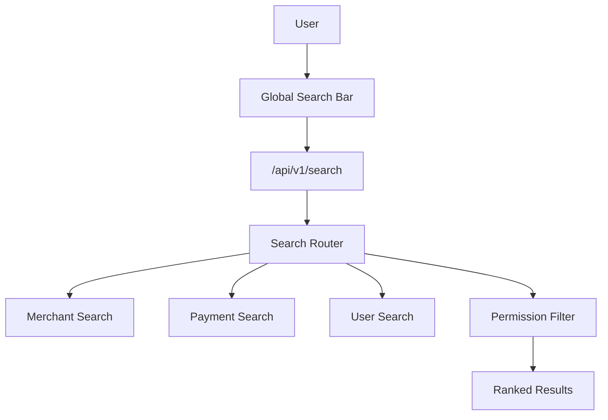
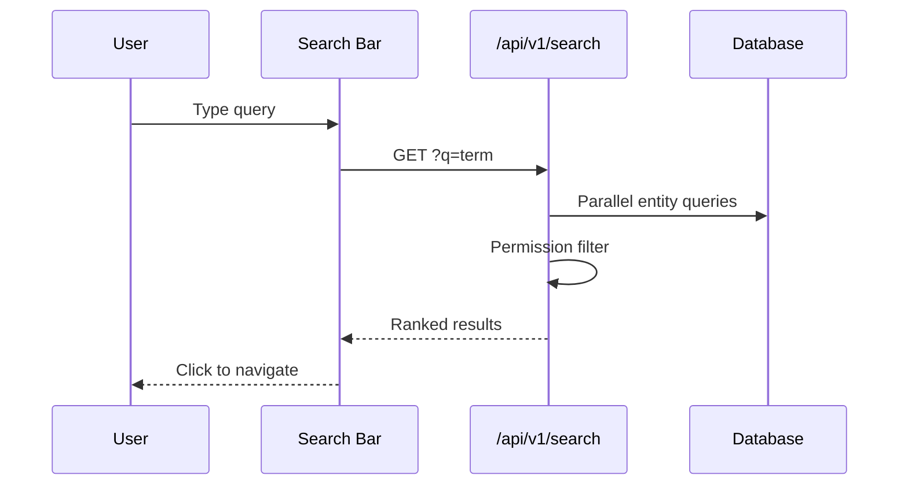

# Search Center Module

> **Module documentation** for Merchant Pro v1.0.0-rc1. Cross-references: [PFS](../Product_Functional_Specification.md) · [Business Rules](../Business_Rules.md) · [Functional Requirements](../Functional_Requirements.md) · [User Journeys](../User_Journeys.md) · [Feature Matrix](../Feature_Matrix.md)

## Table of Contents

1. [Purpose](#1-purpose) · 2. [Business Objective](#2-business-objective) · 3. [Scope](#3-scope) · 4. [Primary Users](#4-primary-users) · 5. [Key Capabilities](#5-key-capabilities) · 6. [Dependencies](#6-dependencies) · 7. [Architecture Overview](#7-architecture-overview) · 8. [Inputs](#8-inputs) · 9. [Outputs](#9-outputs) · 10. [Business Rules](#10-business-rules) · 11. [Permissions and RBAC](#11-permissions-and-rbac) · 12. [API Reference](#12-api-reference) · 13. [Frontend Routes](#13-frontend-routes) · 14. [Data Model](#14-data-model) · 15. [Workflows and State Machines](#15-workflows-and-state-machines) · 16. [Integration Points](#16-integration-points) · 17. [Security Considerations](#17-security-considerations) · 18. [Success Criteria](#18-success-criteria) · 19. [Error Scenarios](#19-error-scenarios) · 20. [Operational Considerations](#20-operational-considerations) · 21. [Related Functional Requirements](#21-related-functional-requirements) · 22. [Related User Journeys](#22-related-user-journeys) · 23. [Feature Matrix Reference](#23-feature-matrix-reference) · 24. [Limitations and Status](#24-limitations-and-status) · 25. [Future Enhancements](#25-future-enhancements)

---

## 1. Purpose

Cross-module global search enabling authenticated users to discover entities (merchants, payments, users, etc.) across the platform from a unified search interface.

## 2. Business Objective

Reduce time-to-find for support, operations, and admin users navigating a multi-module platform. Aligns with [PFS §7.26](../Product_Functional_Specification.md#726-search-center).

## 3. Scope

Global search API at `/api/v1/search`, query parsing, multi-entity result aggregation, permission-filtered results, and search UI integration.

## 4. Primary Users

| Persona | Usage |
|---------|-------|
| Operations User | Find merchants, payments quickly |
| Support Agent | Lookup customer/transaction records |
| Platform Administrator | Cross-module discovery |

## 5. Key Capabilities

| Capability | Description |
|------------|-------------|
| Global query | Single search across modules |
| Entity types | Merchants, payments, users, etc. |
| Permission filter | Results respect user permissions |
| Org scoping | Results limited to active org |
| Ranked results | Relevance-sorted matches |
| Pagination | page/pageSize support |

## 6. Dependencies

| Dependency | Purpose |
|------------|---------|
| Authorization | global_search:read permission |
| All searchable modules | Entity data sources |
| Organization context | Tenant filtering |
| Audit | Search activity (optional) |

## 7. Architecture Overview

## 8. Inputs

| Input | Description |
|-------|-------------|
| q | Search query string |
| types | Optional entity type filter |
| page, pageSize | Pagination |
| organizationId | From JWT context |

## 9. Outputs

| Output | Description |
|--------|-------------|
| Search results | Array of matched entities |
| Entity metadata | type, id, label, route |
| Total count | Pagination metadata |
| Facets | Optional type counts |

## 10. Business Rules

Results filtered by organization context (BR-ORG-003). Users see only entities their permissions allow.

## 11. Permissions and RBAC

| Permission | Action |
|------------|--------|
| `global_search:read` | Execute global search |

Individual entity visibility further filtered by module permissions (e.g., merchants:read).

## 12. API Reference

Base path: `/api/v1/search` — authenticated, org-scoped.

| Method | Path | Permission |
|--------|------|------------|
| GET | `/api/v1/search` | `global_search:read` |

Query parameters: `q`, `types`, `page`, `pageSize`.

## 13. Frontend Routes

Global search accessible via search bar in application header (permission-gated). No dedicated `/search` nav item; integrated across UI.

## 14. Data Model

Search queries existing entity tables; no dedicated search index in V1. Searched entities include:

| Entity Type | Source Table |
|-------------|--------------|
| merchant | merchants |
| payment | payment_intents |
| user | users |
| customer | customers |
| invoice | invoices |

## 15. Workflows and State Machines

## 16. Integration Points

| Module | Integration |
|--------|-------------|
| Audit | Cross-reference from search results |
| Activity Center | Related activity on selection |
| All CRUD modules | Entity source data |
| Dashboard | Quick navigation shortcut |

## 17. Security Considerations

- Org-scoped results only
- Permission filter on each entity type
- Search query logged (no PII in query logs)
- Rate limiting via global API limits (300 req/min)

## 18. Success Criteria

| Criterion | Measure |
|-----------|---------|
| Relevance | Top result matches intent |
| Speed | Results under 500ms |
| Security | No unauthorized entity exposure |

## 19. Error Scenarios

| Scenario | HTTP |
|----------|------|
| Missing permission | 403 |
| Empty query | 400 |
| No results | 200 with empty array |

## 20. Operational Considerations

- Monitor search query latency
- Consider full-text index for scale
- Review popular queries for UX improvements

## 21. Related Functional Requirements

FR-SRC-001 in [Functional Requirements](../Functional_Requirements.md#audit--operations-fr-ops).

## 22. Related User Journeys

See [User Journeys](../User_Journeys.md) — support lookup workflows.

## 23. Feature Matrix Reference

See [Feature Matrix](../Feature_Matrix.md) — Global Search by role.

## 24. Limitations and Status

| Limitation | Notes |
|------------|-------|
| Full-text engine | SQL LIKE queries in V1 |
| Fuzzy matching | Exact/prefix match only |
| **Status** | **Implemented** |

## 25. Future Enhancements

- Elasticsearch/OpenSearch integration
- Fuzzy and phonetic matching
- Search analytics and query suggestions
- Saved searches and alerts
