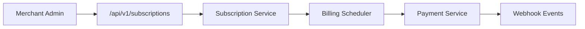
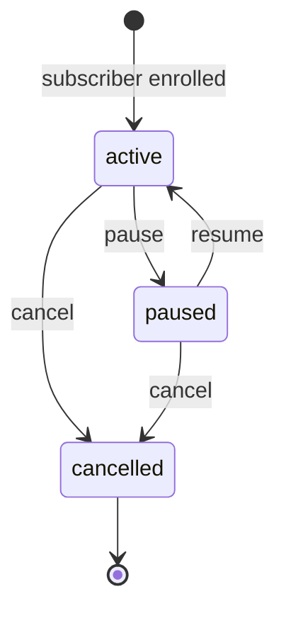

# Subscriptions Module

> **Module documentation** for Merchant Pro v1.0.0-rc1. Cross-references: [PFS](../Product_Functional_Specification.md) · [Business Rules](../Business_Rules.md) · [Functional Requirements](../Functional_Requirements.md) · [User Journeys](../User_Journeys.md) · [Feature Matrix](../Feature_Matrix.md)

## Table of Contents

1. [Purpose](#1-purpose) · 2. [Business Objective](#2-business-objective) · 3. [Scope](#3-scope) · 4. [Primary Users](#4-primary-users) · 5. [Key Capabilities](#5-key-capabilities) · 6. [Dependencies](#6-dependencies) · 7. [Architecture Overview](#7-architecture-overview) · 8. [Inputs](#8-inputs) · 9. [Outputs](#9-outputs) · 10. [Business Rules](#10-business-rules) · 11. [Permissions and RBAC](#11-permissions-and-rbac) · 12. [API Reference](#12-api-reference) · 13. [Frontend Routes](#13-frontend-routes) · 14. [Data Model](#14-data-model) · 15. [Workflows and State Machines](#15-workflows-and-state-machines) · 16. [Integration Points](#16-integration-points) · 17. [Security Considerations](#17-security-considerations) · 18. [Success Criteria](#18-success-criteria) · 19. [Error Scenarios](#19-error-scenarios) · 20. [Operational Considerations](#20-operational-considerations) · 21. [Related Functional Requirements](#21-related-functional-requirements) · 22. [Related User Journeys](#22-related-user-journeys) · 23. [Feature Matrix Reference](#23-feature-matrix-reference) · 24. [Limitations and Status](#24-limitations-and-status) · 25. [Future Enhancements](#25-future-enhancements)

---

## 1. Purpose

Manage recurring billing through subscription plans, subscriber enrollment, billing period tracking, and subscription lifecycle (activate, pause, cancel).

## 2. Business Objective

Enable merchants to offer recurring payment products with predictable billing cycles. Aligns with [PFS §7.12](../Product_Functional_Specification.md#712-subscriptions).

## 3. Scope

Subscription plan CRUD, subscriber management, billing period formatting, and status transitions. Recurring charge execution via Payments module.

## 4. Primary Users

| Persona | Usage |
|---------|-------|
| Merchant Admin | Create plans and manage subscribers |
| Finance User | Monitor recurring revenue |
| End Customer | Subscribes via merchant integration |

## 5. Key Capabilities

| Capability | Description |
|------------|-------------|
| Plan CRUD | Define billing period, amount, currency |
| Subscriber lifecycle | active, paused, cancelled |
| Billing periods | Consistent API formatting (BR-SUB-001) |
| Listing | Plans and subscribers with filters |
| Renewal | Periodic charge via payment engine |

## 6. Dependencies

| Dependency | Purpose |
|------------|---------|
| Payments | Recurring charge processing |
| Customers | Subscriber customer records |
| Invoices | Optional invoice per cycle |
| Webhooks | Subscription event notifications |

## 7. Architecture Overview

## 8. Inputs

| Input | Description |
|-------|-------------|
| planName, amount | Plan definition |
| billingPeriod | monthly, yearly, etc. |
| customerId | Subscriber reference |
| paymentMethod | Stored payment method |

## 9. Outputs

| Output | Description |
|--------|-------------|
| Subscription plan | id, billing config |
| Subscriber record | status, next_billing_date |
| Billing events | Payment per cycle |

## 10. Business Rules

**BR-SUB-001**: Billing period formatted consistently in API responses.

## 11. Permissions and RBAC

| Permission | Action |
|------------|--------|
| `subscriptions:read` | List plans and subscribers |
| `subscriptions:write` | Create and update |
| `subscriptions:manage` | Cancel, pause, delete |

## 12. API Reference

Base path: `/api/v1/subscriptions` — authenticated, org-scoped.

| Method | Path | Permission | Description |
|--------|------|------------|-------------|
| GET | `/api/v1/subscriptions/plans` | `subscriptions:read` | List subscription plans |
| POST | `/api/v1/subscriptions/plans` | `subscriptions:write` | Create plan |
| GET | `/api/v1/subscriptions/plans/:id` | `subscriptions:read` | Get plan detail |
| PUT | `/api/v1/subscriptions/plans/:id` | `subscriptions:write` | Update plan |
| GET | `/api/v1/subscriptions/subscribers` | `subscriptions:read` | List subscribers |
| POST | `/api/v1/subscriptions/subscribers` | `subscriptions:write` | Enroll subscriber |
| PATCH | `/api/v1/subscriptions/subscribers/:id/status` | `subscriptions:manage` | Pause/cancel/resume |

## 13. Frontend Routes

| Route | Permission |
|-------|------------|
| `/subscriptions` | `subscriptions:read` |

## 14. Data Model

| Entity | Key Fields |
|--------|------------|
| `subscription_plans` | id, merchant_id, amount, billing_period |
| `subscribers` | id, plan_id, customer_id, status, next_billing_at |

## 15. Workflows and State Machines

## 16. Integration Points

| Module | Integration |
|--------|-------------|
| Payments | Recurring charge |
| Invoices | Cycle invoice generation |
| Customers | Subscriber profile |
| Webhooks | Subscription events |

## 17. Security Considerations

- Org and merchant scoping
- Cancel requires manage permission
- Payment method tokenization (when enabled)
- Audit on status changes

## 18. Success Criteria

| Criterion | Measure |
|-----------|---------|
| Renewal | Successful charge each period |
| Cancel | No further charges after cancel |
| Format | Consistent billing period in API |

## 19. Error Scenarios

| Scenario | HTTP |
|----------|------|
| Payment failure on renewal | Subscription past_due |
| Invalid plan | 400 |
| Cancelled resubscribe | 400 |

## 20. Operational Considerations

- Monitor failed renewal rate
- Dunning workflow for failed payments
- MRR/ARR reporting via Reports module

## 21. Related Functional Requirements

FR-SUB-001, FR-SUB-002 in [Functional Requirements](../Functional_Requirements.md#subscriptions--invoices-fr-sub).

## 22. Related User Journeys

See [User Journeys](../User_Journeys.md) — subscription enrollment and cancellation.

## 23. Feature Matrix Reference

See [Feature Matrix](../Feature_Matrix.md) — Subscriptions by role.

## 24. Limitations and Status

| Limitation | Notes |
|------------|-------|
| Proration | Not in V1 |
| Trial periods | Basic support |
| **Status** | **Implemented** |

## 25. Future Enhancements

- Proration on plan changes
- Free trial and intro pricing
- Customer self-service subscription portal
- Usage-based billing meters
