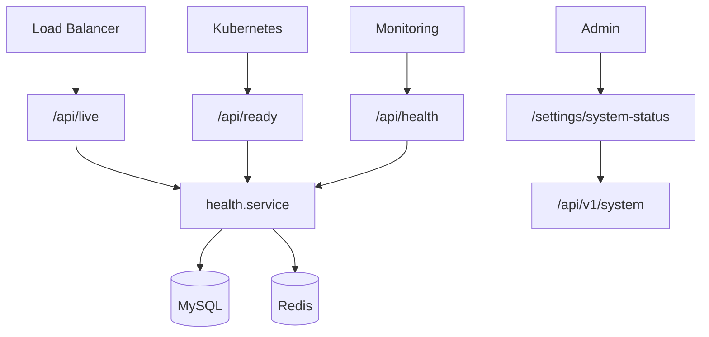
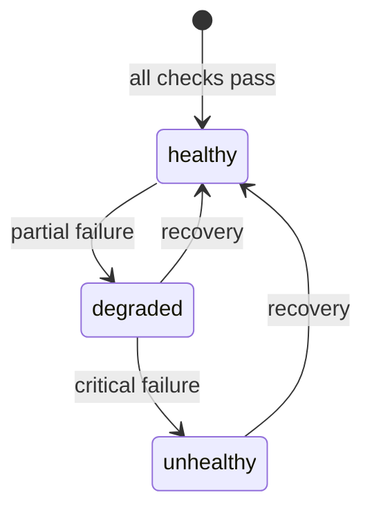
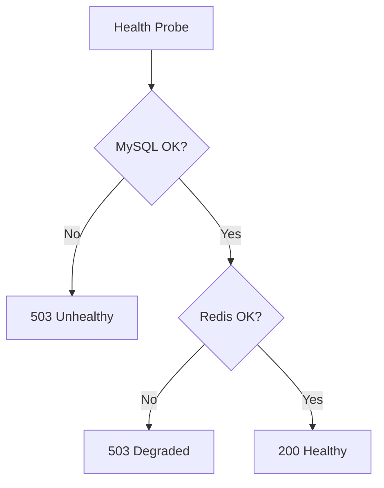

# System Health Module

> **Module documentation** for Merchant Pro v1.0.0-rc1. Cross-references: [PFS](../Product_Functional_Specification.md) · [Business Rules](../Business_Rules.md) · [Functional Requirements](../Functional_Requirements.md) · [User Journeys](../User_Journeys.md) · [Feature Matrix](../Feature_Matrix.md)

## Table of Contents

1. [Purpose](#1-purpose) · 2. [Business Objective](#2-business-objective) · 3. [Scope](#3-scope) · 4. [Primary Users](#4-primary-users) · 5. [Key Capabilities](#5-key-capabilities) · 6. [Dependencies](#6-dependencies) · 7. [Architecture Overview](#7-architecture-overview) · 8. [Inputs](#8-inputs) · 9. [Outputs](#9-outputs) · 10. [Business Rules](#10-business-rules) · 11. [Permissions and RBAC](#11-permissions-and-rbac) · 12. [API Reference](#12-api-reference) · 13. [Frontend Routes](#13-frontend-routes) · 14. [Data Model](#14-data-model) · 15. [Workflows and State Machines](#15-workflows-and-state-machines) · 16. [Integration Points](#16-integration-points) · 17. [Security Considerations](#17-security-considerations) · 18. [Success Criteria](#18-success-criteria) · 19. [Error Scenarios](#19-error-scenarios) · 20. [Operational Considerations](#20-operational-considerations) · 21. [Related Functional Requirements](#21-related-functional-requirements) · 22. [Related User Journeys](#22-related-user-journeys) · 23. [Feature Matrix Reference](#23-feature-matrix-reference) · 24. [Limitations and Status](#24-limitations-and-status) · 25. [Future Enhancements](#25-future-enhancements)

---

## 1. Purpose

Operational visibility into platform health through liveness, readiness, and comprehensive health endpoints plus authenticated system status UI for administrators and DevOps.

## 2. Business Objective

Enable load balancers, orchestrators, and operators to determine service availability and dependency health. Aligns with [PFS §7.24](../Product_Functional_Specification.md#724-system-health).

## 3. Scope

Public health endpoints (`/api/live`, `/api/ready`, `/api/health`), authenticated system status API (`/api/v1/system`), system status UI, and operations health overlap.

## 4. Primary Users

| Persona | Usage |
|---------|-------|
| DevOps / SRE | Load balancer and K8s probes |
| Platform Administrator | System status dashboard |
| Operations User | Health monitoring via Operations Center |

## 5. Key Capabilities

| Capability | Endpoint |
|------------|----------|
| Liveness probe | GET `/api/live` — process alive |
| Readiness probe | GET `/api/ready` — dependencies ready |
| Health check | GET `/api/health` — full health JSON |
| System status UI | `/settings/system-status` |
| System API | `/api/v1/system` authenticated details |
| Dependency checks | MySQL, Redis connectivity |

## 6. Dependencies

| Dependency | Purpose |
|------------|---------|
| MySQL | Database connectivity check |
| Redis | Cache connectivity (if configured) |
| health.service | Health check logic |
| Authorization | system:view for detailed status |

## 7. Architecture Overview

Public endpoints mounted in `app.ts` before `/api/v1` middleware chain.

## 8. Inputs

| Input | Description |
|-------|-------------|
| None | Public endpoints require no input |
| Auth token | System API requires JWT + system:view |

## 9. Outputs

| Output | Description |
|--------|-------------|
| Liveness JSON | `{ status: "ok" }` |
| Readiness JSON | `{ ready: true/false, checks: {} }` |
| Health JSON | status, service, dependencies, uptime |
| HTTP 503 | When unhealthy/not ready |

## 10. Business Rules

Unhealthy status returns HTTP 503 on `/api/health` and `/api/ready`. Liveness always returns 200 if process running.

## 11. Permissions and RBAC

| Endpoint | Auth |
|----------|------|
| `/api/live` | Public |
| `/api/ready` | Public |
| `/api/health` | Public |
| `/api/v1/system/*` | `system:view` |
| `/settings/system-status` | `system:view` |

## 12. API Reference

### Public Endpoints

| Method | Path | Auth | Description |
|--------|------|------|-------------|
| GET | `/api/live` | Public | Liveness — process running |
| GET | `/api/ready` | Public | Readiness — deps available |
| GET | `/api/health` | Public | Full health with dependency status |

### Authenticated

| Method | Path | Permission |
|--------|------|------------|
| GET | `/api/v1/system/*` | `system:view` |

Response includes `service: 'backend-fintech'` on health endpoint.

## 13. Frontend Routes

| Route | Permission |
|-------|------------|
| `/settings/system-status` | `system:view` |

## 14. Data Model

Health checks are runtime probes; no persistent health table. Metrics may include:

| Check | Source |
|-------|--------|
| database | MySQL ping |
| cache | Redis ping |
| uptime | Process uptime seconds |
| memory | Node.js heap usage |

## 15. Workflows and State Machines

Probe decision flow:

## 16. Integration Points

| Module | Integration |
|--------|-------------|
| Operations Center | GET /operations/health |
| Workers | Worker heartbeat monitoring |
| Configuration | System status UI in settings |
| Monitoring | External probe targets |

## 17. Security Considerations

- Public endpoints expose minimal info (no secrets)
- Detailed system info requires system:view
- Health endpoints exempt from rate limiting for probes
- No authentication data in health responses

## 18. Success Criteria

| Criterion | Measure |
|-----------|---------|
| Liveness | 200 when process alive |
| Readiness | 503 when DB unavailable |
| Probe latency | Response under 100ms |
| UI accuracy | Status matches API |

## 19. Error Scenarios

| Scenario | HTTP |
|----------|------|
| DB down | 503 on /ready and /health |
| Redis down | 503 or degraded status |
| Missing system:view | 403 on system API |

## 20. Operational Considerations

- Configure K8s liveness/readiness probes to /api/live and /api/ready
- Alert on sustained 503 responses
- Document dependency failure runbooks
- Monitor health endpoint response times

## 21. Related Functional Requirements

FR-SYS-001 in [Functional Requirements](../Functional_Requirements.md#settings--system-fr-sys).

## 22. Related User Journeys

See [User Journeys](../User_Journeys.md) — DevOps deployment verification.

## 23. Feature Matrix Reference

See [Feature Matrix](../Feature_Matrix.md) — System Health by role.

## 24. Limitations and Status

| Limitation | Notes |
|------------|-------|
| Worker health | Separate worker heartbeat |
| External services | Gateway health not probed |
| **Status** | **Implemented** |

## 25. Future Enhancements

- Synthetic transaction health checks
- Historical uptime SLA dashboard
- Auto-incident creation on health degradation
- Dependency graph visualization
