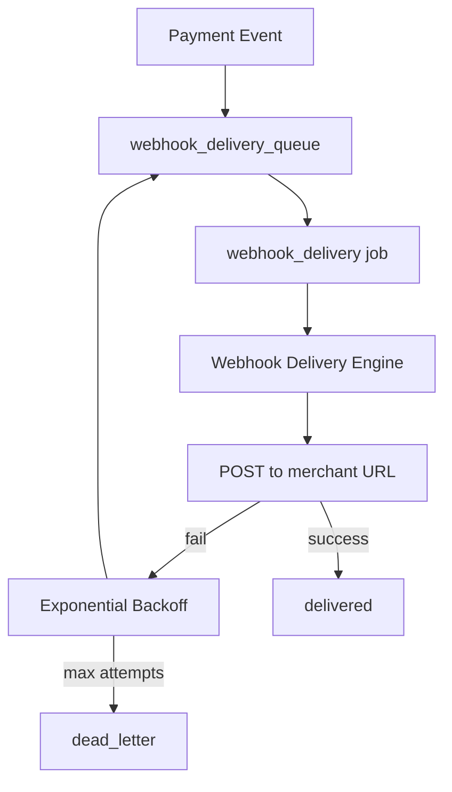
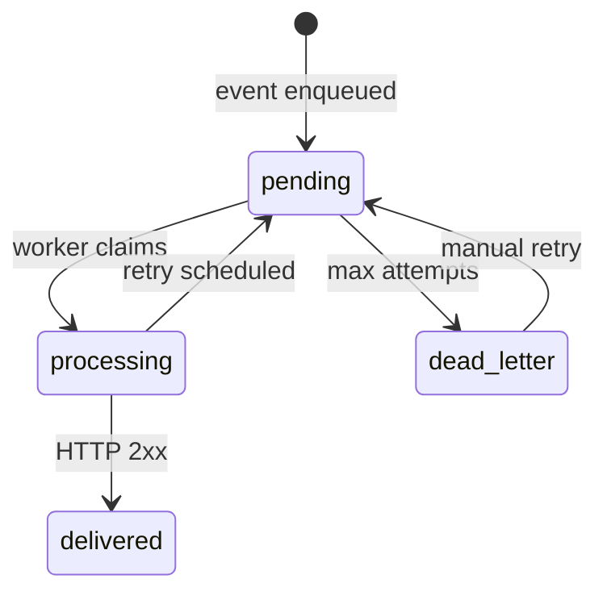

# Webhooks Module

> **Module documentation** for Merchant Pro v1.0.0-rc1. Cross-references: [PFS](../Product_Functional_Specification.md) · [Business Rules](../Business_Rules.md) · [Functional Requirements](../Functional_Requirements.md) · [User Journeys](../User_Journeys.md) · [Feature Matrix](../Feature_Matrix.md)

## Table of Contents

1. [Purpose](#1-purpose) · 2. [Business Objective](#2-business-objective) · 3. [Scope](#3-scope) · 4. [Primary Users](#4-primary-users) · 5. [Key Capabilities](#5-key-capabilities) · 6. [Dependencies](#6-dependencies) · 7. [Architecture Overview](#7-architecture-overview) · 8. [Inputs](#8-inputs) · 9. [Outputs](#9-outputs) · 10. [Business Rules](#10-business-rules) · 11. [Permissions and RBAC](#11-permissions-and-rbac) · 12. [API Reference](#12-api-reference) · 13. [Frontend Routes](#13-frontend-routes) · 14. [Data Model](#14-data-model) · 15. [Workflows and State Machines](#15-workflows-and-state-machines) · 16. [Integration Points](#16-integration-points) · 17. [Security Considerations](#17-security-considerations) · 18. [Success Criteria](#18-success-criteria) · 19. [Error Scenarios](#19-error-scenarios) · 20. [Operational Considerations](#20-operational-considerations) · 21. [Related Functional Requirements](#21-related-functional-requirements) · 22. [Related User Journeys](#22-related-user-journeys) · 23. [Feature Matrix Reference](#23-feature-matrix-reference) · 24. [Limitations and Status](#24-limitations-and-status) · 25. [Future Enhancements](#25-future-enhancements)

---

## 1. Purpose

Deliver event notifications to merchant-configured HTTP endpoints with HMAC-SHA256 signing, subscription management, delivery logging, and retry with exponential backoff.

## 2. Business Objective

Enable reliable asynchronous event-driven integrations for payment and platform events. Aligns with [PFS §7.16](../Product_Functional_Specification.md#716-webhooks).

## 3. Scope

Webhook endpoint CRUD, event subscriptions, delivery queue, retry, manual replay, dashboard, and HMAC signature generation. Worker processing via `webhook_delivery` job.

## 4. Primary Users

| Persona | Usage |
|---------|-------|
| Developer | Configure endpoints and subscriptions |
| Operations | Monitor failed deliveries, manual retry |
| Merchant systems | Receive signed POST events |

## 5. Key Capabilities

| Capability | Description |
|------------|-------------|
| Endpoint CRUD | Register HTTPS URLs |
| Event subscriptions | Per event type routing |
| HMAC signing | SHA256 signature header |
| Delivery log | Status, response code, attempts |
| Retry | Exponential backoff; manual retry |
| Dashboard | Delivery success metrics |
| Dead letter | Exhausted retries → dead_letter |

## 6. Dependencies

| Dependency | Purpose |
|------------|---------|
| Workers | `webhook_delivery` job handler |
| Payments | Payment event source |
| Background Jobs | Queue enqueue |
| Authorization | webhooks:* permissions |

## 7. Architecture Overview

## 8. Inputs

| Input | Description |
|-------|-------------|
| url | HTTPS endpoint |
| signingSecret | HMAC secret |
| eventTypes | Subscription events |
| payload | JSON event body |

## 9. Outputs

| Output | Description |
|--------|-------------|
| Delivery record | status, attempt_count, response_code |
| HTTP POST | Signed JSON to merchant |
| Headers | X-Webhook-Signature, X-Event-Type, etc. |

## 10. Business Rules

See [Business Rules — Webhooks & Workers](../Business_Rules.md#webhooks--workers):

| Rule | Summary |
|------|---------|
| BR-WH-001 | HMAC-SHA256 when secret configured |
| BR-WH-002 | Format: `t={timestamp},v1={hex}` |
| BR-WH-003 | Max 3 delivery attempts (default) |
| BR-WH-004 | Backoff: base × 2^(attempt-1), max 3600s |
| BR-WH-005 | Exhausted → dead_letter |
| BR-WH-006 | Manual retry creates replay history |
| BR-WH-007 | Queue claim uses SELECT FOR UPDATE |

## 11. Permissions and RBAC

| Permission | Action |
|------------|--------|
| `webhooks:read` | Dashboard, endpoints, deliveries |
| `webhooks:write` | Create/update endpoints, subscriptions |
| `webhooks:manage` | Delete, retry delivery |

## 12. API Reference

Base path: `/api/v1/webhooks`

| Method | Path | Permission |
|--------|------|------------|
| GET | `/dashboard` | `webhooks:read` |
| GET/POST | `/endpoints` | read/write |
| GET/PUT/DELETE | `/endpoints/:id` | read/write/manage |
| POST/PUT/DELETE | `/endpoints/:id/subscriptions` | write/manage |
| GET | `/deliveries` | `webhooks:read` |
| GET | `/deliveries/:id` | `webhooks:read` |
| POST | `/deliveries/:id/retry` | `webhooks:manage` |

### Signature Verification

Header: `X-Webhook-Signature: t={timestamp},v1={hex}`

Computed: `HMAC-SHA256(secret, "{timestamp}.{body}")`

## 13. Frontend Routes

| Route | Permission |
|-------|------------|
| `/webhooks` | `webhooks:read` |

## 14. Data Model

| Entity | Key Fields |
|--------|------------|
| `merchant_webhooks` | id, url, signing_secret, merchant_id |
| `webhook_subscriptions` | webhook_id, event_type |
| `webhook_delivery_queue` | id, status, attempt_count, next_retry_at |

### Subscribed Payment Events

`payment.created`, `payment.authorized`, `payment.captured`, `payment.failed`, `payment.refunded`, `payment.settled`

## 15. Workflows and State Machines

## 16. Integration Points

| Module | Integration |
|--------|-------------|
| Payments | Event emission on transitions |
| Workers | webhook_delivery processor |
| Operations | Failed webhooks queue |
| Audit | Delivery and retry logged |

## 17. Security Considerations

- HTTPS endpoints required
- Signing secret encrypted at rest
- Timestamp tolerance for replay protection
- Idempotency key per delivery (X-Idempotency-Key)
- Timeout configurable (env.worker.webhookTimeoutMs)

## 18. Success Criteria

| Criterion | Measure |
|-----------|---------|
| Delivery | HTTP 2xx within timeout |
| Signature | Merchant verifies HMAC |
| Retry | Failed deliveries re-attempted with backoff |

## 19. Error Scenarios

| Scenario | Result |
|----------|--------|
| HTTP 5xx | Retry with backoff |
| Timeout | Retry scheduled |
| Invalid URL | Endpoint validation error |
| Max attempts | dead_letter status |

## 20. Operational Considerations

- Monitor dead_letter queue depth
- Operations Center failed-webhooks view
- Alert on delivery success rate drop
- Manual retry for merchant-side outages

## 21. Related Functional Requirements

FR-WH-001 through FR-WH-004 in [Functional Requirements](../Functional_Requirements.md#developer--webhooks-fr-dev).

## 22. Related User Journeys

See [User Journeys](../User_Journeys.md) — webhook setup and event handling.

## 23. Feature Matrix Reference

See [Feature Matrix](../Feature_Matrix.md) — Webhooks by role.

## 24. Limitations and Status

| Limitation | Notes |
|------------|-------|
| Event catalog | Payment events primary in V1 |
| **Status** | **Implemented** |

## 25. Future Enhancements

- Webhook event catalog expansion (subscriptions, invoices)
- Partner webhook forwarding
- Delivery latency SLA dashboard
- Automatic endpoint health checking
