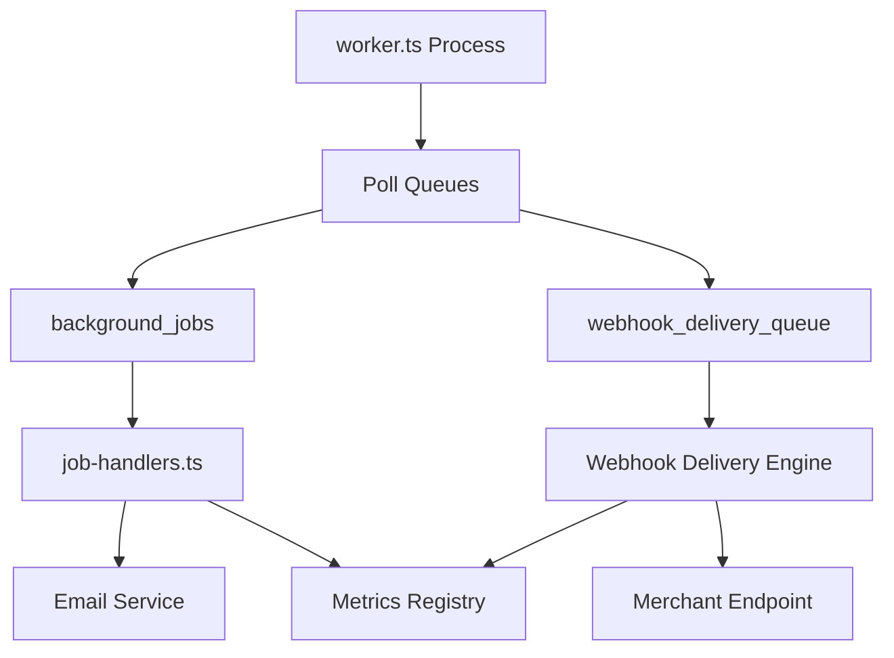
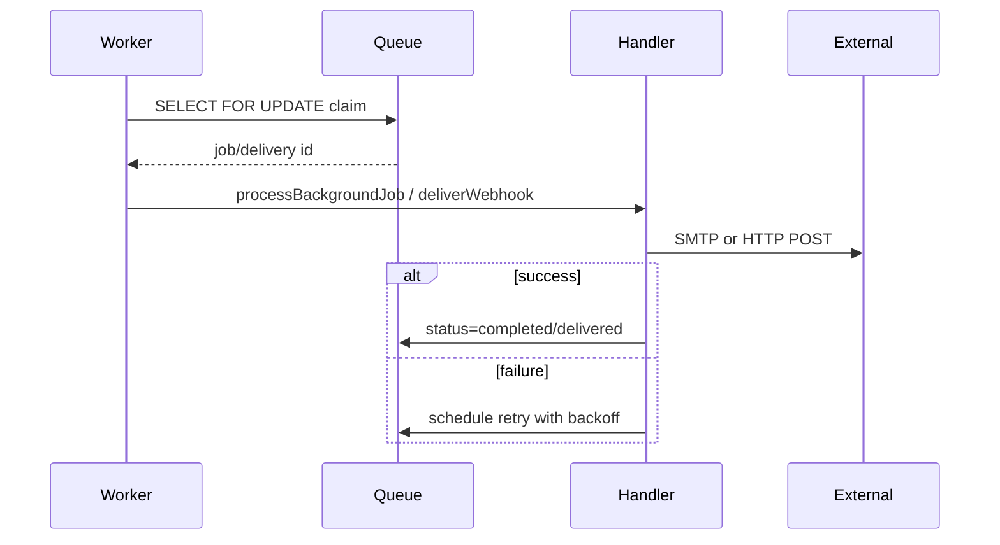

# Workers Module

> **Module documentation** for Merchant Pro v1.0.0-rc1. Cross-references: [PFS](../Product_Functional_Specification.md) · [Business Rules](../Business_Rules.md) · [Functional Requirements](../Functional_Requirements.md) · [User Journeys](../User_Journeys.md) · [Feature Matrix](../Feature_Matrix.md)

## Table of Contents

1. [Purpose](#1-purpose) · 2. [Business Objective](#2-business-objective) · 3. [Scope](#3-scope) · 4. [Primary Users](#4-primary-users) · 5. [Key Capabilities](#5-key-capabilities) · 6. [Dependencies](#6-dependencies) · 7. [Architecture Overview](#7-architecture-overview) · 8. [Inputs](#8-inputs) · 9. [Outputs](#9-outputs) · 10. [Business Rules](#10-business-rules) · 11. [Permissions and RBAC](#11-permissions-and-rbac) · 12. [API Reference](#12-api-reference) · 13. [Frontend Routes](#13-frontend-routes) · 14. [Data Model](#14-data-model) · 15. [Workflows and State Machines](#15-workflows-and-state-machines) · 16. [Integration Points](#16-integration-points) · 17. [Security Considerations](#17-security-considerations) · 18. [Success Criteria](#18-success-criteria) · 19. [Error Scenarios](#19-error-scenarios) · 20. [Operational Considerations](#20-operational-considerations) · 21. [Related Functional Requirements](#21-related-functional-requirements) · 22. [Related User Journeys](#22-related-user-journeys) · 23. [Feature Matrix Reference](#23-feature-matrix-reference) · 24. [Limitations and Status](#24-limitations-and-status) · 25. [Future Enhancements](#25-future-enhancements)

---

## 1. Purpose

Separate worker process (`worker.ts`) that polls and processes background job queues and webhook delivery queues with configurable concurrency and heartbeat monitoring.

## 2. Business Objective

Decouple long-running and retry-prone operations from the API server for reliability and scalability. Aligns with [PFS §7.23](../Product_Functional_Specification.md#723-workers).

## 3. Scope

Worker process lifecycle, queue polling, job handler dispatch, webhook delivery engine integration, retry queue processing, and operational heartbeat. See [Background_Jobs.md](./Background_Jobs.md) for job types.

## 4. Primary Users

| Persona | Usage |
|---------|-------|
| System (DevOps) | Deploy and monitor worker process |
| Operations User | Monitor queues via Operations Center |
| Platform | Automated queue processing |

## 5. Key Capabilities

| Capability | Description |
|------------|-------------|
| Background job polling | Process background_jobs queue |
| Webhook queue | webhook_delivery_queue processing |
| Concurrency control | Default 5 concurrent jobs |
| Job handlers | invoice_email, password_reset_email, notification_email, webhook_delivery |
| Webhook engine | HMAC-signed HTTP delivery with backoff |
| Heartbeat | Worker liveness monitoring |
| Retry queue | Failed item reprocessing |

## 6. Dependencies

| Dependency | Purpose |
|------------|---------|
| MySQL | Job and webhook queues |
| Background Jobs | Job records and payloads |
| Webhook Engine | webhook-delivery.engine.ts |
| SMTP | Email job handlers |
| Operations | Queue monitoring UI |

## 7. Architecture Overview

Separate from API server (`app.ts`). Runs as independent Node.js process.

## 8. Inputs

| Input | Source |
|-------|--------|
| Queued jobs | background_jobs WHERE status=queued |
| Webhook deliveries | webhook_delivery_queue WHERE status=pending |
| Env config | Concurrency, timeouts, retry settings |

## 9. Outputs

| Output | Description |
|--------|-------------|
| Completed jobs | status=completed |
| Delivered webhooks | status=delivered |
| Retry schedules | next_retry_at with backoff |
| Metrics | webhook.delivery, job duration |
| Dead letter | status=dead_letter after max attempts |

## 10. Business Rules

**BR-JOB-002**: Worker concurrency default 5.
**BR-WH-004**: Exponential backoff base × 2^(attempt-1), max 3600s.
**BR-WH-007**: Queue claim uses SELECT FOR UPDATE.
**BR-WH-005**: Exhausted retries → dead_letter.

## 11. Permissions and RBAC

Worker runs as system process (no user RBAC). Operations monitoring requires `operations:read` / `operations:manage`.

## 12. API Reference

No direct worker API. Monitoring via Operations Center:

| Method | Path | Permission |
|--------|------|------------|
| GET | `/api/v1/operations/queues` | operations:read |
| GET | `/api/v1/operations/dead-letter-queue` | operations:read |
| GET | `/api/v1/operations/failed-webhooks` | operations:read |
| POST | `/api/v1/operations/retry-queue/:id/retry` | operations:manage |

## 13. Frontend Routes

Worker monitoring via `/operations` (see [Operations_Center.md](./Operations_Center.md)).

## 14. Data Model

| Queue | Key Fields |
|-------|------------|
| `background_jobs` | id, job_type, status, payload |
| `webhook_delivery_queue` | id, status, attempt_count, next_retry_at, last_error |

## 15. Workflows and State Machines

## 16. Integration Points

| Module | Integration |
|--------|-------------|
| Background Jobs | Job processing |
| Webhooks | Delivery engine |
| Operations | Queue dashboards |
| Audit | Unknown job types, retries |
| System Health | Worker heartbeat |

## 17. Security Considerations

- Worker uses same DB credentials as API (restricted network)
- Webhook secrets decrypted only during delivery
- SELECT FOR UPDATE prevents double-processing
- AbortController timeout on webhook HTTP calls

## 18. Success Criteria

| Criterion | Measure |
|-----------|---------|
| Throughput | Jobs processed within SLA |
| No duplicate delivery | FOR UPDATE claim integrity |
| Backoff | Retries spaced per BR-WH-004 |
| Heartbeat | Worker process alive |

## 19. Error Scenarios

| Scenario | Handling |
|----------|----------|
| Handler exception | Job marked failed |
| Webhook timeout | Retry scheduled |
| Worker crash | Jobs remain queued for next worker |
| Max attempts | dead_letter status |

## 20. Operational Considerations

- Run multiple worker instances for HA (FOR UPDATE prevents conflicts)
- Monitor dead_letter queue depth
- Tune concurrency via environment variable
- Separate worker deployment from API scaling
- Alert on worker heartbeat loss

## 21. Related Functional Requirements

See [Functional Requirements](../Functional_Requirements.md) — FR-WH-003 (delivery retry), FR-OPS-002 (retry queue).

## 22. Related User Journeys

See [User Journeys](../User_Journeys.md) — operational retry workflows.

## 23. Feature Matrix Reference

See [Feature Matrix](../Feature_Matrix.md) — Operations queue management by role.

## 24. Limitations and Status

| Limitation | Notes |
|------------|-------|
| Horizontal scaling | Requires shared MySQL queue |
| **Status** | **Implemented** |

## 25. Future Enhancements

- Redis-based queue for higher throughput
- Worker auto-scaling based on queue depth
- Per-job-type concurrency limits
- Distributed tracing across worker spans
