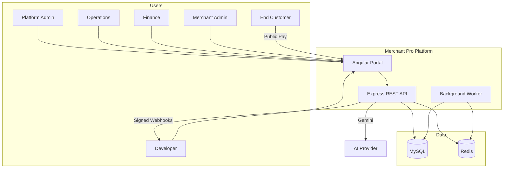
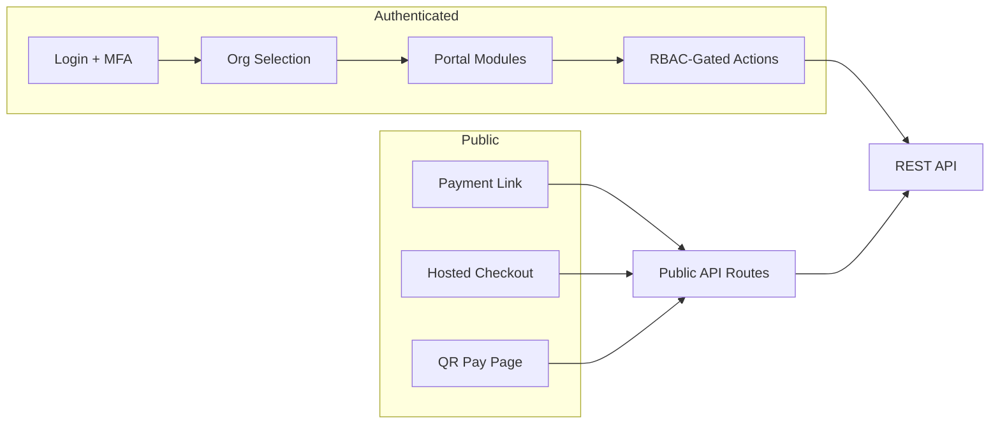
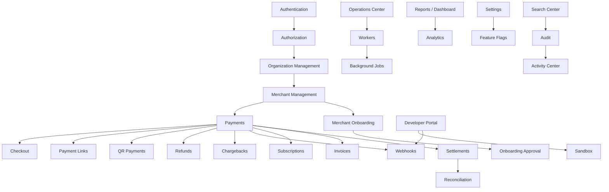
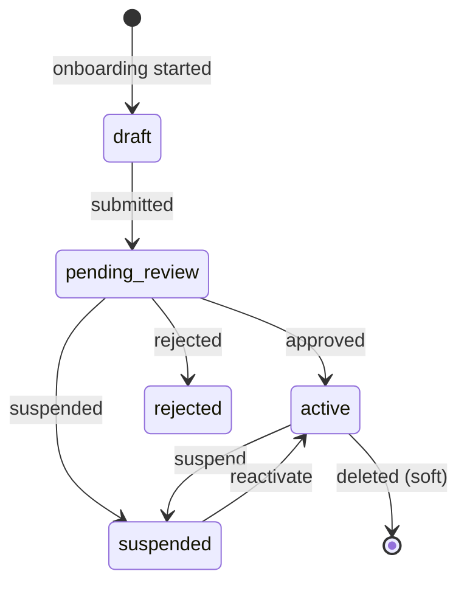
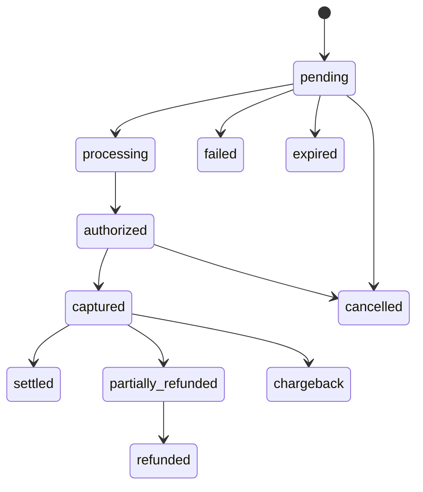
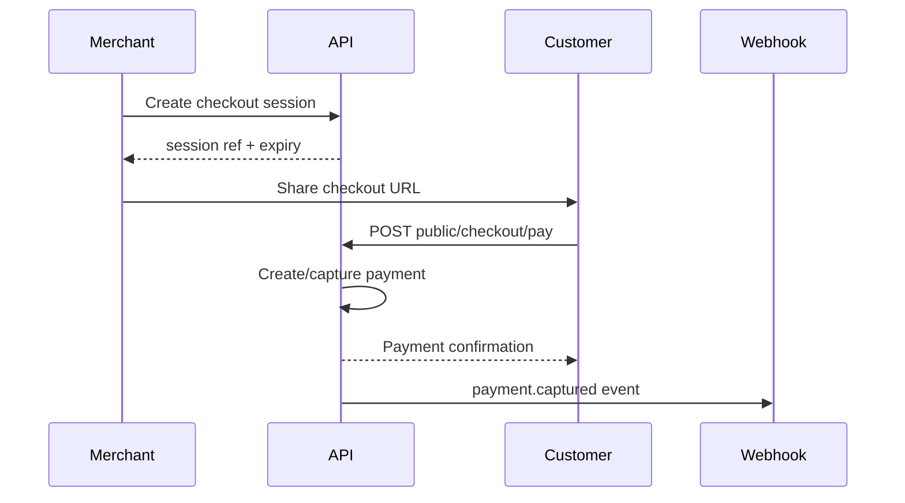

# Product Functional Specification (PFS)

**Merchant Pro — Merchant Management Portal**  
**Version 1.0.0-rc1**

---

## Table of Contents

1. [Document Information](#1-document-information)
2. [Executive Summary](#2-executive-summary)
3. [Product Vision](#3-product-vision)
4. [Product Scope](#4-product-scope)
5. [User Personas](#5-user-personas)
6. [User Roles](#6-user-roles)
7. [Functional Modules](#7-functional-modules)
8. [Business Rules](#8-business-rules)
9. [Functional Requirements](#9-functional-requirements)
10. [Non-Functional Requirements](#10-non-functional-requirements)
11. [User Journeys](#11-user-journeys)
12. [Feature Matrix](#12-feature-matrix)
13. [Assumptions](#13-assumptions)
14. [Constraints](#14-constraints)
15. [Success Metrics](#15-success-metrics)
16. [Glossary](#16-glossary)

---

## 1. Document Information

| Field | Value |
|-------|-------|
| **Document Title** | Product Functional Specification — Merchant Pro |
| **Version** | 1.0.0-rc1 |
| **Author** | Product Engineering |
| **Status** | Approved for UAT |
| **Classification** | Internal — Enterprise |
| **Release Date** | 29 July 2026 |

### Revision History

| Version | Date | Author | Changes |
|---------|------|--------|---------|
| 1.0.0-rc1 | 2026-07-29 | Product Engineering | Initial PFS for V1 release candidate |

### Approvals

| Role | Name | Date | Signature |
|------|------|------|-----------|
| Product Owner | _Pending_ | — | — |
| Engineering Lead | _Pending_ | — | — |
| Compliance | _Pending_ | — | — |

---

## 2. Executive Summary

> Full document: [Executive_Summary.md](./Executive_Summary.md)

**Merchant Pro** is an enterprise Merchant Management Portal combining payment operations, merchant lifecycle management, financial workflows, developer integrations, and compliance tooling in a multi-organization SaaS product.

| Dimension | Summary |
|-----------|---------|
| **Business purpose** | Operational backbone for PSPs, acquirers, and merchant aggregators |
| **Target users** | Platform admins, operations, finance, support, merchant staff, developers, auditors |
| **Business value** | Unified ops, faster onboarding, payment visibility, developer enablement, auditability |
| **Major capabilities** | Payments, checkout, links, QR, subscriptions, settlements, webhooks, RBAC, AI assistant |
| **Deployment** | Docker Compose (prod) or dev servers; MySQL + Redis + API + worker + Angular SPA |

### High-Level Product Overview

---

## 3. Product Vision

> Full document: [Product_Vision.md](./Product_Vision.md)

| Objective | Description |
|-----------|-------------|
| Unify merchant operations | Single portal from onboarding to settlement |
| Productize payments | Checkout, links, QR, subscriptions as products |
| Multi-tenant SaaS | Organization isolation with layered RBAC |
| Developer adoption | Sandbox, API keys, webhooks, OpenAPI |
| Compliance | Audit trails, KYC queues, risk/fraud modules |

**Future scalability (V2):** distributed rate limiting, SSO, API key enforcement, horizontal workers, fraud ML, nonce CSP.

---

## 4. Product Scope

### 4.1 Included Features (V1 / RC1)

- Authentication (JWT, MFA, sessions, password reset, CSRF)
- 144-permission RBAC with org and merchant caps
- 46 backend API modules, 38+ frontend feature areas
- Payment intent lifecycle (create → authorize → capture → settle/refund/chargeback)
- Public checkout, payment links, QR payments
- Merchant onboarding and approval workflows
- Settlements, payouts, reconciliation, accounting
- Webhooks with HMAC signing and retry
- Background workers and job queues
- Reports, analytics, executive dashboard
- AI assistant (Gemini)
- Feature flags, system health, operations center
- Audit, notifications, support tickets

### 4.2 Excluded Features (V1)

- Native mobile applications
- SSO (Google/GitHub) — UI placeholders only
- Inbound partner webhook receiver
- Real-time fraud ML models
- Multi-language UI
- Cryptocurrency payments

### 4.3 Out of Scope

- Core payment gateway switching logic (external processor assumed)
- Banking settlement rail execution (status tracking only)
- PCI DSS Level 1 certification process (controls documented, certification external)

### 4.4 V2 Roadmap (Summary)

Redis rate limits, SSO, API key middleware, HSTS preload, advanced fraud, worker autoscaling, nonce CSP.

See [Assumptions_and_Constraints.md](./Assumptions_and_Constraints.md).

---

## 5. User Personas

> Detail: [User_Roles.md §4](./User_Roles.md#4-user-personas)

| Persona | Role Code(s) | Primary Modules |
|---------|--------------|-----------------|
| Platform Administrator | `super_admin`, `admin` | Users, roles, settings, system |
| Operations User | `operations_manager` | Operations, onboarding, merchants |
| Support User | `support_agent` | Support, customers, notifications |
| Merchant Administrator | `merchant_manager`, `merchant_admin` | Merchants, outlets, payment products |
| Merchant Staff | `branch_manager`, `viewer` | Transactions, outlet ops |
| Developer / API Consumer | `developer:*` | Developer portal, sandbox, webhooks |
| Auditor | `read_only` + audit perms | Audit, reports |
| Compliance Officer | compliance/KYC perms | Onboarding approval, compliance queue |
| Finance User | `finance_manager` | Settlements, payouts, refunds, accounting |

### User Interaction Overview

---

## 6. User Roles

> Full RBAC: [User_Roles.md](./User_Roles.md)

- **7 platform roles** — super_admin through read_only
- **4 organization roles** — owner, admin, member, viewer
- **8 merchant portal roles** — merchant_owner through viewer
- **144 permissions** — `{resource}:{action}` format
- **3-layer resolution** — platform → org cap → merchant cap

---

## 7. Functional Modules

> Feature availability: [Feature_Matrix.md](./Feature_Matrix.md)

### Module Relationship Map

---

### 7.1 Authentication

| Attribute | Detail |
|-----------|--------|
| **Purpose** | Secure user identity and session management |
| **Business objective** | Prevent unauthorized access; support MFA and multi-org |
| **Primary users** | All personas |
| **Key capabilities** | Login, MFA (TOTP/SMS), refresh, logout, password reset, CSRF, session CRUD |
| **Dependencies** | MySQL (users, sessions), email worker |
| **Inputs** | Email, password, OTP, reset token, CSRF token |
| **Outputs** | JWT access token, refresh cookie, user profile, org list |
| **Business rules** | BR-AUTH-001 – BR-AUTH-014 |
| **Success criteria** | Valid login → dashboard; invalid → lockout after threshold |
| **Error scenarios** | Invalid credentials, expired token, locked account, MFA failure |
| **Limitations** | SSO not active V1 |
| **Status** | **Implemented** |

**API:** `/api/auth/*`

---

### 7.2 Authorization

| Attribute | Detail |
|-----------|--------|
| **Purpose** | Enforce RBAC on API and UI |
| **Business objective** | Least-privilege access with tenant isolation |
| **Primary users** | System (all authenticated requests) |
| **Key capabilities** | Permission check, org cap, merchant cap, super admin bypass |
| **Dependencies** | Authentication, roles/permissions tables |
| **Inputs** | JWT claims, X-Organization-Id, X-Merchant-Id |
| **Outputs** | Allow/deny (403) |
| **Business rules** | BR-RBAC-001 – BR-MER-003 |
| **Success criteria** | Unauthorized action blocked; authorized proceeds |
| **Error scenarios** | Missing org context, insufficient permission, cross-tenant access |
| **Limitations** | API key enforcement partial V1 |
| **Status** | **Implemented** |

---

### 7.3 Organization Management

| Attribute | Detail |
|-----------|--------|
| **Purpose** | Manage tenant organizations and membership |
| **Business objective** | Multi-tenant SaaS isolation |
| **Primary users** | Platform Administrator |
| **Key capabilities** | Org CRUD, members, domains, billing settings, API keys |
| **Dependencies** | Authorization |
| **Inputs** | Org profile, member assignments |
| **Outputs** | Organization records, membership roles |
| **Business rules** | BR-ORG-* |
| **Success criteria** | Users access only member orgs |
| **Error scenarios** | Duplicate domain, invalid member role |
| **Limitations** | — |
| **Status** | **Implemented** — `/api/v1/organizations`, `/organizations` |

---

### 7.4 Merchant Management

| Attribute | Detail |
|-----------|--------|
| **Purpose** | CRUD and lifecycle for merchant entities |
| **Business objective** | Central merchant portfolio management |
| **Primary users** | Operations, Merchant Administrator |
| **Key capabilities** | Create, update, search, status, KYC documents |
| **Dependencies** | Organization context |
| **Inputs** | Merchant profile, status, region |
| **Outputs** | Merchant records scoped to org |
| **Business rules** | BR-MER-001 – BR-MER-003 |
| **Success criteria** | Merchant visible only in owning org |
| **Error scenarios** | Cross-org access denied, validation errors |
| **Limitations** | — |
| **Status** | **Implemented** — `/api/v1/merchants`, `/merchants` |

### Merchant Lifecycle

---

### 7.5 Merchant Users

| Attribute | Detail |
|-----------|--------|
| **Purpose** | Manage users within merchant portal context |
| **Business objective** | Delegate outlet-level access |
| **Primary users** | Merchant Administrator |
| **Key capabilities** | Assign merchant roles, outlet access |
| **Dependencies** | Merchant Management, Authorization |
| **Status** | **Implemented** — `/api/v1/merchant-users` |

---

### 7.6 Payments & Payment Lifecycle

| Attribute | Detail |
|-----------|--------|
| **Purpose** | Core payment intent processing |
| **Business objective** | Reliable payment state management |
| **Primary users** | Finance, Operations, Developer (API) |
| **Key capabilities** | Create, authorize, capture, cancel, timeline, idempotency |
| **Dependencies** | Merchants, customers, webhooks |
| **Inputs** | Amount, currency, merchantId, idempotency key |
| **Outputs** | Payment intent, status, timeline events |
| **Business rules** | BR-PAY-* |
| **Success criteria** | Valid lifecycle transitions only |
| **Error scenarios** | Invalid transition, amount mismatch, expired intent |
| **Limitations** | Gateway simulated in sandbox |
| **Status** | **Implemented** — `/api/v1/payments` |

### Payment Lifecycle

---

### 7.7 Checkout

| Attribute | Detail |
|-----------|--------|
| **Purpose** | Hosted checkout sessions for customer payment |
| **Business objective** | Conversion-optimized payment pages |
| **Primary users** | Merchant Admin (create); End Customer (pay) |
| **Key capabilities** | Session create, branding, analytics, public pay |
| **Dependencies** | Payments, merchants |
| **Inputs** | Amount, merchant, expiry, return URL |
| **Outputs** | Session ref, public URL, payment result |
| **Business rules** | BR-PUB-*, BR-PAY-009 |
| **Success criteria** | Customer completes pay before expiry |
| **Error scenarios** | Expired session, amount tampering rejected |
| **Limitations** | — |
| **Status** | **Implemented** — `/api/v1/checkout`, `/api/v1/public/checkout`, `/pay/checkout/:ref` |

### Checkout Lifecycle

---

### 7.8 QR Payments

| Attribute | Detail |
|-----------|--------|
| **Purpose** | QR-based customer payment |
| **Primary users** | Merchant Admin, Customer |
| **Key capabilities** | Static/dynamic QR, disable, public pay |
| **Status** | **Implemented** — `/api/v1/qr-payments`, `/qr/:token` |

---

### 7.9 Payment Links

| Attribute | Detail |
|-----------|--------|
| **Purpose** | Shareable URL payments |
| **Primary users** | Merchant Admin, Customer |
| **Key capabilities** | Create, expire, public pay |
| **Status** | **Implemented** — `/api/v1/payment-links`, `/pay/:token` |

---

### 7.10 Refunds

| Attribute | Detail |
|-----------|--------|
| **Purpose** | Return captured funds |
| **Primary users** | Finance User |
| **Key capabilities** | Full/partial refund, approval workflow |
| **Business rules** | BR-REF-* |
| **Status** | **Implemented** — `/api/v1/refunds` |

---

### 7.11 Chargebacks

| Attribute | Detail |
|-----------|--------|
| **Purpose** | Dispute management |
| **Primary users** | Finance User |
| **Key capabilities** | Create, evidence, representment, resolve |
| **Business rules** | BR-CB-* |
| **Status** | **Implemented** — `/api/v1/chargebacks` |

---

### 7.12 Subscriptions

| Attribute | Detail |
|-----------|--------|
| **Purpose** | Recurring billing |
| **Primary users** | Merchant Admin, Finance |
| **Key capabilities** | Plans, subscribers, billing periods |
| **Status** | **Implemented** — `/api/v1/subscriptions` |

---

### 7.13 Invoices

| Attribute | Detail |
|-----------|--------|
| **Purpose** | Customer invoicing |
| **Primary users** | Finance, Merchant Admin |
| **Key capabilities** | Create, PDF, email, payment link |
| **Status** | **Implemented** — `/api/v1/invoices` |

---

### 7.14 Developer Portal

| Attribute | Detail |
|-----------|--------|
| **Purpose** | Developer self-service |
| **Primary users** | Developer, API Consumer |
| **Key capabilities** | Profiles, OAuth apps, API keys, usage logs |
| **Status** | **Implemented** — `/api/v1/developer`, `/developer` |

---

### 7.15 Sandbox

| Attribute | Detail |
|-----------|--------|
| **Purpose** | Test environment for integrations |
| **Primary users** | Developer |
| **Key capabilities** | Dashboard, test payment simulation |
| **Status** | **Implemented** — `/api/v1/sandbox`, `/sandbox` |

---

### 7.16 Webhooks

| Attribute | Detail |
|-----------|--------|
| **Purpose** | Event notification to merchant endpoints |
| **Primary users** | Developer |
| **Key capabilities** | Endpoint CRUD, subscriptions, delivery log, retry, HMAC signing |
| **Business rules** | BR-WH-* |
| **Status** | **Implemented** — `/api/v1/webhooks`, `/webhooks` |

---

### 7.17 Notifications

| Attribute | Detail |
|-----------|--------|
| **Purpose** | User and system notifications |
| **Primary users** | All users, Admin (broadcast) |
| **Key capabilities** | Inbox, templates, broadcast, email delivery |
| **Status** | **Implemented** — `/api/v1/notifications` |

---

### 7.18 Reports & Analytics

| Attribute | Detail |
|-----------|--------|
| **Purpose** | Business reporting and analytics |
| **Primary users** | Finance, Admin |
| **Key capabilities** | Templates, scheduled reports, 16 analytics endpoints, export |
| **Status** | **Implemented** — `/api/v1/reports`, `/api/v1/analytics` |

---

### 7.19 Audit

| Attribute | Detail |
|-----------|--------|
| **Purpose** | Compliance and forensic logging |
| **Primary users** | Auditor, Compliance, Admin |
| **Key capabilities** | Audit logs, API logs, webhook logs, export |
| **Business rules** | BR-AUD-* |
| **Status** | **Implemented** — `/api/v1/audit`, `/audit` |

---

### 7.20 Feature Flags

| Attribute | Detail |
|-----------|--------|
| **Purpose** | Toggle features without deployment |
| **Primary users** | Platform Administrator |
| **Key capabilities** | CRUD flags, route mapping, rollout % |
| **Business rules** | BR-FF-* |
| **Status** | **Implemented** — settings feature flags |

---

### 7.21 Configuration (Settings & Payment Config)

| Attribute | Detail |
|-----------|--------|
| **Purpose** | Platform and payment configuration |
| **Primary users** | Platform Administrator |
| **Key capabilities** | Branding, security, SMTP, password policy, payment config, pricing |
| **Status** | **Implemented** — `/api/v1/settings`, `/api/v1/payment-config`, `/api/v1/pricing` |

---

### 7.22 Background Jobs

| Attribute | Detail |
|-----------|--------|
| **Purpose** | Asynchronous task processing |
| **Primary users** | System |
| **Key capabilities** | invoice_email, password_reset_email, notification_email, webhook_delivery |
| **Business rules** | BR-JOB-* |
| **Status** | **Implemented** |

---

### 7.23 Workers

| Attribute | Detail |
|-----------|--------|
| **Purpose** | Poll and process queues |
| **Primary users** | System (ops monitoring) |
| **Key capabilities** | Background jobs, webhook queues, retry queue, notification email, heartbeat |
| **Status** | **Implemented** — separate `worker.ts` process |

---

### 7.24 System Health

| Attribute | Detail |
|-----------|--------|
| **Purpose** | Operational visibility |
| **Primary users** | Platform Administrator, DevOps |
| **Key capabilities** | Liveness, readiness, health JSON, system status UI |
| **Status** | **Implemented** — `/api/live`, `/api/ready`, `/api/health`, `/settings/system-status` |

---

### 7.25 Dashboard

| Attribute | Detail |
|-----------|--------|
| **Purpose** | Executive KPI overview |
| **Primary users** | Admin, Finance, Operations |
| **Key capabilities** | KPIs, charts, activity feed, AI panel, export |
| **Status** | **Implemented** — `/api/v1/dashboard/executive`, `/dashboard` |

---

### 7.26 Search Center

| Attribute | Detail |
|-----------|--------|
| **Purpose** | Cross-module search |
| **Primary users** | All authenticated users with permission |
| **Key capabilities** | Global search across entities |
| **Status** | **Implemented** — `/api/v1/search` |

---

### 7.27 Operations Center

| Attribute | Detail |
|-----------|--------|
| **Purpose** | Operational incident and queue management |
| **Primary users** | Operations User |
| **Key capabilities** | Dashboard, alerts, incidents, retry queue, failed items |
| **Status** | **Implemented** — `/api/v1/operations`, `/operations` |

---

### 7.28 Activity Center

| Attribute | Detail |
|-----------|--------|
| **Purpose** | Recent platform activity feed |
| **Primary users** | Operations, Admin |
| **Key capabilities** | Activity stream |
| **Status** | **Implemented** — `/api/v1/activity`, `/activity` |

---

### 7.29 Additional Modules (Summary)

| Module | Route | Status |
|--------|-------|--------|
| Transactions | `/api/v1/transactions` | Implemented |
| Settlements | `/api/v1/settlements` | Implemented |
| Payouts | `/api/v1/payouts` | Implemented |
| Customers | `/api/v1/customers` | Implemented |
| Smart Collect | `/api/v1/smart-collect` | Implemented |
| Reconciliation | `/api/v1/reconciliation` | Implemented |
| Fraud | `/api/v1/fraud` | Implemented |
| Risk Rules | `/api/v1/risk-rules` | Implemented |
| Accounting | `/api/v1/accounting` | Implemented |
| Devices | `/api/v1/devices` | Implemented |
| Outlets | `/api/v1/outlets` | Implemented |
| Support | `/api/v1/support` | Implemented |
| AI | `/api/v1/ai` | Implemented |
| Acceptance Analytics | `/api/v1/acceptance` | Implemented |
| Exports | `/api/v1/exports` | Implemented |

---

## 8. Business Rules

> Full catalog: [Business_Rules.md](./Business_Rules.md) — **52 rules**

Categories: Authentication (14), Authorization/Tenancy (13), Payments (9), Refunds/Chargebacks (4), Subscriptions/Invoices (3), Webhooks/Workers (10), Audit/Notifications (5), Rate Limiting/Flags (5), Public Pay (3).

> ⚠️ **Warning:** Cross-tenant access attempts must always return 403/404 without leaking entity existence.

---

## 9. Functional Requirements

> Full catalog: [Functional_Requirements.md](./Functional_Requirements.md) — **78 requirements**

Requirements grouped by: AUTH (10), RBAC (4), MER (6), PAY (7), CHK/PL/QR (7), REF/CB (5), SUB/INV (4), DEV/WH (7), SBX (2), RPT (4), OPS/AUD (6), NOT/SUP (4), SYS/SET (6), USR (3), FIN (5).

---

## 10. Non-Functional Requirements

> Full catalog: [Non_Functional_Requirements.md](./Non_Functional_Requirements.md) — **42 requirements**

Categories: Performance (7), Availability (4), Scalability (4), Reliability (4), Security (10), Maintainability (5), Logging (5), Audit (5), Backup (4), Deployment (5).

---

## 11. User Journeys

> Full catalog: [User_Journeys.md](./User_Journeys.md) — **15 journeys**

| ID | Journey |
|----|---------|
| UJ-001 | Platform Administrator daily operations |
| UJ-002 | Merchant onboarding to go-live |
| UJ-003 | Merchant login and org selection |
| UJ-004 | Create and capture payment |
| UJ-005 | Refund payment |
| UJ-006 | Hosted checkout customer payment |
| UJ-007 | QR payment scan-to-pay |
| UJ-008 | Payment link distribution |
| UJ-009 | Subscription renewal |
| UJ-010 | Webhook delivery and retry |
| UJ-011 | Chargeback representment |
| UJ-012 | Developer sandbox integration |
| UJ-013 | Admin reporting and export |
| UJ-014 | Support ticket resolution |
| UJ-015 | Auditor compliance review |

---

## 12. Feature Matrix

> Full matrix: [Feature_Matrix.md](./Feature_Matrix.md) — **62 feature entries** across 35 modules

---

## 13. Assumptions

> Full list: [Assumptions_and_Constraints.md § Assumptions](./Assumptions_and_Constraints.md)

Technical (9), Business (8), Deployment (6).

---

## 14. Constraints

> Full list: [Assumptions_and_Constraints.md § Constraints](./Assumptions_and_Constraints.md)

Known V1 limitations (7), infrastructure limits (6), deployment constraints (4), accepted V2 items (10).

---

## 15. Success Metrics

> Full KPIs: [Success_Metrics.md](./Success_Metrics.md) — **36 KPIs**

Categories: Merchant ops (4), Payment (5), Financial (5), Webhooks (5), Reliability (5), Security (5), UX (5), Quality (2).

---

## 16. Glossary

> Full glossary: [Product_Glossary.md](./Product_Glossary.md) — **40+ terms**

---

## Appendix A — Related Documents

| Document | Path |
|----------|------|
| Architecture | [Documentation/ARCHITECTURE.md](../../Documentation/ARCHITECTURE.md) |
| Admin Guide | [Documentation/ADMIN_GUIDE.md](../../Documentation/ADMIN_GUIDE.md) |
| API Guide | [Documentation/API_GUIDE.md](../../Documentation/API_GUIDE.md) |
| Security | [SECURITY.md](../../SECURITY.md) |
| Release Notes | [RELEASE_NOTES.md](../../RELEASE_NOTES.md) |

---

*End of Product Functional Specification v1.0.0-rc1*
