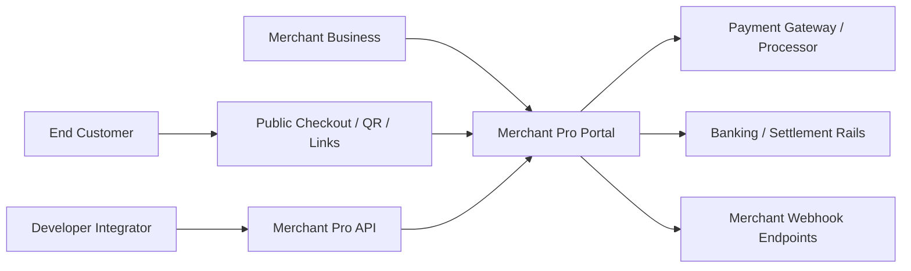

# Product Vision — Merchant Pro

## Business Objectives

1. **Unify merchant operations** — single portal for onboarding through settlement
2. **Enable payment productization** — checkout, links, QR, subscriptions as first-class products
3. **Support multi-tenant SaaS** — organization isolation with configurable RBAC
4. **Accelerate integrator adoption** — developer portal, sandbox, webhooks
5. **Maintain auditability** — immutable audit trails for compliance and dispute resolution

## Problems Solved

| Pain Point | Solution |
|------------|----------|
| Disconnected spreadsheets and legacy tools | Centralized module-based portal |
| Slow merchant go-live | Onboarding + approval workflow with KYC queues |
| Opaque payment status | Payment intent lifecycle with timeline and webhooks |
| Manual refund/chargeback handling | Workflow modules with approval gates |
| Developer integration friction | Sandbox, API keys, signed webhooks, OpenAPI docs |
| Compliance gaps | Audit logs, API logs, org-scoped data access |

## Target Market

- Payment service providers (PSPs) and acquirers
- Merchant aggregators and ISOs
- Enterprise merchants with multi-outlet operations
- Fintech platforms requiring white-label merchant management

## Merchant Pain Points Addressed

- Complex onboarding paperwork → digital onboarding with document upload
- Unclear settlement timing → settlements module with batch visibility
- Chargeback surprise → chargeback module with evidence and representment tracking
- Limited self-service → merchant portal roles for outlet and user management
- Integration uncertainty → sandbox environment mirroring production APIs

## Payment Ecosystem Position

Merchant Pro sits as the **merchant-facing operations layer** above payment processing:

## Competitive Positioning

| Dimension | Merchant Pro V1 |
|-----------|-----------------|
| Scope | Full-stack merchant ops + payments (not gateway-only) |
| Tenancy | Native multi-organization with RBAC caps |
| Developer experience | Sandbox, webhooks, developer portal |
| Compliance | Audit, KYC queues, risk rules, fraud module |
| AI | Embedded assistant with analytics-backed responses |

## Future Scalability (V2 Roadmap)

- Redis-backed distributed rate limiting and session store
- Nonce-based CSP; SSO (Google/GitHub) activation
- API key enforcement on all developer API routes
- Inbound webhook signature verification for partner integrations
- Horizontal worker scaling with queue partitioning
- Advanced fraud ML and real-time risk scoring
- Multi-currency settlement optimization

See [Assumptions_and_Constraints.md](./Assumptions_and_Constraints.md) for V1 exclusions.
