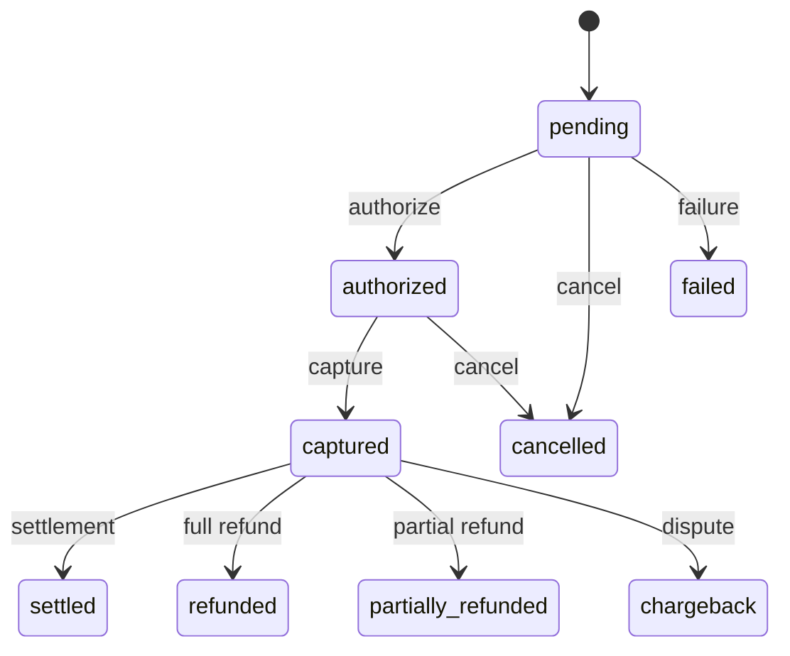

# User Journeys — Merchant Pro

End-to-end journeys with actors, steps, and success criteria. Cross-reference: [Business_Rules.md](./Business_Rules.md).

---

## UJ-001: Platform Administrator — Daily Operations

| Step | Action | System Response |
|------|--------|-----------------|
| 1 | Navigate to `/auth/login` | Login page displayed |
| 2 | Enter credentials; complete MFA if required | Dashboard or org selection |
| 3 | Select organization (if multi-org) | JWT updated with org context |
| 4 | Review `/dashboard` KPIs | Executive metrics loaded |
| 5 | Check `/settings/system-status` | Health/readiness green |
| 6 | Review `/audit` for critical events | Org-scoped audit list |
| 7 | Manage users at `/users` | CRUD per RBAC |

**Success:** Admin completes monitoring and provisioning without errors.  
**Rules:** BR-AUTH-*, BR-RBAC-*, BR-AUD-*

---

## UJ-002: Merchant Onboarding to Go-Live

| Step | Action | System Response |
|------|--------|-----------------|
| 1 | Operations user opens `/merchant-onboarding` | Onboarding list |
| 2 | Create onboarding application | Draft record |
| 3 | Upload KYC documents | Documents attached |
| 4 | Submit for approval | Status → pending review |
| 5 | Compliance officer reviews `/onboarding-approval` | Queue item visible |
| 6 | Approve application | Merchant activated |
| 7 | Execute go-live (`go_live:execute`) | Merchant status live |

**Success:** Merchant appears in `/merchants` with active status.  
**Rules:** BR-MER-*, BR-ORG-*

---

## UJ-003: Merchant Login and Organization Selection

| Step | Action | System Response |
|------|--------|-----------------|
| 1 | Merchant admin logs in | Auth tokens issued |
| 2 | If multiple orgs → `/select-organization` | Org list displayed |
| 3 | Select org | Org embedded in session |
| 4 | Navigate to `/merchants` or `/merchant-portal` | Scoped merchant data |

**Success:** User sees only their organization's merchants.  
**Rules:** BR-AUTH-008, BR-ORG-*

---

## UJ-004: Create and Capture Payment

| Step | Action | System Response |
|------|--------|-----------------|
| 1 | Finance user opens payments module | Payment list |
| 2 | Create payment intent (amount, currency, merchant) | Status `pending` |
| 3 | Authorize payment | Status `authorized`; webhook `payment.authorized` |
| 4 | Capture payment | Status `captured`; webhook `payment.captured` |
| 5 | View payment timeline | Events listed chronologically |

**Success:** Payment reaches `captured`; timeline complete.  
**Rules:** BR-PAY-*

---

## UJ-005: Refund Payment

| Step | Action | System Response |
|------|--------|-----------------|
| 1 | User locates captured payment | Payment detail |
| 2 | Initiate full or partial refund | Refund record created |
| 3 | If approval required → approver reviews `/refunds` | Pending status |
| 4 | Approve refund | Refund processed |
| 5 | Payment status → refunded/partially_refunded | Webhook emitted |

**Success:** Refund amount ≤ captured; status updated.  
**Rules:** BR-REF-*, BR-PAY-005

---

## UJ-006: Hosted Checkout — Customer Payment

| Step | Action | System Response |
|------|--------|-----------------|
| 1 | Merchant creates checkout session | Session with expiry |
| 2 | Customer opens `/pay/checkout/:ref` | Hosted checkout page |
| 3 | Customer enters payment details | Validation |
| 4 | Customer submits payment | Payment intent created/captured |
| 5 | Merchant receives webhook | Signed POST to endpoint |

**Success:** Customer receipt; session `complete`.  
**Rules:** BR-PUB-*, BR-PAY-009, BR-WH-*

---

## UJ-007: QR Payment — Customer Scan-to-Pay

| Step | Action | System Response |
|------|--------|-----------------|
| 1 | Merchant creates QR at `/qr-payments` | QR with public token |
| 2 | Customer scans → `/qr/:token` | Public pay page |
| 3 | Customer pays fixed amount | Payment recorded |
| 4 | Merchant views QR status | Paid/active indicator |

**Success:** Payment 201; QR reflects completion.  
**Rules:** BR-PUB-002, BR-QR (FR-QR-*)

---

## UJ-008: Payment Link Distribution

| Step | Action | System Response |
|------|--------|-----------------|
| 1 | Merchant creates link at `/payment-links` | Link with token |
| 2 | Merchant shares URL `/pay/:token` | — |
| 3 | Customer pays | Payment success |
| 4 | Merchant expires link if needed | Future pays rejected |

**Success:** One-time or limited use payment completed.  
**Rules:** BR-PUB-*

---

## UJ-009: Subscription Renewal Cycle

| Step | Action | System Response |
|------|--------|-----------------|
| 1 | Merchant defines plan at `/subscriptions` | Plan record |
| 2 | Customer subscribed | Active subscription |
| 3 | Billing period elapses | Renewal job/charge triggered |
| 4 | Payment success/failure recorded | Subscription status updated |
| 5 | Merchant views billing history | Period-formatted records |

**Success:** Renewal completes or dunning path initiated.  
**Rules:** BR-SUB-001

---

## UJ-010: Webhook Delivery and Retry

| Step | Action | System Response |
|------|--------|-----------------|
| 1 | Developer configures endpoint at `/webhooks` | Webhook + secret stored |
| 2 | Platform event occurs (e.g., payment.captured) | Delivery queued |
| 3 | Worker POSTs signed payload | HTTP response recorded |
| 4 | On failure → exponential backoff retry | attempt_count incremented |
| 5 | Admin retries from delivery log | Replay history created |

**Success:** 2xx response or dead-letter after max attempts.  
**Rules:** BR-WH-*

---

## UJ-011: Chargeback Representment

| Step | Action | System Response |
|------|--------|-----------------|
| 1 | Finance user creates chargeback on payment | Chargeback record |
| 2 | Upload evidence documents | Evidence attached |
| 3 | Submit representment | Status updated |
| 4 | Resolve as merchant_won or merchant_lost | Final status |

**Success:** Chargeback resolved with outcome.  
**Rules:** BR-CB-*

---

## UJ-012: Developer Sandbox Integration

| Step | Action | System Response |
|------|--------|-----------------|
| 1 | Developer opens `/developer` | Developer dashboard |
| 2 | Create OAuth app or use API keys | Credentials issued |
| 3 | Test in `/sandbox` | Simulated payment events |
| 4 | Configure webhook URL | Test delivery |
| 5 | Review API usage logs | Request history |

**Success:** Sandbox simulation succeeds; webhook received.  
**Rules:** FR-SBX-*, FR-DEV-*

---

## UJ-013: Admin Reporting and Export

| Step | Action | System Response |
|------|--------|-----------------|
| 1 | User opens `/reports` | Report templates |
| 2 | Run on-demand report | Report generated |
| 3 | Schedule recurring report | Cron job saved |
| 4 | Export from `/analytics` or audit | CSV/PDF export |

**Success:** Report delivered to configured recipients.  
**Rules:** FR-RPT-*

---

## UJ-014: Support Ticket Resolution

| Step | Action | System Response |
|------|--------|-----------------|
| 1 | Support agent opens `/support` | Ticket queue |
| 2 | Assign ticket to self | Status in_progress |
| 3 | Add internal note | Note saved |
| 4 | Link related transaction | Context attached |
| 5 | Close ticket | Status closed |

**Success:** Ticket closed with resolution notes.  
**Rules:** FR-SUP-*

---

## UJ-015: Auditor Compliance Review

| Step | Action | System Response |
|------|--------|-----------------|
| 1 | Auditor logs in (read_only role) | Limited nav |
| 2 | Search `/audit` by date/module | Org-scoped logs |
| 3 | Export audit trail | Export file |
| 4 | Review compliance queue | KYC decisions traceable |

**Success:** Complete audit trail exported without write access.  
**Rules:** BR-AUD-*, BR-RBAC-003

**Total user journeys documented:** 15
