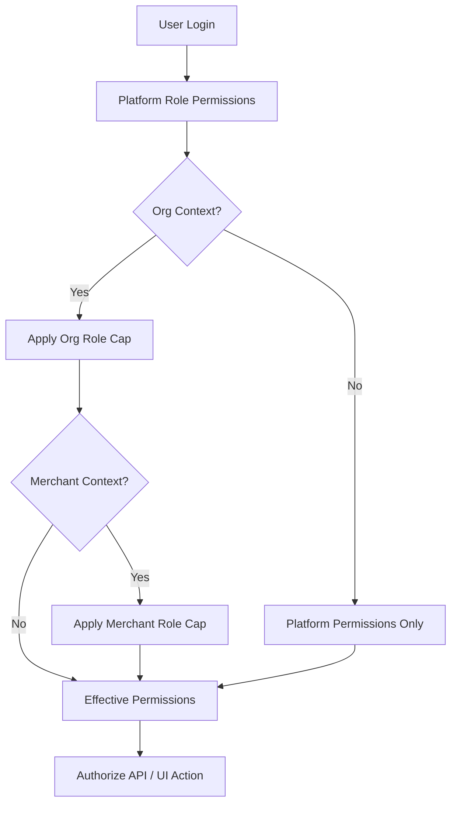

# User Roles — Merchant Pro

Complete RBAC documentation for v1.0.0-rc1.

## Permission Resolution Model

Effective permissions are computed in **three layers**:

1. **Platform role** — permissions from `user_roles` → `role_permissions`
2. **Organization role cap** — intersects with org membership role (`owner`, `admin`, `member`, `viewer`)
3. **Merchant role cap** — when merchant context active (`x-merchant-id`), intersects with merchant portal role

**Super Admin** (`super_admin`) bypasses all checks.

---

## 1. Platform Roles

| Code | Name | Primary Users | Allowed Modules (summary) | Restrictions |
|------|------|---------------|---------------------------|--------------|
| `super_admin` | Super Admin | Platform Administrator | All modules; `permissions:manage` | None — full bypass |
| `admin` | Admin | Platform Administrator | All business modules | No `permissions:manage` |
| `finance_manager` | Finance Manager | Finance User | Settlements, transactions, refunds, payouts, accounting, reports | No user/role admin |
| `operations_manager` | Operations Manager | Operations User | Merchants, transactions, operations, onboarding | Limited settings write |
| `merchant_manager` | Merchant Manager | Merchant Administrator | Merchant onboarding, merchants, outlets | No platform config |
| `support_agent` | Support Agent | Support User | Support, customers, transactions (read), notifications | Read-heavy; limited write |
| `read_only` | Read Only | Auditor, Compliance | All `:read` and `:export` permissions | No write/approve/delete |

---

## 2. Organization Membership Roles

| Code | Name | Cap Behavior |
|------|------|--------------|
| `owner` | Owner | Full global permissions within org |
| `admin` | Org Admin | Full global permissions within org |
| `member` | Member | Blocks `:write`, `:approve`, `:resolve`, `:delete`, `:manage` |
| `viewer` | Viewer | Only `:read` and `:export` |

---

## 3. Merchant Portal Roles

| Code | Name | Typical Users | Scope |
|------|------|---------------|-------|
| `merchant_owner` | Merchant Owner | Merchant Administrator | Full merchant portal |
| `merchant_admin` | Merchant Admin | Merchant Staff | Outlets, users, operations |
| `finance_manager` | Finance Manager | Finance User | Settlements, payouts, reports |
| `accountant` | Accountant | Finance User | Accounting exports |
| `operations_manager` | Operations Manager | Operations User | Transactions, outlets |
| `branch_manager` | Branch Manager | Merchant Staff | Assigned outlet only |
| `support_executive` | Support Executive | Support User | Customer/transaction support |
| `viewer` | Viewer | Merchant Staff | Read-only merchant data |
| `platform` | Platform Access | Platform user with merchant access | All outlets in org |

---

## 4. User Personas

### Platform Administrator

| Attribute | Detail |
|-----------|--------|
| Responsibilities | User/role management, org setup, feature flags, system settings |
| Permissions | `admin` or `super_admin` platform role |
| Goals | Secure, configured platform; user provisioning |
| Daily workflow | Review system status → manage users/roles → configure settings → review audit |

### Operations User

| Attribute | Detail |
|-----------|--------|
| Responsibilities | Merchant onboarding oversight, operations center, incident response |
| Permissions | `operations_manager`; `operations:*` |
| Goals | Resolve failed items; maintain merchant pipeline |
| Daily workflow | Operations dashboard → retry queue → merchant onboarding approvals |

### Support User

| Attribute | Detail |
|-----------|--------|
| Responsibilities | Ticket management, customer lookup, transaction inquiry |
| Permissions | `support_agent`; `support:read/write` |
| Goals | Resolve merchant/customer issues quickly |
| Daily workflow | Support inbox → ticket assign/escalate → linked transaction review |

### Merchant Administrator

| Attribute | Detail |
|-----------|--------|
| Responsibilities | Merchant profile, outlets, merchant users, payment products |
| Permissions | `merchant_manager` or `merchant_admin` merchant role |
| Goals | Go-live merchants; configure payment acceptance |
| Daily workflow | Merchant dashboard → outlet setup → payment links/QR → review transactions |

### Merchant Staff

| Attribute | Detail |
|-----------|--------|
| Responsibilities | Day-to-day transaction monitoring, outlet operations |
| Permissions | `branch_manager`, `operations_manager`, or `viewer` merchant role |
| Goals | Process payments; monitor outlet performance |
| Daily workflow | Transactions list → QR/link sharing → support escalation |

### Developer / API Consumer

| Attribute | Detail |
|-----------|--------|
| Responsibilities | API integration, webhook endpoints, sandbox testing |
| Permissions | `developer:read/write/manage` |
| Goals | Reliable API integration; webhook delivery |
| Daily workflow | Developer portal → sandbox test → webhook config → API usage review |

### Auditor / Compliance Officer

| Attribute | Detail |
|-----------|--------|
| Responsibilities | Audit log review, compliance queue, KYC verification |
| Permissions | `audit:read/export`, `compliance_queue:*`, `kyc_review:*` |
| Goals | Demonstrate regulatory compliance; trace actions |
| Daily workflow | Audit search → compliance queue → export reports |

### Finance User

| Attribute | Detail |
|-----------|--------|
| Responsibilities | Settlements, payouts, refunds approval, reconciliation |
| Permissions | `finance_manager`; financial module permissions |
| Goals | Accurate fund movement; timely settlement |
| Daily workflow | Settlements → payout approval → reconciliation → reports |

---

## 5. Permission Matrix (Module × Action)

Full permission codes: **144** defined in `permissions.ts`. Summary by module:

| Module | Read | Write | Manage / Special |
|--------|------|-------|------------------|
| dashboard | ✓ | — | export |
| merchants | ✓ | ✓ | delete |
| payments | ✓ | ✓ | capture, refund, manage |
| checkout | ✓ | ✓ | manage, analytics, branding |
| refunds | ✓ | ✓ | approve |
| chargebacks | ✓ | ✓ | resolve |
| webhooks | ✓ | ✓ | manage |
| developer | ✓ | ✓ | manage |
| audit | ✓ | — | export |
| settings | ✓ | ✓ | — |
| system | view | — | — |

> **Note:** See [Feature_Matrix.md](./Feature_Matrix.md) for feature-level availability by role.

---

## 6. HTTP Context Headers

| Header | Purpose |
|--------|---------|
| `Authorization: Bearer` | Access token (alternative to cookie) |
| `X-Organization-Id` | Active organization when JWT lacks org claim |
| `X-Merchant-Id` | Merchant portal context |
| `X-Outlet-Id` | Outlet scope within merchant |
| `X-CSRF-Token` | CSRF protection for cookie auth |
