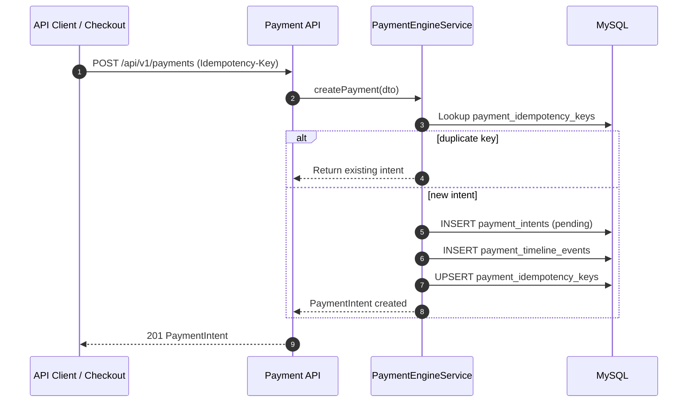
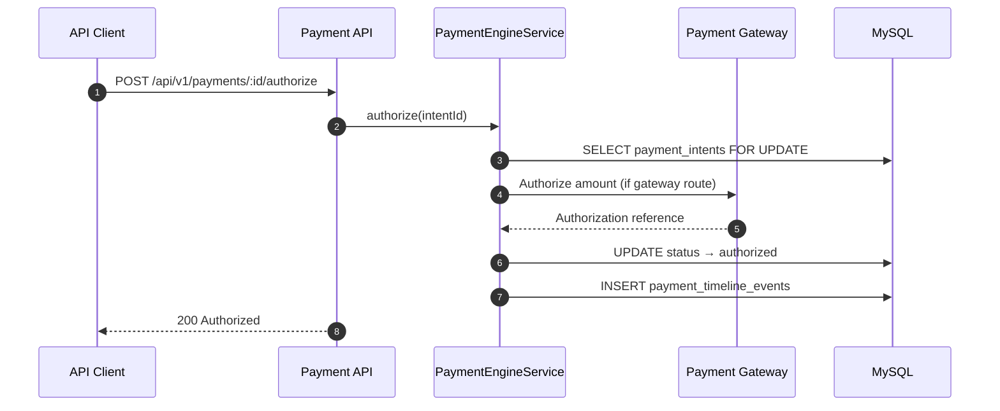
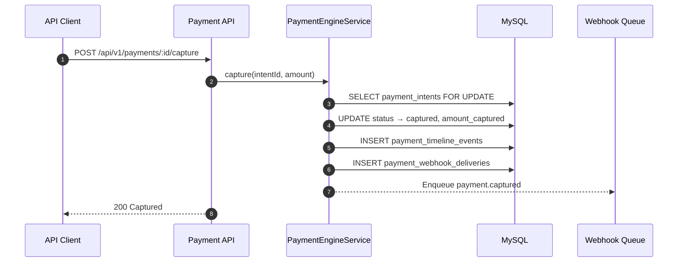
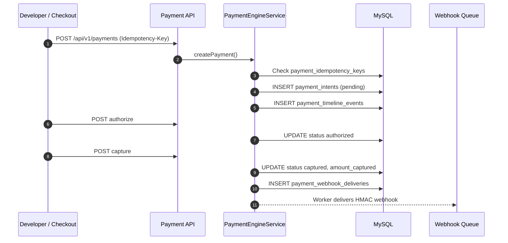
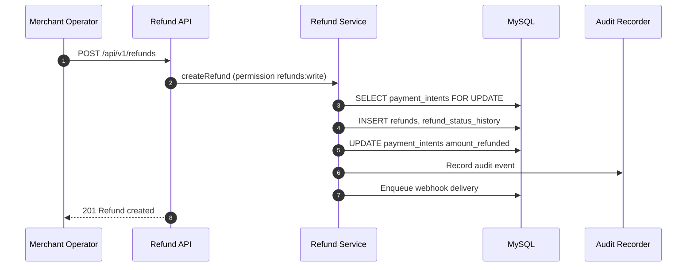
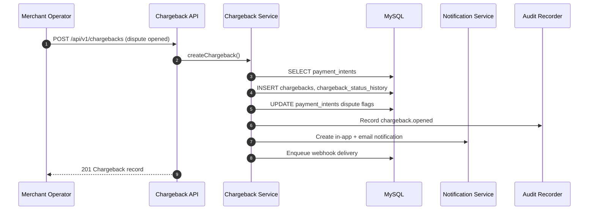

# Payment Architecture

> **Merchant Pro Enterprise Architecture** · v1.0.0-rc1 · Product: [01_Product](../01_Product/README.md)

## Table of Contents

1. [Purpose](#purpose)
2. [Responsibilities](#responsibilities)
3. [Components](#components)
4. [Dependencies](#dependencies)
5. [Communication](#communication)
6. [Data Flow](#data-flow)
7. [Trust Boundaries](#trust-boundaries)
8. [Failure Handling](#failure-handling)
9. [Scalability](#scalability)
10. [Limitations](#limitations)
11. [Future Evolution](#future-evolution)
12. [Cross References](#cross-references)

---

## Purpose

Payment intent lifecycle: create, authorize, capture, settle, refund.

## Responsibilities

Define technical structure, boundaries, and cross-cutting concerns for Merchant Pro v1.0.0-rc1.

## Components

`PaymentEngineService`, `payment_intents`, `payment_orders`, `payment_timeline_events`, idempotency via `payment_idempotency_keys`.

## Dependencies

Node 20+, MySQL 8, Redis 7, SMTP for email, external payment gateway.

## Communication

HTTPS JSON REST between SPA and API; worker polls MySQL queues; Redis pub/sub not used.

## Data Flow

### Create Payment

### Payment Authorization

### Payment Capture

### Authorize and Capture (Combined)

### Refund

### Chargeback

## Trust Boundaries

Public internet → TLS → API → private DB network. See [Trust_Boundaries.md](./Trust_Boundaries.md).

## Failure Handling

Structured `AppError` responses; worker retries with exponential backoff; health endpoints for orchestration.

## Scalability

Horizontally scale API and worker replicas; Redis locks coordinate; MySQL remains primary bottleneck.

## Limitations

Single-region deployment in rc1; no read replica requirement; polling-based queues.

## Future Evolution

Read replicas, event outbox, multi-region DR, gateway abstraction layer.

## Cross References

[01_Product/Modules/Payments.md](../01_Product/Modules/Payments.md) · [01_Product/Modules/Payment_Lifecycle.md](../01_Product/Modules/Payment_Lifecycle.md)
