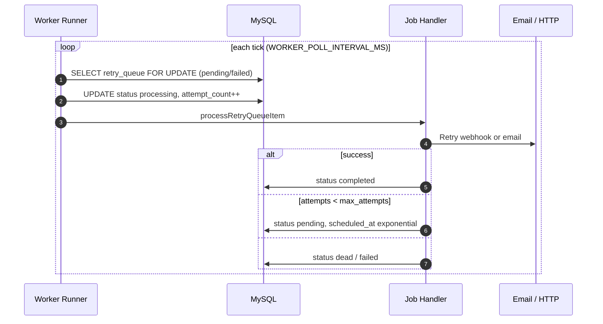

# Worker Architecture

> **Merchant Pro Enterprise Architecture** · v1.0.0-rc1 · Product: [01_Product](../01_Product/README.md)

## Table of Contents

1. [Purpose](#purpose)
2. [Responsibilities](#responsibilities)
3. [Components](#components)
4. [Dependencies](#dependencies)
5. [Communication](#communication)
6. [Data Flow](#data-flow)
7. [Trust Boundaries](#trust-boundaries)
8. [Failure Handling](#failure-handling)
9. [Scalability](#scalability)
10. [Limitations](#limitations)
11. [Future Evolution](#future-evolution)
12. [Cross References](#cross-references)

---

## Purpose

Background processing via custom MySQL queues — not BullMQ.

## Responsibilities

Define technical structure, boundaries, and cross-cutting concerns for Merchant Pro v1.0.0-rc1.

## Components

| Queue Table | Claim Pattern |
|-------------|---------------|
| background_jobs | FOR UPDATE → running |
| retry_queue | FOR UPDATE → processing |
| notification_deliveries | FOR UPDATE email pending |
| webhook_delivery_queue | FOR UPDATE |
| payment_webhook_deliveries | FOR UPDATE |

## Dependencies

Node 20+, MySQL 8, Redis 7, SMTP for email, external payment gateway.

## Communication

HTTPS JSON REST between SPA and API; worker polls MySQL queues; Redis pub/sub not used.

## Data Flow

### Worker Retry

## Trust Boundaries

Public internet → TLS → API → private DB network. See [Trust_Boundaries.md](./Trust_Boundaries.md).

## Failure Handling

Redis locks prevent duplicate processing; unknown job types marked failed and audited.

## Scalability

Horizontally scale API and worker replicas; Redis locks coordinate; MySQL remains primary bottleneck.

## Limitations

Single-region deployment in rc1; no read replica requirement; polling-based queues.

## Future Evolution

Read replicas, event outbox, multi-region DR, gateway abstraction layer.

## Cross References

[01_Product/Modules/Workers.md](../01_Product/Modules/Workers.md) · [01_Product/Modules/Background_Jobs.md](../01_Product/Modules/Background_Jobs.md)
