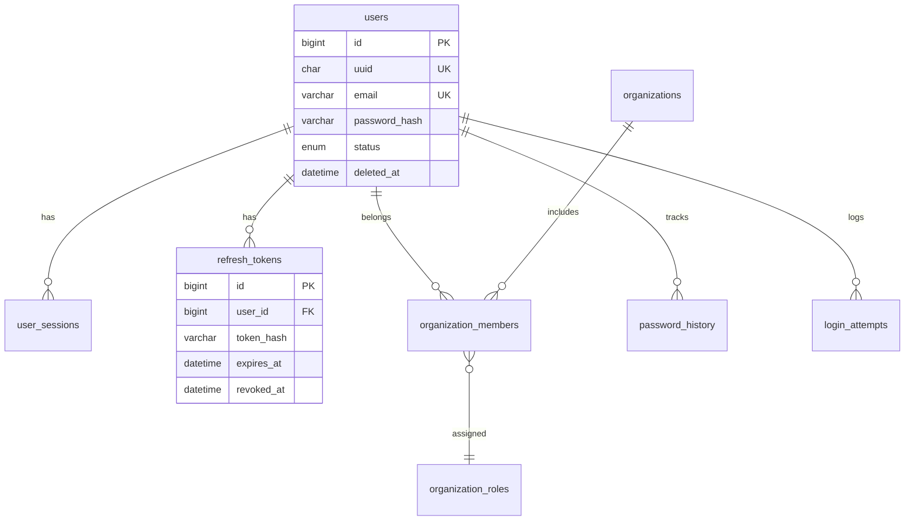
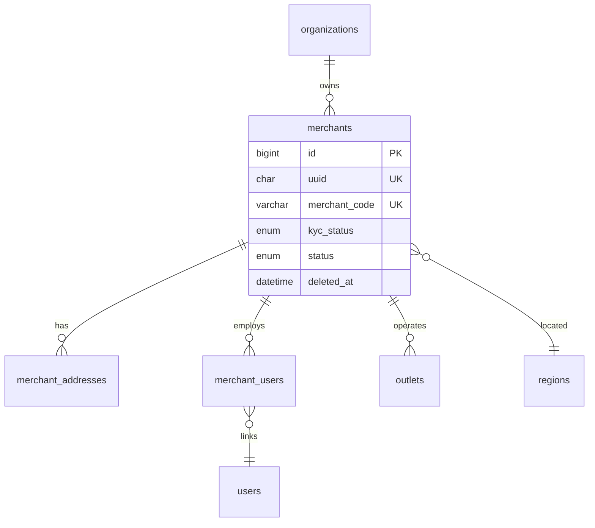
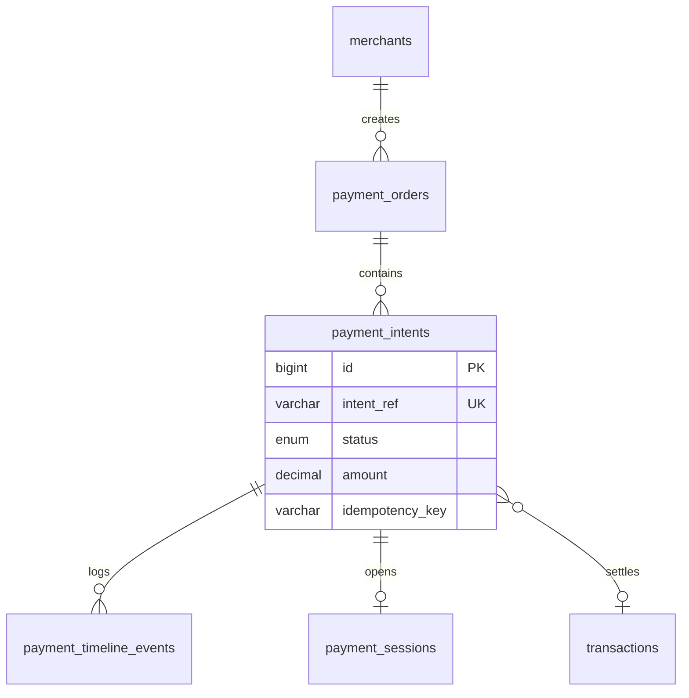
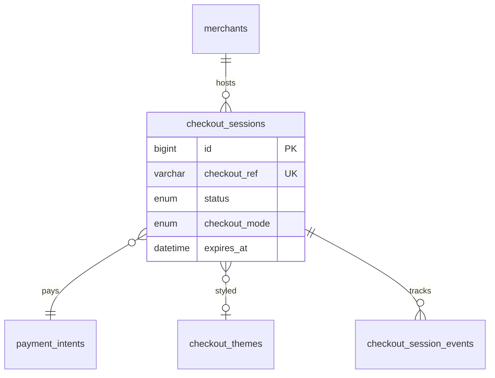
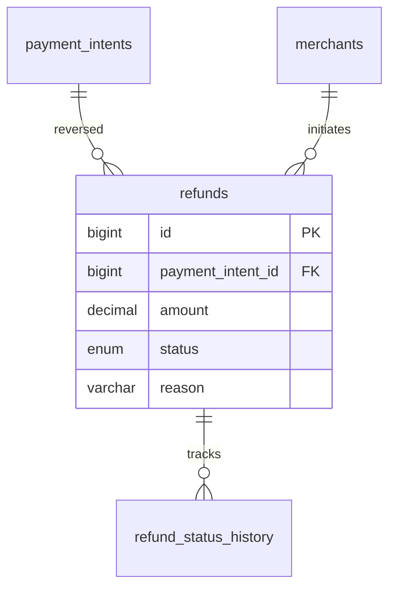
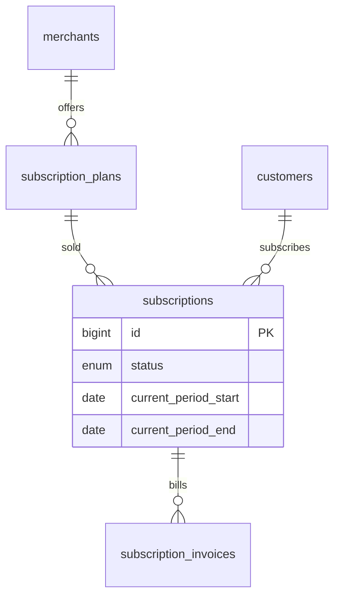
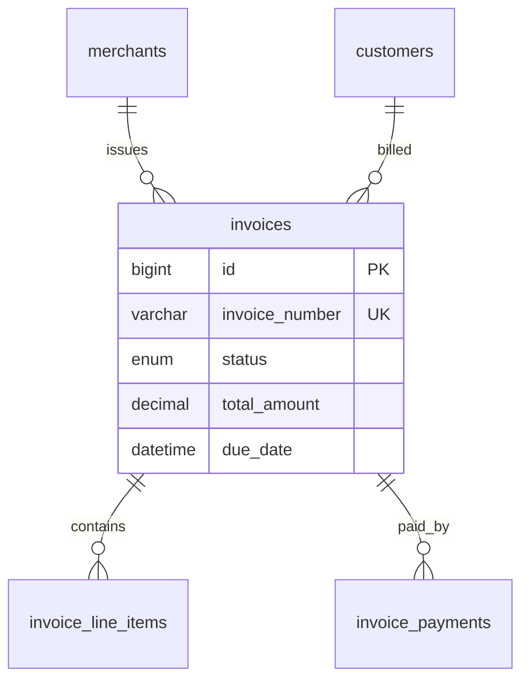
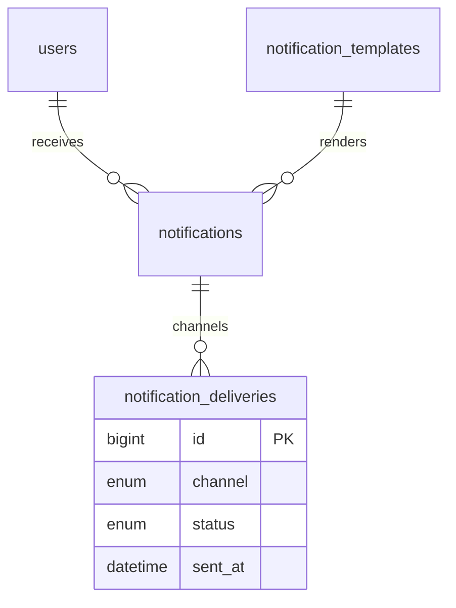
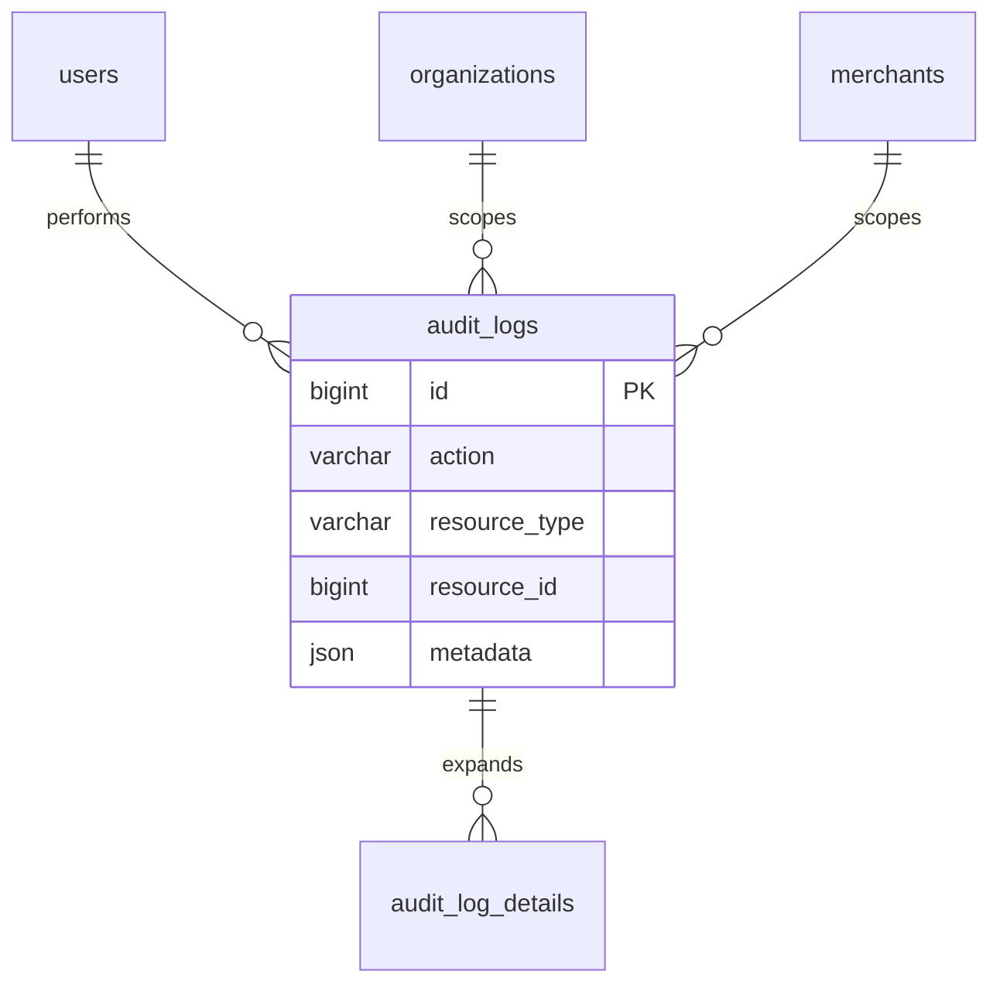
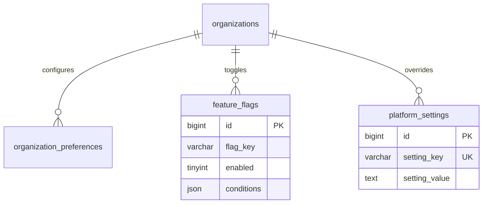

# Entity Relationship Diagrams

> **Merchant Pro Database Architecture** · v1.0.0-rc1 · Schema: `Database_Fintech/master_database.sql` (223 tables)

## Table of Contents

1. [Purpose](#purpose)
2. [Identity](#identity)
3. [Merchant](#merchant)
4. [Payments](#payments)
5. [Checkout](#checkout)
6. [Refunds](#refunds)
7. [Subscriptions](#subscriptions)
8. [Invoices](#invoices)
9. [Notifications](#notifications)
10. [Audit](#audit)
11. [Configuration](#configuration)
12. [Notes](#notes)

---

## Purpose

Domain-scoped ER diagrams for major bounded contexts.

## Identity

## Merchant

## Payments

## Checkout

## Refunds

## Subscriptions

## Invoices

## Notifications

## Audit

## Configuration

## Notes

Full schema: `Database_Fintech/master_database.sql`. FK constraints enforce referential integrity with RESTRICT/SET NULL/CASCADE per relationship.
