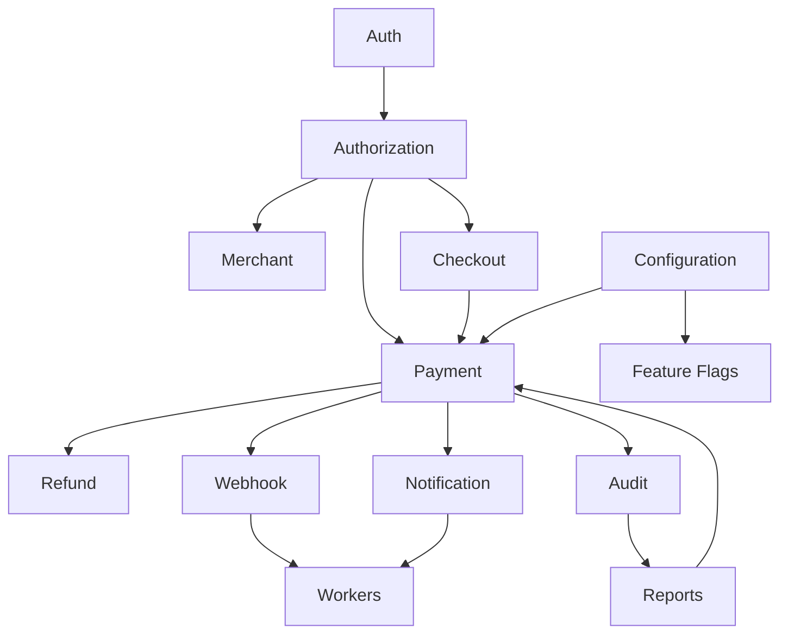

# Module Interaction

> **Merchant Pro Solution Design** · v1.0.0-rc1

## Table of Contents

1. [Purpose](#purpose)
2. [Modules](#modules)
3. [Diagram](#diagram)
4. [Auth → Payment](#auth--payment)
5. [Payment → Webhook → Worker](#payment--webhook--worker)
6. [Configuration](#configuration)

---

## Purpose

Inter-module communication among core platform modules.

## Modules

Auth, Authorization, Merchant, Payment, Checkout, Refund, Webhook, Notification, Workers, Reports, Audit, Configuration.

## Diagram

## Auth → Payment

JWT carries organizationId and merchant scope; PaymentEngineService validates merchant access.

## Payment → Webhook → Worker

State change inserts delivery row; worker claims and POSTs HMAC payload.

## Configuration

Settings module and feature_flags table gate module behavior at runtime.
